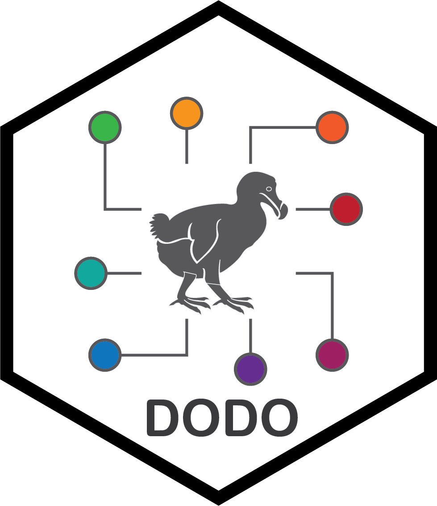

# Dictionary of Disease Ontologies (DODO)

  
 

</br>



## Aim

The aim of DODO is to allow an easier way to interact and explore disease ontologies and their identifiers. The database is build on Neo4j and incorporates different ontologies with an accompanying R package that allows easy access, exploration, and definition of disease concepts of interest. It can work as the intermediate player to facilitate access and exhaustive extraction of information from other life science databases without the need to harmonize these up front. 

## Installation 

A public instance of the DODO Neo4j database dump is provided for convenience and can be reached as on Zenodo.
https://zenodo.org/records/13993040

The data model is implemented using the Neo4j graph database which using the Cypher query language [@Neo4j2020]. One accompagnying R package *DODO* was developed to connect and query the resource. It provides higher level functions to query the Neo4j graph database based on the described data model (above) [@R2019].

```
devtools::install_github("Elysheba/DODO")
```

The minimal system requirements are: 

- R ≥ 4.4
- Operating system: Linux, macOS, Windows
- Memory ≥ 4GB RAM

The graph database has been implemented with Neo4j 4.15 [@Neo4j2020], the DODO R package depends on the following packages:

-   stringr,
-   DT,
-   data.table,
-   igraph,
-   neo2R (>= 2.4),
-   magrittr,
-   visNetwork


## Versions

### Version 2.0.0

An major update of the DODO package and database was released on October 2024 where the underlying data model, R functions and neo4j ingestion was changed fully.

A public instance of the DODO Neo4j database dump is provided for convenience and can be reached as on Zenodo.
https://zenodo.org/records/13993040

### Version 1.1.0

   - `connect_to_dodo()` supports the .opts parameter of `neo2R::startGraph()`.

The original [paper:](https://doi.org/10.12688/f1000research.25144.1).


## Implementation and usage

Please refer to vignette for more information. Briefly:

```
library(DODO)
connect_to_dodo(local = T)

*Show the data model*
show_dodo_model()

*List node types and databases that are included*
list_database()
list_node_type()

*Return a full ontology*
get_ontology("MONDO")

*Identify direct cross-reference relations for (an) identifier(s)*
convert_concept(
  ids = "MONDO:0005027",
  relationship = "xref",
  direct = T
)

*Identify indirect cross-reference relations for (an) identifier(s).*
convert_concept(
  ids = "MONDO:0005027",
  relationship = "xref",
  direct = F
)

*Identify all indirect parent-child relations for (an) identifier(s).*
convert_concept(
  ids = "MONDO:0005027",
  relationship = "parent", # "child"
  direct = F
)

*Identify all disease-phenotype or inverse for (an) identifier(s).*
convert_concept(
  ids = "HP:0001250",
  relationship = "disease"
) # "phenotype"

*Identify alternative identifiers.*
convert_concept(
  ids = "DOID:9489",
  relationship = "alternative"
) # "phenotype"
```


## Constructing a new DODO Neo4j database

To construct a DODO instance, a set of script is available to load and feed a Neo4j instance. These are not exposed directly to the user instead, these scripts are available in the *build/scripts* folder. The feeding of DODO is based on the parsed files of the different ontologies, a workflow on downloading and parsing for each included ontology is available through GitHub.


|Resource | GitHub repository|
|----|-------|
|Monarch Disease Ontology (MonDO) | https://github.com/Elysheba/Monarch |
|Experimental Factor Ontology (EFO) | https://github.com/Elysheba/EFO |
|Orphanet | https://github.com/Elysheba/Orphanet |
|MedGen | https://github.com/Elysheba/MedGen |
|Medical Subject Headings (MeSH) | https://github.com/Elysheba/MeSH |
|Human Phenotype Ontology (HPO) | https://github.com/patzaw/HPO |
|ClinVar | https://github.com/patzaw/ClinVar |
|Disease Ontology (DO) | https://github.com/Elysheba/DO |
|International Classification of Diseases (ICD11) | https://github.com/Elysheba/ICD11 |

## Neo4j dump file

This neo4j dump file provides a dump of the DODO (Dictionary of Disease Ontologies) graph database. It aims to provide a more complete mapping across the multitude of disease ontologies and a comprehensive way to explore and interact with disease ontologies. It includes the ontologies listed below: 

- Monarch Ontology
- EFO
- DO
- ICDO
- MedGen
- MeSH
- HPO


A public instance of the DODO Neo4j database dump is provided for convenience and can be reached as on Zenodo.
https://zenodo.org/records/13993040

### Load the neo4j dump file

```
## download the apoc library
wget https://github.com/neo4j/apoc/releases/download/5.15.1/apoc-5.15.1-core.jar
## Load the database from the neo4j dump file
docker run --interactive --tty --rm  \
    --name dodo  \
    --publish=7474:7474 --publish=7687:7687  \
    --env NEO4J_AUTH=none  \
    --env NEO4J_server_memory_heap_initial__size=8G   \
    --env NEO4J_server_memory_heap_max__size=20G  \
    --env NEO4J_server_memory_pagecache_size=8G  \
    --volume=/user/neo4j_backups:/backups \
    --volume=/user/neo4j_data:/data \
    neo4j:5.15 `
    neo4j-admin database load neo4j --from-path=/backups --overwrite-destination --verbose

docker run --interactive --tty --rm \
    --name dodo  \
    --publish=7474:7474 --publish=7687:7687  \
    --env NEO4J_AUTH=none  \
    --env NEO4J_server_memor/y_heap_initial__size=8G  \
    --env NEO4J_server_memory_heap_max__size=20G  \
    --env NEO4J_server_memory_pagecache_size=8G  \
    --env NEO4J_apoc_export_file_enabled=true \
    --env NEO4J_apoc_import_file_enabled=true \
    --env NEO4J_apoc_import_file_use__neo4j__config=true \
    --env NEO4J_dbms_security_procedures_unrestricted=apoc.* \
    --env NEO4J_dbms_security_procedures_allowlist=apoc.* \
    --volume=/user/neo4j_data:/data \
    --volume/users/neo4j_plugins:/plugins \
    neo4j:5.15
```


