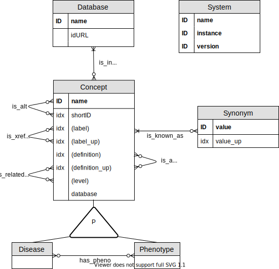

<!----------------------------------------------------------------->
<!----------------------------------------------------------------->

# Introduction

This document shows how to build a Dictionary of Disease Ontologies (DODO). It can be adapted for specific needs or additional ontologies as required. The DODO functions used to feed the DB are not exported to avoid unintended modifications of the DB. To call them, they are preceded by `DODO:::`.

In this example several publically available disease ontologies are integrated into DODO. These ontologies have been parse beforehand and these scripts are made available through a GitHub repository (as described in the paper).

```{r config, message=FALSE}
##
library(neoDODO)
library(knitr)
library(here)
library(dplyr)
library(readr)
library(tibble)
library(stringr)
library(DT)
library(ReDaMoR)
##

workingDirectory <- here("build/working1")
# setwd("~/Documents/Development/neoDODO/build/working1/")
##
opts_knit$set(root.dir=workingDirectory)
opts_chunk$set(
   eval=TRUE,
   message=FALSE,
   root.dir=workingDirectory
)
## Specific config
dodoInstance <- "UCB-Public"
dodoVersion <- format(Sys.Date(), "%Y.%m.%d")
## General config
reDumpThr <- as.difftime(2, units="days")
curDate <- Sys.Date()
## Original resources location
# oriDir <- "~/Shared/Data-Science/Data-Source-Model-Repository"
## Connect to DODO database
connect_to_dodo(
   url = "http://localhost:7476",
   importPath = "/data/lfrancois/Development/neoDODO/build/working1/neo4jImport"
   # importPath = "neo4jImport"
)

```

<!----------------------------------------------------------------->
<!----------------------------------------------------------------->

# Data model



# Load ontologies

The different ontologies included are MonDO, EFO, DO, Orphanet, MedGen, MeSH, HPO, ICD10CM, ICD11 (only ICD10 ids), Cortellis (if available) and ICD10CM. These files were parsed with the source scripts provided in the respective GitHub repositories. 

```{r load_onto, include = TRUE}
path_name <- "/home/lfrancois/Shared/Data-Science/Data-Source-Model-Repository"
src <- c("Monarch","EFO","DO","Orphanet","MedGen","MeSH","HPO", "ICD11", "CortellisONT","ICD10CM")
for(s in src){
  ddir <- file.path(path_name,s,"data")
  dbfiles <- grep("txt",list.files(ddir),value =T)
  for(i in dbfiles){
    x <- read.table(file.path(ddir,i),header = TRUE, sep = "\t", 
                    quote = '"', comment.char = "", colClasses= c("character"))
    # if(grepl("entryId",i)){
    #   x$resource <- s
    # }
    assign(gsub(".txt","",i), x) 
  }
}
```


# Format input tables

This script generates the different tables required to build the DODO Dgraph database and takes the files created by parsing the disease ontologies as input. The ontologies provided in public DODO instance are:

- MONDO (Monarch)
- EFO
- DO
- Orphanet
- MedGen
- MeSH
- HPO
- ICD11
- ICD10CM
- ClinVar

The URL provides a link to its respective GitHub repository where you can find the scripts to parse the different ontologies and generate the necessary input files for the current workflow. However, this workflow is easily adapted to include additional disease or phenotype ontologies. It requires parsing the ontology and generating files with specific format and specific table name. The table name is always constructes as follows: *name of the ontology*_*name table*, eg. "Monarch_entryId". The script will read these files with the specific table names from the global environment and append them automatically to each other. The format of each table is listed below, if information is not available or not provided in the ontology, the table doesn't need to be created. If specific information of a table is missing, please assign NA to that column. 

**entryId**

Dataframe with columns *DB* (character, database or ontology), *id* (character, identifier without database prefix), *def* (character, definition of the concept), and *level* (integer, in the ontology hierarchy).

```{r ex_entryId, include = TRUE, echo = FALSE}
DT::datatable(Monarch_entryId %>% head(n = 2))
```

**idNames**

Dataframe with columns *DB* (character, database or ontology), *id* (character, identifier without database prefix), *syn* (character, synonym and label), and canonical (boolean, whether *syn* is the canonical concept label).

```{r ex_idNames, include = TRUE, echo = FALSE}
DT::datatable(Monarch_idNames %>% head(n = 2))
```

**parentId**

Dataframe with columns *DB* (character, database or ontology), *id* (character, identifier without the database prefex), *pDB* (character, database or ontology of the parent term), *parent* (character, identifiers of the parent), origin (character, database or ontology where this relationship originates from).

```{r ex_parentId, include = TRUE, echo = FALSE}
DT::datatable(Monarch_parentId %>% head(n = 2))
```

**crossId**

Dataframe with columns *DB1* (character, database or ontology of the first identifier), *id1* (character, first identifier without the database prefex), *DB2* (character, database or ontology of the second identifier), *id2* (character, second identifier also called cross-referenced identifier without database prefix).

```{r ex_crossId, include = TRUE, echo = FALSE}
DT::datatable(Monarch_crossId %>% head(n = 2))
```

**altId**

Dataframe with columns *DB* (character, database or ontology), *id* (character, identifier without the database prefex), *alt* (character, database or ontology of the alternative identifier), *altDB* (character, alternative identifier).

```{r ex_hp, include = TRUE, echo = FALSE}
toShow <- HPO_altId %>%
  mutate(altDB = "HP",
         DB = "HP")
DT::datatable(toShow %>% head(n = 2))
```

**pheno2dis**

Dataframe with columns *phenoDB* (character, database or ontology of the phenotype), *phenoID* (character, phenotype identifier without the database prefex), *disDB* (character, database or ontology of the disease identifier), *disID* (character, disease identifier).

```{r ex_hpdis, include = TRUE, echo = FALSE}
toShow <- HPO_diseaseHP %>%
  mutate(phenoDB = "HP") %>%
  select(phenoDB, 
         phenoID = hp,
         disDB = db,
         disID = id)
DT::datatable(toShow %>% head(n = 2))
```

## Database convention

There are often different abbreviations available for different ontology database. Here, we adopt a naming convention to harmonize the different inputs.

```{r db_convention, echo = FALSE, include = TRUE}
toShow <- readxl::read_xlsx(here::here("inst", "documentation", "DatabaseDocumentation.xlsx"))
datatable(toShow,
          rownames = FALSE)
```

## Cross-reference edges

There are two types of cross-reference edges encoded into the database, *is_xref* and *is_related*.  The *is_xref* edge is used for equal cross-reference relationships where the concepts relate more directly to each other (similar concept levels). The *is_related* edge is used for all other cross-reference edges.

```{r db_xref_edge, echo = FALSE, include = TRUE}
xrefDB <- readxl::read_xlsx(here::here("inst", "documentation", "is_xref_edges.xlsx"))
datatable(xrefDB,
          rownames = FALSE)
```

## Harmonize HPO

HPO captures phenotype information, the information in the HPO parsed files needs to be harmonized before joining.

```{r harm_hpo, echo = TRUE, results = "hide", prompt = TRUE}
list2env(neoDODO:::harmonize_HPO(
  HPO_diseaseHP,
  HPO_synonyms,
  HPO_hp,
  HPO_altId,
  HPO_diseases,
  HPO_parents,
  Monarch_hp),
  envir = .GlobalEnv)
```

## Harmonize CortellisONT

Harmonize information from CortellisONT when available.

```{r harm_cort, include = FALSE, echo = FALSE}
if(params$type == "internal"){
  ## Identify missing IDs from other Cortellis APIs
  cortDD <- read.table("/home/lfrancois/Shared/Data-Science/Data-Source-Model-Repository/CortellisDD/data/CortellisDD_conditions.txt",
                       header = TRUE, 
                       sep = "\t", 
                       quote = '"', 
                       comment.char = "", 
                       colClasses= c("character")) %>%
    dplyr::mutate(conditionId = paste("Cortellis_condition", conditionId, sep = ":")) %>%
    dplyr::distinct(conditionId, .keep_all = T) 
   list2env(neoDODO:::harmonize_Cortellis(
     CortellisONT_siConditions = CortellisONT_siConditions,
     CortellisONT_siConditionXref = CortellisONT_siConditionXref,
     CortellisONT_siConditionParents = CortellisONT_siConditionParents,
     CortellisONT_ciIndications = CortellisONT_ciIndications,
     CortellisONT_ciIndicationXref = CortellisONT_ciIndicationXref,
     CortellisONT_ciIndicationParents = CortellisONT_ciIndicationParents,
     checkMissing = cortDD),
     envir = .GlobalEnv)
}
```

# Integrate resources

The input tables from the different ontologies are integrated and checked for consistency.

```{r integrate}
##################################################################@
## Bind all datasets----
obj <- c("entryId","crossId","idNames","parentId","pheno2dis","altId")

for(i in obj){
  dbobj <- grep(i,ls(),value = T)
  print(i)
  sapply(dbobj,
           function(x){
             print(names(get(x)))
           })
  sobj <- unique(do.call(rbind,lapply(dbobj,function(x) get(x))))
  fn <- paste0("DODO_",i)
  assign(value = sobj,x = fn)
}

# table(DODO_crossId$DB1)
# table(DODO_crossId$DB2)
# table(DODO_entryId$DB)
# table(DODO_idNames$DB)
# table(DODO_parentId$DB)
# table(DODO_parentId$pDB)
# table(DODO_pheno2dis$disDB)
# table(DODO_pheno2dis$phenoDB)
# table(DODO_altId$altDB)
# table(DODO_altId$DB)


##################################################################@
## create dbid
DODO_entryId <- DODO_entryId %>%
  distinct() %>%
  mutate(dbid = str_c(DB, id, sep = ":"))

DODO_pheno2dis <- DODO_pheno2dis %>%
  mutate(ddbid = str_c(disDB, disID, sep = ":"),
         pdbid = str_c(phenoDB, phenoID, sep = ":"))

DODO_crossId <- DODO_crossId %>%
  mutate(dbid1 = str_c(DB1, id1, sep = ":"),
         dbid2 = str_c(DB2, id2, sep = ":"))

DODO_altId <- DODO_altId %>%
  mutate(dbid = str_c(DB, id, sep = ":"),
         adbid = str_c(altDB, alt, sep =":"))

DODO_parentId <- DODO_parentId %>%
  mutate(dbid = str_c(DB, id, sep = ":"),
          pdbid = str_c(pDB, parent, sep = ":"))

DODO_idNames <- DODO_idNames %>%
  mutate(dbid = str_c(DB, id, sep = ":"))
```

## Load ClinVar information

ClinVar uses an internal clinvar disease identifier (t.id) that cross-references to different ontology. To complete the information and facilitate integration with ClinVar resource, this information is added in DODO.

```{r load_cv}
list2env(neoDODO:::load_ClinVar(
  DODO_entryId = DODO_entryId,
  path_name = "/home/lfrancois/Shared/Data-Science/Data-Source-Model-Repository/ClinVar/data/",
  traitCref = "ClinVar_traitCref.txt", 
  traitName = "ClinVar_traitNames.txt", 
  MedGen_MGSTY = "/home/lfrancois/Shared/Data-Science/Data-Source-Model-Repository/MedGen/sources/MGSTY.RFF"),
  envir = .GlobalEnv)
```

The parsed dataframes are appended to their respective DODO counterparts.

```{r bind_dodo}
## Add to DODO
DODO_entryId <- rbind(DODO_entryId, cv_entryId)
DODO_idNames <- rbind(DODO_idNames, cv_idNames)
DODO_crossId <- rbind(DODO_crossId, cv_crossId)

DODO_entryId <- bind_rows(DODO_entryId,
                          DODO_crossId %>% 
                             select(DB = DB2, id = id2) %>% 
                             mutate(def = NA) %>% distinct) %>%
  distinct() %>%
  mutate(dbid = str_c(DB, id, sep = ":"))

DODO_pheno2dis <- bind_rows(DODO_pheno2dis,
                            DODO_crossId %>% 
                              filter(DB2 == "HP") %>% 
                              select(phenoDB = DB2,
                                     phenoID = id2,
                                     disDB = DB1,
                                     disID = id1),
                            DODO_crossId %>% 
                              filter(DB1 == "HP") %>% 
                              select(phenoDB = DB1,
                                     phenoID = id1,
                                     disDB = DB2,
                                     disID = id2)) %>%
  distinct() %>%
  mutate(ddbid = str_c(disDB, disID, sep = ":"),
         pdbid = str_c(phenoDB, phenoID, sep = ":"))

DODO_crossId <- DODO_crossId %>%
  filter(DB2 != "HP",
         DB1 != "HP") %>%
  mutate(dbid1 = str_c(DB1, id1, sep = ":"),
         dbid2 = str_c(DB2, id2, sep = ":"))


## All IDs in DODO_entryId
# table(DODO_pheno2dis$pdbid %in% DODO_entryId$dbid)
# table(DODO_pheno2dis$ddbid %in% DODO_entryId$dbid) ## ok not all ids in entryId -> rm
# table(DODO_altId$dbid %in% DODO_entryId$dbid)
# table(DODO_altId$adbid %in% DODO_entryId$dbid)
# table(DODO_idNames$dbid %in% DODO_entryId$dbid)
# table(DODO_parentId$dbid %in% DODO_entryId$dbid)
# table(DODO_parentId$pdbid %in% DODO_entryId$dbid)
# table(DODO_crossId$dbid1 %in% DODO_entryId$dbid)
# table(DODO_crossId$dbid2 %in% DODO_entryId$dbid)
```

## Modify database name

Some resources use either "MedGen" or "UMLS" as database name for NCI Metathesaurus Links. Identifiers from either will therefore be encoded twice into DODO. Similarly, ICD10CM identifiers are also considered as ICD10 identifiers.


```{r modify_db}
##################################################################@
## Modify DB names and entries ----
## Add UMLS entries as MedGen entries (double entry)
DODO_entryId <- filter(DODO_entryId,DB == "UMLS") %>% 
  mutate(DB =  str_replace_all(DB, "UMLS","MedGen"),
         dbid = str_replace_all(dbid, "UMLS","MedGen")) %>%
  bind_rows(DODO_entryId)
tmp <- DODO_entryId %>%
  filter(grepl("UMLS", dbid)) %>%
  mutate(DB1 = DB,
         id1 = id,
         dbid1 = dbid,
         DB2 = "MedGen",
         id2 = id,
         dbid2 = str_replace_all(dbid, "UMLS","MedGen")) %>%
  select(DB1, 
         id1 = id, 
         DB2, 
         id2, 
         dbid1, 
         dbid2)
##
DODO_crossId <- filter(DODO_crossId,(DB1 == "UMLS" | DB2 == "UMLS")) %>% 
  mutate(DB1 =  str_replace_all(DB1, "UMLS","MedGen"),
         dbid1 = str_replace_all(dbid1, "UMLS","MedGen"), 
         DB2 =  str_replace_all(DB2, "UMLS","MedGen"),
         dbid2 = str_replace_all(dbid2, "UMLS","MedGen")) %>%
  bind_rows(DODO_crossId) %>%
  bind_rows(tmp)
##
DODO_idNames <- filter(DODO_idNames,DB == "UMLS") %>% 
  mutate(DB =  str_replace_all(DB, "UMLS","MedGen"),
         dbid = str_replace_all(dbid, "UMLS","MedGen")) %>%
  bind_rows(DODO_idNames)
##
DODO_pheno2dis <- filter(DODO_pheno2dis,disDB == "UMLS") %>% 
  mutate(disDB =  str_replace_all(disDB, "UMLS","MedGen"),
         ddbid = str_replace_all(ddbid, "UMLS","MedGen")) %>%
  bind_rows(DODO_pheno2dis)
##

## Add ICD10CM entries as ICD10 entries (double entry)
DODO_entryId <- filter(DODO_entryId,DB == "ICD10CM") %>% 
  mutate(DB =  str_replace_all(DB, "ICD10CM","ICD10"),
         dbid = str_replace_all(dbid, "ICD10CM","ICD10")) %>%
  bind_rows(DODO_entryId) %>%
  distinct()
##
DODO_crossId <- filter(DODO_crossId,(DB1 == "ICD10CM" | DB2 == "ICD10CM")) %>% 
  mutate(DB1 =  str_replace_all(DB1, "ICD10CM","ICD10"),
         dbid1 = str_replace_all(dbid1, "ICD10CM","ICD10"), 
         DB2 =  str_replace_all(DB2, "ICD10CM","ICD10"),
         dbid2 = str_replace_all(dbid2, "ICD10CM","ICD10")) %>%
  bind_rows(DODO_crossId) %>%
  distinct()
##
DODO_idNames <- filter(DODO_idNames,DB == "ICD10CM") %>% 
  mutate(DB =  str_replace_all(DB, "ICD10CM","ICD10"),
         dbid = str_replace_all(dbid, "ICD10CM","ICD10")) %>%
  bind_rows(DODO_idNames) %>%
  distinct()
##
DODO_pheno2dis <- filter(DODO_pheno2dis,disDB == "ICD10CM") %>% 
  mutate(disDB =  str_replace_all(disDB, "ICD10CM","MedGen"),
         ddbid = str_replace_all(ddbid, "ICD10CM","MedGen")) %>%
  bind_rows(DODO_pheno2dis) %>%
  distinct()
##
##
DODO_parentId <- filter(DODO_parentId,pDB == "ICD10CM" | DB == "ICD10CM") %>% 
  mutate(pDB =  str_replace_all(pDB, "ICD10CM","ICD10"),
         pdbid = str_replace_all(pdbid, "ICD10CM","ICD10"),
         DB =  str_replace_all(DB, "ICD10CM","ICD10"),
         dbid = str_replace_all(dbid, "ICD10CM","ICD10"),
         origin = str_replace_all(origin, "ICD10CM","ICD10")) %>%
  bind_rows(DODO_parentId) %>%
  distinct()

## Mistake in DOID parent ID
DODO_parentId <- mutate(DODO_parentId,
                        origin = str_replace_all(origin, "\\bDO\\b","DOID"))
```

## Remove duplicated entries

Duplicated entries are removed from the different DODO tables. 

```{r rm_dupl, echo = TRUE, include = FALSE}
##################################################################@
sum(duplicated(DODO_entryId))
sum(duplicated(DODO_entryId[,c("dbid")]))
dim(DODO_entryId)
dim(unique(DODO_entryId))
DODO_entryId <- DODO_entryId[order(DODO_entryId$def,decreasing = T),]
d <- which(duplicated(DODO_entryId[,c("dbid")]))
DODO_entryId <- DODO_entryId[-d,]
dim(DODO_entryId)
sum(duplicated(DODO_entryId))
sum(duplicated(DODO_entryId[,c("dbid")]))

sum(duplicated(DODO_crossId))
dim(DODO_crossId)
dim(unique(DODO_crossId))
DODO_crossId <- unique(DODO_crossId)
sum(duplicated(DODO_crossId))
dim(DODO_crossId)
## no duplicates id1 -> id2, id2 -> id1
# d <- DODO_crossId[,c("dbid2","dbid1")]
# dd <- duplicated(paste(DODO_crossId$dbid1,DODO_crossId$dbid2,sep = "_") %in% paste(d$dbid2,d$dbid1,sep = "_"))
# length(dd)
# a <- DODO_crossId[-dd,]
dim(DODO_crossId)

sum(duplicated(DODO_idNames))
dim(DODO_idNames)
dim(unique(DODO_idNames))
DODO_idNames <- DODO_idNames[order(DODO_idNames$canonical,decreasing = T),]
DODO_idNames <- unique(DODO_idNames)
dim(DODO_idNames)
sum(duplicated(DODO_idNames))

sum(duplicated(DODO_pheno2dis))
dim(DODO_pheno2dis)
dim(unique(DODO_pheno2dis))

## all entries in entryID -- (OK)
table(DODO_crossId$dbid1 %in% DODO_entryId$dbid)
table(DODO_parentId$dbid %in% DODO_entryId$dbid)
table(DODO_idNames$dbid %in% DODO_entryId$dbid)
table(DODO_pheno2dis$pdbid %in% DODO_entryId$dbid)

## ASCII characters
DODO_idNames$syn <- iconv(x = DODO_idNames$syn,to="ASCII//TRANSLIT")
DODO_idNames$syn <- gsub(paste("\n","\t","\r","\\{", "\\}", sep = "|"),
                                " ",
                                DODO_idNames$syn)
DODO_idNames$syn <- gsub("\"","'",DODO_idNames$syn)
#
DODO_entryId$def <- iconv(x = DODO_entryId$def,to="ASCII//TRANSLIT")
DODO_entryId$def <- gsub(paste("\n","\t","\r","\\{", "\\}", sep = "|"),
                                " ",
                                DODO_entryId$def)
DODO_entryId$def <- gsub("\"","'",DODO_entryId$def)
# table(unlist(sapply(DODO_entryId$def, strsplit, split = "")))
```

## Create multiple *is_in* edges

Some ontologies such as EFO (Experimental Factor Ontology) incorporate disease identifiers from external resources in particular cases. For these identifiers, an additional *is_in* edge referring to their EFO ontology needs to be created.

```{r efo_is_in}
DODO_database <- EFO_entryId %>%
  filter(!grepl("EFO", DB)) %>%
  mutate(resource = "EFO",
         dbid = paste(DB, id, sep = ":"))

```

## Load into Neo4j


## Write files

Files are writting to the specified location both as rdf and rda files.

```{r write_files}
fn <- here("build","data",paste0(params$name, "-dgraphInput.rdf"))

a <- lapply(DODO_InputDgraph,
            function(x){
              slice(x, 1:100)
            })

# cat(c("{", "set{"), file = fn, append = F,sep = "\n", fill = TRUE)
cat(c(" "), file = fn, append = F,sep = "\n", fill = TRUE)
for(i in 1:length(DODO_InputDgraph)){
  write.table(a[[i]],
              col.names = F,
              row.names = F,
              quote = F,
              sep = " ",
              file = fn,
              append = T)
}
# cat(c("}","}"), file g= fn, append = T, sep = "\n", fill = TRUE)

############################@
## Save .rda ----
############################@
# toSave <- grep("^dgraph[_]", ls(), value=T)
# save(list = toSave, 
#      file = here("build","data",
#                  paste0(params$name,"-dgraphInput.rda")))
# toSave <- grep("^DODO[_]", ls(), value=T)
# save(list = toSave,
#      file = here("build","data",
#                  paste0(params$name, "-combinedTables.rda")))
```
