**R version**: `r R.version.string`

**Bioconductor version**: `r BiocManager::version()`

**Package**: `r packageVersion("DODO")`


```{r setup, include = FALSE, warning=FALSE, echo=FALSE}
# knitr::opts_chunk$set(
#   collapse = TRUE,
#   comment = "#>"
# )
library(DODO)
connect_to_dodo(url = "http://localhost:7476")
library(BED)
library(TKCat)
library(here)
library(dplyr)
library(knitr)
options(kableExtra.latex.load_packages = FALSE)
library(kableExtra)
library(ggplot2)
tkcon <- chTKCat()
# install.packages('webshot')
# webshot::install_phantomjs()

## Rerun calculations
rerun <- FALSE
```

<!-- ============================================================= -->
<!-- ============================================================= -->
<!-- Introduction -->
# Introduction

Ontologies have been developed to structure, classify, and describe diseases  [@Gruber1993; @Haendel2018; @Hoehndorf2013]. As ontologies were independently created to support different biomedical databases dealing with genetics, treatments, and demographics, they differ in granularity and organization and define diseases in different ways [@Haendel2018; @Hasnain2014; @Hoehndorf2013; @Kibbe2015; @Livingston2015; @Malone2010; @Rappaport2013]. While this stimulated the construction of integrated biological knowledgebases, the use of independent, ontology-specific identifiers, heterogeneous decisions on disease definitions, and the inherent presence of errors complicates integrating disease ontologies [@Livingston2015; @Rappaport2013]. In addition, the navigation of these large integrated knowledgebases with often an inherently complicated data model, is difficult for most, non-expert users [@Hasnain2014; @Hu2017; @Livingston2015]. 

Efforts have been made to establish new integrative disease ontologies [@Mungall2017; @Shefchek2019; @Rappaport2013]. Using semantic similarity, the Monarch Disease Ontology (MonDO) aggregates different sources including OMIM, Orphanet, NCiT, GARD, DO, and MF [@Mungall2017; @Shefchek2019]. The Disease Ontology (DO) resource aims to standardize disease descriptions and classifications from a clinical perspective using equivalence mappings [@Cheng2013; @Schriml2015; @Yu2015]. Finally, the [Experimental Factor Ontology (EFO)](https://blog.opentargets.org/2019/12/19/efo3-a-community-driven-ontology-to-advance-clinical-discoveries/) also establishes a unified ontology (not limited to diseases) by re-using several reference ontologies that lie within its scope. It subsequently enriches these classes with additional axioms when needed (Malone et al. 2010). Currently, it combines information from OMIM, Orphanet, ICD9/10 and SNOMEDCT, HPO, UBERON, and MonDO.

Despite these ongoing efforts, two bottlenecks hamper the connection of information around disease ontologies efficiently: (1) no resource provides a complete mapping across the multitude of ontologies and (2) there is no software available to comprehensively explore and interact with disease ontologies. The Dictionary of Disease Ontologies (DODO) was developed to address these two challenges. (1) While efforts such as MonDO and EFO try to integrate different disease ontologies through semantic learning and manual curation, these resources, like the different disease ontologies themselves, are currently not providing a complete mapping across all diseases ontologies [@Hu2017; @Rappaport2013]. In addition, the existing efforts for integration are not flexible to extend easily to proprietary disease ontologies. DODO combines the information provided by the different ontologies and allows connecting ontologies to one another, even if they don’t have direct cross-references. This is achieved by transitive mapping and carefully considering some indirect cross-reference relationships. (2) The second challenge addressed by DODO is the lack of an efficient and straightforward manner to access disease information through well-established bioinformatics platforms (such as R or python) [@Rappaport2013; @Saqi2019]. Such access would facilitate a more flexible connection to the different life science resources and create a more complete biomedical knowledge landscape. Currently, the programmatic access provided by many ontologies often requires expertise in creating SPARQL queries and a high level of understanding of the underlying databases or data model to be able to generate more complex queries [@Hasnain2014; @Hu2017; @Rappaport2013]. The DODO R package allows easier access, exploration, and definition of disease concepts of interest. It can work as an intermediate layer to facilitate access and ensure exhaustive extraction of information from life science databases without the need to harmonize upfront. Here, the DODO graph database and R package are introduced, and we exemplify their added value by going through some use cases.

<!-- ============================================================= -->
<!-- ============================================================= -->
<!-- Methods -->
# Methods

## Implementation

In this section, an overview of the DODO database and the R package is presented.

### Data model 

(ref:fig1) The DODO data model. It is shown as an Entity/Relationship (ER) diagram: entities (concept, disease, phenotype, database) correspond to graph nodes and relationships to graph edges. *ID* and *idx* refer to a unique or indexed entity respectively. Some properties are duplicated in upper case (`_up`) to improve the performance of case-insensitive searches. The system node is a technical node used to document the DODO instance."

```{r dataModel, include = TRUE, echo = FALSE, fig.cap='(ref:fig1)' , out.width='50%'}
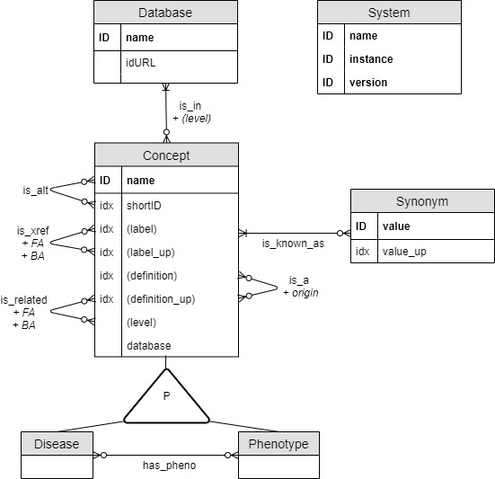
```

The data model underlying DODO aims to capture the relationship between disease and phenotypes as described across different databases (Figure \@ref(fig:dataModel)). *Disease* and *Phenotype* are two different kinds of *Concepts* sharing the same properties and they are related through a *has_pheno* relationship. *Concepts* are identified by name, the concatenation of the short identifier (*shortID*) and *database*. Additional properties of a *Concept* are (when available) a unique canonical *label*, disease *definition*, several *Synonyms*, and node *type*. Each *Concept* *is_in* one or multiple *Databases* with their URL encoded in the *idURL* property. Therefore, the *Database* *name* can differ from the *Concept* database as some ontologies re-use Concept names like EFO [@Malone2010]. If the concepts are hierarchically organized, the *level* captures the highest level a disease has in the ontological tree (the most general term being level 0). This information is encoded as a property of a *Concept* where it captures the *level* of the term in the original ontology. In addition, as *Concepts* can be re-used, the ontology-specific *level* is also encoded as a property of the *is_in* relationship. Hierarchical information is also encoded by identifying a parent *Concept* through an *is_a* relationship. The property *origin* is assigned to this edge and corresponds to the ontology from which the relationship is derived (this can be useful when Concept names are re-used). Former and alternative identifiers of a *Concept* are documented using *is_alt* relationship. 

Cross-references between *Concepts* are managed through two types of relationships depending of the confidence put on them (more detailed explanation below). The *is_xref* relationship is considered for more trusted relationships compared to *is_related* relationship. Each cross-reference (*is_xref* and *is_related*) between two *Concept* nodes is recorded as two edges, each in one direction. A *Concept* can have multiple cross-reference relationships to nodes of the same database. This ambiguity (one-to-many) is captured by the property *FA* (forward ambiguity) on a cross-reference edge and captures the number of cross-references to the same *Concept* database. The *BA* (backward ambiguity) property of the edge is defined symmetrically as the *FA* property of the edge going in the opposite direction. Both types of cross-reference edges and forward and backward ambiguities are used to define the relations used for transitivity mapping as explained below. 

### Feeding the database
 
A DODO instance is built on data from external resources that should be pre-processed to organize the information. This work was done for several public ontologies and the scripts can be found in the corresponding GitHub repositories (Table \@ref(tab:githubOntology)).

```{r githubOntology, include = TRUE, echo = FALSE}
do <- c("Monarch Disease Ontology (MonDO)", "Experimental Factor Ontology (EFO)", "Orphanet", "MedGen", "Medical Subject Headings (MeSH)", "Human Phenotype Ontology (HPO)", "ClinVar", "Disease Ontology (DO)", "International Classification of Diseases (ICD11)")
gh <- c("https://github.com/Elysheba/Monarch",
        "https://github.com/Elysheba/EFO",
        "https://github.com/Elysheba/Orphanet",
        "https://github.com/Elysheba/MedGen",
        "https://github.com/Elysheba/MeSH",
        "https://github.com/patzaw/HPO",
        "https://github.com/patzaw/ClinVar",
        "https://github.com/Elysheba/DO",
        "https://github.com/Elysheba/ICD11")
toShow <- tibble(`Disease ontology` = do,
                 GitHub = gh)
toShow %>%
  kable(caption = "Different disease ontologies included into DODO database and link to GitHub repository.",
        format = "latex", 
        booktabs = T) 
```

A R markdown document showing how to construct a new instance is provided alongside with a set of scripts to load and feed a Neo4j instance. These are not exported to avoid confusing the user when querying the database. The different steps to construct a new DODO Neo4j instance are briefly described below:

  1.	Structuring and harmonize the information derived from each ontology 
  2.	Combine the information obtained from the different ontologies and identify any duplicate or missing data
  3.	Start a new Neo4j instance and load data model
  4.	Information is imported into Neo4j by type. First, information around database nodes and concept nodes is imported. Next, information on the different relationships are loaded into the instance (cross-references, parent/child, alternative identifiers, phenotype mappings). For cross-reference identifiers, the type of edge is defined based on (see Extended Data) and subsequently imported into Neo4j. After import, the forward and backward ambiguity is calculated on each edge and assigned as property values to that edge. 

### Database instance availability

The DODO instance build using the workflow described above is provided as a Docker image [@Docker2019]: [https://hub.docker.com/repository/docker/elysheba/public-dodo](https://hub.docker.com/repository/docker/elysheba/public-dodo) (tag: 02.04.2020). This instance is build on information from the following disease ontologies listed in (Table \@ref(tab:githubOntology)).

DODO contains information on 54 different disease ontologies (Figure \@ref(fig:listDB)). There are 418,881 disease nodes and 18,354 phenotype nodes present in the database. 92,300 disease nodes have no recorded is_xref or is_related relationships across ontologies. The number of edges per relationship type is listed in Table \@ref(tab:nodeNb). 


```{r listDB, out.width="50%", out.height="30%", fig.cap="Overview of the number of nodes present for each disease ontology in DODO. 30 ontologies have less than 100 entries in DODO are summarized as 'other'.", include = TRUE, echo = FALSE}
list_database() %>%
  mutate(database = case_when(count < 100 ~ "Other",
                              TRUE ~ database)) %>%
  group_by(database) %>%
  summarise(count = sum(count)) %>%
  arrange(desc(count)) %>%
  mutate(database=factor(database, levels=database)) %>%   
  ggplot(aes(x = database, y = count)) +
  geom_point(color = "#66c2a5") +
  xlab(label = "Ontology") +
  ylab(label = "Number of nodes") +
  coord_flip() +
  theme_classic() +
  theme(text = element_text(size=12)) + 
  scale_y_log10()
```


```{r nodeNb, include = TRUE, echo = FALSE}
type <- c("is_xref", "is_related", "has_pheno", "is_a", "is_alt")
nb <- c("280,691 (bidirectionally implemented)",
        "225,021 (bidirectionally implemented)", 
        "363,589",
        "221,360",
        "5,057")
toShow <- tibble(Relation = type,
                 "Number of edges" = nb)
toShow %>%
  kable(caption = "The number of edges for each relationship type present in DODO graph database",
        format = "latex", 
        booktabs = T) 
```

<!-- In addition, a *setDisNet* S3 object is also available which build as a list of *disNet* objects. Figure \@ref{fig:disNet} shows an example disNet object for epilepsy. -->

<!-- ============================================================= -->
<!-- ============================================================= -->
## Operation

The database is implemented in Neo4j which uses the Cypher query language [@Neo4j2020]. A DODO R package was developed to interact with and provide higher level functions to query the Neo4j graph database based on the data model described above [@R2019].

The minimal system requirements are: 

- R $\geq$ 3.6
- Operating system: Linux, macOS, Windows
- Memory $\geq$ 4GB RAM


The graph database has been implemented with Neo4j 3.5.14 [@Neo4j2020] with the [apoc.path.expand](http://neo4j-contrib.github.io/neo4j-apoc-procedures/3.5/path-finding/path-expander/) procedure 3.5.0.11. The DODO R package uses the following packages:

- `r BiocStyle::CRANpkg("dplyr")` [@Wickham2019]
- `r BiocStyle::CRANpkg("tibble")` [@Muller2019]
- `r BiocStyle::CRANpkg("neo2R")` [@Godard2018]
- `r BiocStyle::CRANpkg("rlist")` [@Ren2016]
- `r BiocStyle::CRANpkg("stringr")` [@Wickham2019b]
- `r BiocStyle::CRANpkg("readr")` [@Wickham2018]
- `r BiocStyle::CRANpkg("visNetwork")` [@Almende2019]
- `r BiocStyle::CRANpkg("shinythemes")` [@Chang2018]
- `r BiocStyle::CRANpkg("DT")` [@Xie2019]
- `r BiocStyle::CRANpkg("igraph")` [@Csardi2006]
- `r BiocStyle::CRANpkg("shiny")` [@Chang2019]

### Querying the database

The DODO R package combines several functions to construct, interact, and explore the relationships between disease and phenotype identifiers. These can be divided in five different scopes (see Extended Data):

  -	**Disease network functions:** these functions allow the user to build a disease network based on their relationships in the graph database: cross-reference, hierarchical information, and phenotypes. These functions include ways to extend, filter, split or combine disease networks. The information on diseases and phenotypes and their relationships is structured as a S3 disease network (disNet) object. It captures all information (disease node information, hierarchical information, phenotype information, alternative identifiers, and cross-reference information) around a disease.
  -	**Visualization and exploration:** these functions allow the exploration and visualization of relationships between disease and phenotype identifiers by querying them or providing a disease network. 
  -	**Conversion:** this category of functions converts a list of disease and phenotype identifiers across ontologies or concepts based on the data model and provided parameters. Conversion can also include indirect relationships across ontologies using transitive mappings. 
  -	**Connection and low level interactions:** these functions are technical helpers for establishing and managing connection with a DODO graph database. These functions also return information on the content of the current database and allow to directly send cypher queries to the database. 
  -	**Data information:** these functions give access to content information such as the list of original databases, concept description and reference URL and allow ontology dump.

### Transitivity mapping

#### Ambiguity of cross-reference relationships

```{r dodobafa, echo = FALSE, include = TRUE, fig.cap="Example of transitivity mapping to infer an indirect relation with information on the ambiguity on the cross-reference edges.", , out.width='100%'}
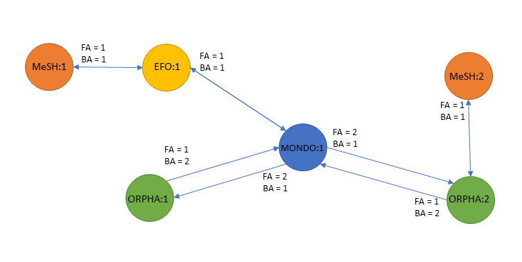
```

```{r exampleAmb, echo = FALSE, include = FALSE, eval = FALSE}
disNet <- build_disNet(id = "ORPHA:192")
disNet <- extend_disNet(disNet)

col <- DODO:::color_database(disNet = disNet)

disNet <- focus_disNet(disNet, diseaseID = "ORPHA:192", relationship = "xref", step = 2)

edges <- disNet$xref %>%
  dplyr::select(from, 
                to,
                type,
                FA = forwardAmbiguity,
                BA = backwardAmbiguity) %>%
  # filter(BA == 1 & FA == 1) %>%
  bind_rows(disNet$xref %>%
              filter(to == "ICD10:Q87.0") %>%
              select(from, 
                to,
                type,
                FA = forwardAmbiguity,
                BA = backwardAmbiguity)) %>%
  dplyr::mutate(color = dplyr::case_when(grepl("is_related", type) ~ "#fc8d62",
                                         TRUE ~ "#8da0cb"),
                title = paste(gsub("_nba", "", type), ", FA = ", FA, ", BA = ", BA),
                arrows = case_when(FA == 1 & BA == 1 ~ "to;from",
                                   BA == 1 ~ "to",
                                   FA == 1 ~ "from",
                                   TRUE ~ "FALSE")) %>%
  dplyr::distinct()
# edges <- disNet$children %>%
#   dplyr::select(from = parent, 
#                 to = child,
#                 origin) %>%
#   dplyr::mutate(title = paste("is_a, origin = ", origin),
#                 arrows = "to",
#                 color = "#66c2a5") %>%
#   dplyr::bind_rows(edges)

## Nodes
nodes <- tibble(id = disNet$nodes$id,
                database = disNet$nodes$database,
                label = disNet$nodes$label) %>%
  filter(id %in% c(edges$from, edges$to)) %>%
  distinct() %>%
  mutate(color = col[database],
         shape =  "dot",
         lbl = label,
         label = case_when(is.na(lbl) ~ id,
                      TRUE ~ paste(id, paste0(stringr::str_sub(lbl, start = 1, end = 21), "..."), 
                                   sep = "\n")),)

## Visnetwork
visNetwork::visNetwork(nodes = nodes,
                       edges = edges) %>%
  visOptions(highlightNearest = TRUE) %>%
  visLayout(randomSeed = 123) %>%
  visPhysics(solver = "barnesHut", barnesHut = list(avoidOverlap = 0.5))
  # visNetwork::visIgraphLayout(smooth = TRUE)
``` 

(ref:fig4) Subset of a disease network around Coffin-Lowry syndrome (ORPHA:192). The network shows equivalent cross-reference relations and ambiguous cross-reference relation to ICD10:Q87.0. This ICD10 disease identifier connects to 283 additional disease identifiers. The colors refer to different databases. *Is_xref* and *is_related* edges are indicated in blue and orange respectively. The arrows on the edge refer to the backward ambiguity: the identifier at the arrow destination has only one cross-reference in the database of the identifier at the arrow start. A double arrow indicates an unambiguous mapping between the 2 databases for the 2 identifiers in both directions. An edge should be considered transitive only in the direction of the arrow otherwise it can only be the final edge of a conversion path.
```{r ICD10q87, echo = FALSE, out.width="100%", include = TRUE, fig.cap="(ref:fig4)"}
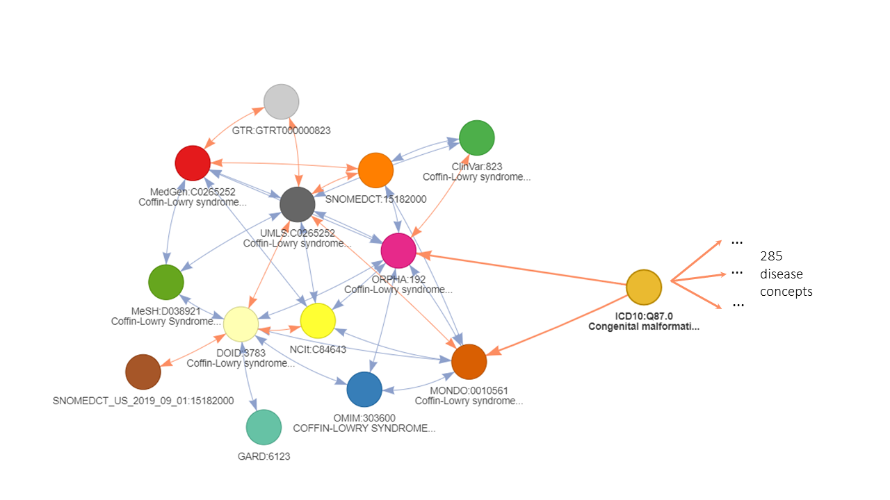
```

Disease identifiers within the different ontologies are annotated with cross-reference relationships to connect to independent biomedical databases. However, no ontology provides a complete mapping across all existing ontologies [@Hu2017; @Rappaport2013]. Efforts to create an integrated ontology such as [MonDO](https://mondo.monarchinitiative.org/) and [EFO](http://blog.opentargets.org/2019/12/19/efo3-a-community-driven-ontology-to-advance-clinical-discoveries/) are continuously expanding to enrich their mappings but are currently not exhaustive and will lack mappings to proprietary ontologies. Here we propose the use of transitive mappings to extend the cross-reference information and connect ontologies (and biomedical resources) that lack direct relationship(s). This is exemplified in Figure \@ref(fig:dodobafa), where transitivity mappings is needed to connect the initial MONDO identifier to a MeSH identifier using the indirect cross-reference relationship to the EFO and ORPHA node. 

Most mappings are unambiguous (one concept in an ontology is related to only one concept in another ontology); however, some concepts map to many similar concepts within the same ontology. This is conceptually visualized in Figure \@ref(fig:dodobafa) where the MONDO identifier maps to 2 ORPHA identifiers.

A real example is provided in Figure \@ref(fig:ICD10q87) with focus on the “Coffin-Lowry syndrome” (ORPHA: 192), a rare syndrome affecting brain and skeleton development. It relates to many disease identifiers, that often share similar disease definitions in an unambiguous or one-on-one manner. These relationships are valuable for transitive mapping as they extend the initial node to very similar nodes in other ontologies. However, the cross-reference relationship to ICD10 deals with a very broad term of “Congenital malformation syndromes predominantly affecting facial appearance” (ICD:Q87.0). This identifier is highly ambiguous as it has `r nrow(filter(convert_concept(from = "ICD10:Q87.0", from.concept = "Disease", to.concept = "Disease"), !to %in% c("ORPHA:192", "ICD10:Q87.0")))` additional direct cross-reference relationships to other disease identifiers. The use of this type of indirect relationships needs to be carefully considered. This ambiguity is a consequence of the inter-ontology differences in concept definitions and precision where some cross-reference edges connect identifiers that are not equivalent. Ontologies such as MonDO or EFO use a greater granularity in disease definitions than others like ICD10 or ICD9. If cross-reference edges are all considered equal without taking this distinction into account, it would be detrimental to the relevance of the conversion as it will return numerous more distantly related concepts when traversing these edges. Therefore, such relationships need to be avoided for transitive mappings. 

To prevent these inaccurate conversions, we propose the use of backward ambiguity filtering. First, the forward ambiguity of a cross-reference edge needs to be quantified and it is the number of relationships where a node maps to several similar concepts within the same ontology. The value of the forward ambiguity is shown for the example in Figure \@ref(fig:ICD10q87) on each cross-reference edge between the nodes. A forward ambiguity greater than one indicates that the original concept is likely more general than the concepts it maps to. By following the relationship in the other direction, this ambiguity value is considered as the backward ambiguity. Similarly, a backward ambiguity greater than one, indicates that the original concept is probably more precise than the concepts it is mapped to (Figure \@ref(fig:ICD10q87). Applied to our example, the filtering on ambiguity will prevent traversing through the ambiguous ICD10 when using the transitivity mechanisms and return only cross-reference identifiers close to the original node.

#### Defining subtypes of cross-reference edges


```{r, include = FALSE, echo= FALSE}
max_amb <- readr::read_csv(here("vignettes/ambiguity_between_ontologies.csv"))
oriAmb <- reshape2::acast(max_amb, formula = DB1 ~ DB2, value.var = "Max.")  %>%
  log10()

my_palette <- colorRampPalette(c("yellow", "darkgreen"))(n = 20)

jpeg(file = "fig/heatmap_ambiguity.jpg")
gplots::heatmap.2(x = oriAmb,
                  revC = T,
                  Rowv = TRUE,
                  Colv = TRUE,
                  trace = "none",
                  symbreaks = FALSE,
                  col = my_palette,
                  density.info = "none",
                  key.title = "Ambiguity",
                  key.xlab = "Ambiguity",
                  key.ylab = "Ambiguity")
dev.off()
```

(ref:fig5) The heatmap shows the maximum value of total ambiguity between ontologies using a $log_{10}$ transformation

```{r heatmapAmbiguity, echo = FALSE, out.width="80%", out.height="50%", include = TRUE, fig.cap="(ref:fig5)"}
# 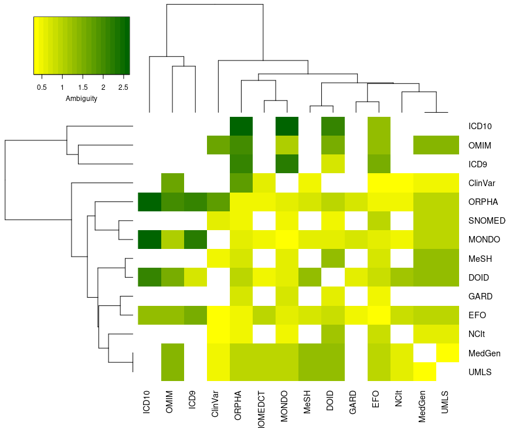
gplots::heatmap.2(x = oriAmb,
                  revC = T,
                  Rowv = TRUE,
                  Colv = TRUE,
                  trace = "none",
                  symbreaks = FALSE,
                  col = my_palette,
                  density.info = "none",
                  key.title = "Ambiguity",
                  key.xlab = "Ambiguity",
                  key.ylab = "Ambiguity")
```

```{r, include = FALSE, echo = FALSE}
load(here("tmp/All_benchmark_ambiguities.rda"))
monarch <- lapply(results_benchmark, function(x){x$Monarch})
names(monarch) <- 1:20
monarch <- plyr::compact(monarch)
lapply(monarch, function(x){x %>% dplyr::arrange(desc(n))})
toPlot <- lapply(monarch, function(x) x$n)

jpeg(file = "fig/boxplot_ambiguity_conversion_mondo.jpg")
boxplot(toPlot,
        log = "y",
        xlab = "Maximum ambiguity allowed to define is_xref",
        ylab = "Number of conversions for each identifier",
        main = "Ontology = Monarch" )
dev.off()
```

(ref:fig6) Number of conversions from each MONDO identifiers. This number depends on the cut-offs in the (total) ambiguity to define *is_xref* and *is_related* cross-reference edges on an ontology scale shown in x axis

```{r boxplotAmbiguity, out.width="50%",out.height="20%", include = TRUE, echo = FALSE, fig.cap="(ref:fig6)"}
# knitr::include_graphics("fig/Figure6.jpg")
boxplot(toPlot,
        log = "y",
        xlab = "Maximum ambiguity allowed to define is_xref",
        ylab = "Number of conversions for each identifier",
        main = "Ontology = Monarch" )
```


The filter on backward ambiguity improves greatly the accuracy of conversions. However, some inaccurate mappings may still be present due to higher general ambiguity between specific ontologies. The maximum total ambiguity of all relationships between two ontologies (the maximum value of the sum of forward and backward ambiguities of all cross-reference edges) quantifies the symmetry of their cross-reference relationships.  The heatmap in Figure \@ref(fig:heatmapAmbiguity) shows this value in a $log_{10}$ scale. While many ontologies are using concepts of similar level as identified by low maximum total ambiguity, a few can be identified that are more ambiguous in their mappings.  Therefore, the general trust assigned to cross-reference relationships between ontologies is captured by defining two types of cross-reference edges: (1) the *is_xref* edge is used for equal cross-reference relationships where the concepts relate more directly to each other (similar concept definitions); (2) the *is_related* edge is used for all other cross-reference edges.

To assign relations to either type, a threshold is applied on the maximum total ambiguity between two ontologies. Different thresholds between 2 and 20 have been explored taking 14 different ontologies into account. For each step the cross-reference relationships between ontologies with the maximum total ambiguity falling below the threshold are defined as *is_xref* and otherwise as *is_related*. Next, all the identifiers from an ontology are converted to identifiers from any other ontology by applying transitive mappings only on *is_xref* relationships with a backward ambiguity of 1 (step = NULL, intransitive_ambiguity = 1). Since the number of *is_xref* relationships increases with the threshold applied, the number of conversions achieved from each identifier increases as well (see Figure \@ref(fig:boxplotAmbiguity) for an example focused on the MONDO ontology).

When choosing a conservative and low threshold, the conversions may be more precise but will hamper the ability of the transitive mappings to identify the most relevant mappings. It may therefore not return all cross-reference identifiers whereas a too high threshold impacts strongly the number of converted nodes at the cost of some inaccurate conversions. Especially the effect of on a limited set of identifiers is strong with the return of many, more distantly related and less precise cross-reference identifiers as can be seen by looking at the tail of the boxplot shown on Figure \@ref(fig:boxplotAmbiguity). 

After having compared the results of the different ontologies, the threshold on the maximum total ambiguity value has been arbitrarily set to 4: cross-references between ontology with a maximum total ambiguity below 4 were considered as *is_xref* and others as *is_related* edges (see Extended Data). However, two exceptions are ICD9/ICD10 and OMIM/Orphanet. Both ICD9 and ICD10 use higher level disease definitions, and therefore, these will never be connected through an *is_xref* edge except between themselves. OMIM and Orphanet on the other hand, use very narrow subtypes of diseases or mention specific variants. This results in a higher ambiguity as a general disease may have many relations to subtypes but as these ontologies use a higher granularity their relationships are still encoded as an *is_xref* edge.

<!-- ============================================================= -->
<!-- ============================================================= -->
# Use cases

<!-- ##### -->
## Conversion of concept identifiers

```{r, include = FALSE, echo = FALSE}
disNet <- build_disNet(id = "MONDO:0005027")
sdisNet <- extend_disNet(disNet = disNet)
                        
edisNet <- extend_disNet(disNet = disNet,
                        transitive.ambiguity = 1,
                        intransitive.ambiguity = NULL,
                        relations = "xref")
# col <- DODO:::color_database(disNet = disNet)

conv1 <- convert_concept(from = "MONDO:0005027",
                         to = "EFO",
                         from.concept = "Disease",
                         to.concept = "Disease",
                         step = 1,
                         intransitive_ambiguity = 1)
conv2 <- convert_concept(from = "MONDO:0005027",
                         to = "ORPHA",
                         from.concept = "Disease",
                         to.concept = "Disease",
                         step = NULL,
                         intransitive_ambiguity = 1)
conv3 <- convert_concept(from = "MONDO:0005027",
                         to = "ORPHA",
                         from.concept = "Disease",
                         to.concept = "Disease",
                         step = NULL,
                         intransitive_ambiguity = NULL) 
conv3
## Edges
edges <- edisNet$xref %>%
  dplyr::select(from, 
                to,
                type,
                FA = forwardAmbiguity,
                BA = backwardAmbiguity) %>%
  dplyr::mutate(color = dplyr::case_when(grepl("is_related", type) ~ "#fc8d62",
                                         TRUE ~ "#8da0cb"),
                title = paste(gsub("_nba", "", type), ", FA = ", FA, ", BA = ", BA),
                arrows = case_when(FA == 1 & BA == 1 ~ "to;from",
                                   BA == 1 ~ "to",
                                   FA == 1 ~ "from",
                                   TRUE ~ "FALSE"))

## Nodes
nodes <- edisNet$nodes %>%
  dplyr::select(id,
                database,
                label) %>%
  dplyr::mutate(color = case_when(#id %in% sdisNet$nodes$id ~ "#fb9a99",
    id == "MONDO:0005027" ~ "#feb24c",
    id %in% conv3$to ~ "#33a02c",
    id %in% conv2$to ~ "#1f78b4",
    id %in% conv1$to ~ "#e31a1c",
    TRUE ~ "#969696"),
    shape = case_when(id %in% edisNet$seed ~ "triangle",
                      TRUE ~ "dot"),
    lbl = label,
    label = case_when(is.na(lbl) ~ id,
                      TRUE ~ paste(id, paste0(stringr::str_sub(lbl, start = 1, end = 21), "..."), sep = "\n")),
    title = paste(id, lbl, sep = " | "))


## Visnetwork
p <- visNetwork::visNetwork(nodes = nodes,
                       edges = edges) %>%
  visNetwork::visIgraphLayout(smooth = TRUE)
```

(ref:fig7) The network of identifiers around the MonDO identifier for 'Epilepsy' ('MONDO:0005027'). The seed node, MONDO:0005027, is depicted as a yellow triangle. Subsequently, the results of the different use cases are highlighted. The results of use case 1 (direct conversion) is indicated in red. The results of use case 2 (strict indirect conversion) and 3 (extended indirect conversion) to obtain corresponding Orphanet identifiers using transitivity are indicated in blue and green, respectively. *Is_xref* and *is_related* edges are indicated in blue and orange respectively. The arrows on the edge indicate the direction mapping can occur taking into account a backward ambiguity of one. Absence of arrow on an edge indicate these relations can only be exploited when no filtering is applied (generally final step of conversion).

```{r extension, include = TRUE, echo = FALSE, out.width="120%", fig.cap='(ref:fig7)'}
# 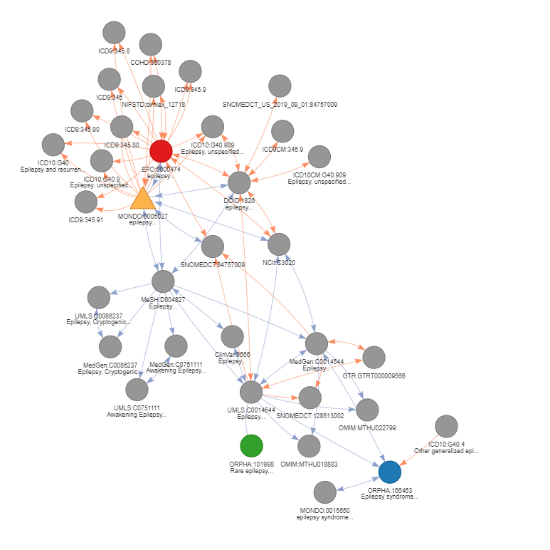
## Correct image!
p
```


One of the basic functionalities of DODO is the ability to convert disease and phenotype identifiers between ontologies. The conversion of identifiers is generally performed using a two-step process based on the type of cross-reference edge to traverse and ambiguity values to filter on. The first step uses transitivity on is_xref edges only to identify the high confidence identifiers mapped to the initial identifier of interest. This makes the core of cross-referenced identifiers. It is strongly recommended to limit the backward ambiguity in this transitive mapping to one (transitive_ambiguity = 1 (default)) to avoid unwilled conversion to less accurate concepts. Once the core of identifiers is established, the second step expands it by a single step using both types of cross-reference edges (is_xref and is_related) with specification on the backward ambiguity filtering (“intransitive_ambiguity” parameter). 

Six separate use cases can be identified for converting disease or phenotype identifiers to other ontologies or concepts:

  -	Direct conversion: only return the direct cross-references without any transitive mapping
  
  -	Strict indirect conversion: uses transitive mapping and applies a filter on the backward ambiguity of the last step to only return equivalent concepts. Can be used to convert between ontologies that use similar granularity to define concepts. 
  
  -	Extended indirect conversion (default): uses transitive mapping without any filter on the backward ambiguity of the last step to return both equivalent and more broader terms. This way of conversion returns ambiguous relations, but these relations are not used for transitive mapping steps. In general, when the aim is to reach a broader concept related to the original identifiers but not move through it, it is recommended to put no filter on the backward ambiguity filtering of the final step.
  
  -	Loosened indirect conversion: a specific conversion procedure is created for ontologies that are less connected through is_xref edges such as ontologies like WHO’s ICD10 or ICD9. These ontologies have highly ambiguous mappings and use very broad disease definitions. The absence of is_xref cross-reference relationships restrict the utility of the transitivity mechanism when applying the standard conversion. Therefore, we recommend an additional step to the standard conversion implemented in the get_related function.
  
  -	Conversion between concepts: convert between concepts types, i.e. from disease identifier to phenotype identifiers or vice versa.
  
  -	Return deprecated identifiers: return previous version (deprecated) identifiers
  
The use cases will be illustrated using the Mondo identifier for epilepsy (MONDO:0005027). The conversion between concept types (phenotype to disease or vice versa) is exemplified here for one identifier; however, the conversion procedure can take multiple identifiers at once as input. Finally, a comparison of the different conversion possibilities is performed using the entire MonDO ontology.

### Use case 1: Direct conversion

A first basic use case is conversion of the identifier of interest to direct cross-references (without any transitive mapping - parameter "step = 1"). As an example, MonDO identifier for epilepsy (MONDO:0005027) is mapped to its corresponding EFO identifier using *convert_concept* function. 

In this first use case, only the direct relations are used to return the corresponding EFO identifiers (highlighted in red on Figure \@ref(fig:extension). Using transitive mappings is also not required for this example, as there would be no additional EFO identifiers returned by moving through indirect relationships.

```{r, include = TRUE, echo = TRUE}
## Use case 1
conv <- convert_concept(from = "MONDO:0005027",
                         to = "EFO",
                         from.concept = "Disease",
                         to.concept = "Disease",
                         step = 1,
                         intransitive_ambiguity = 1)
conv
```

### Use case 2: Strict indirect conversion

A second use case deals with the conversion using equivalent indirect relations. The same seed MonDO identifier for epilepsy will be mapped to return the corresponding Orphanet ontology identifier. By specifying "step = NULL", transitive mappings will be used to convert the identifier(s). To return only equivalent concepts, thereby avoiding the mapping to less precise disease concepts, backward ambiguity filtering is applied on the final step of conversion ("intransitive_ambiguity = 1"). This can be a good practice when converting between ontologies that define concept with similar granularity. As there is no direct mapping provided by the resources between MonDO and Orphanet, transitive mapping provided by DODO needs to be applied. This conversion of the seed identifier MONDO:0005027 returns one corresponding Orphanet identifier (ORPHA:166463) as shown in Figure \@ref(fig:extension) (blue node).

```{r, include = TRUE, echo = TRUE}
## Use case 2
conv <- convert_concept(from = "MONDO:0005027",
                         to = "ORPHA",
                         from.concept = "Disease",
                         to.concept = "Disease",
                         step = NULL,
                         intransitive_ambiguity = 1)
conv
```

### Use case 3: Extended indirect conversion (default)

In some instances, you may want to define a list of disease identifiers more largely related to a disease of interest. The third use case addresses this by extending the transitivity mapping with no filtering on the final step of conversion ("intransitive_ambiguity = NULL" and "step = NULL"). The conversion of the seed identifier MONDO:0005027 to Orphanet with this setup, returns an additional Orphanet identifier (ORPHA:101993) indicated in green on Figure \@ref(fig:extension). The initial transitive mapping steps apply filtering with ambiguity equal to one via the is_xref edges (blue). The final mapping step is intransitive and will therefore return all nodes related through either an *is_related* or *is_xref* edge with no filtering on backward ambiguity. It does return ambiguous relations at the last step, but these relations are not used for transitive mapping steps. This conversion can be used to get all identifiers around a disease concept both equivalent and more broader terms or when converting from a narrower concept to a broader concept. In general, when the aim is to reach a broader concept related to the original identifiers but not move through it, it is recommended to put no filter on the "intransitive_ambiguity". 

```{r, include = TRUE, echo = TRUE}
## Use case 3
conv <- convert_concept(from = "MONDO:0005027",
                        to = "ORPHA",
                        from.concept = "Disease",
                        to.concept = "Disease",
                        step = NULL,
                        intransitive_ambiguity = NULL) 
conv
```


### Use case 4: Loosened indirect conversion

The fourth use case deals with the specific conversion procedure that is recommended for the ontologies which are less connected through *is_xref* edges to the “core” ontologies in DODO (e.g. MonDO, EFO, MedGen, etc.) such as ontologies like WHO’s ICD10 or ICD9. These ontologies have highly ambiguous mappings and use very broad disease definitions. When starting the mapping from such ambiguous identifiers, the convert_concept function will not return cross-reference relationships to most other databases. It is restricted by the rules defined by transitivity mechanism. Therefore, we recommend an additional step to the standard conversion implemented in the get_related function. It performs an additional expansion step through *is_related* and *is_xref* edges before the standard conversion procedure. The ambiguity on this additional step is the same for the final step in the standard conversion procedure (use case 2 – strict indirect conversion - modified by the intransitive_ambiguity parameter equal to NULL). To illustrate the difference, we will show the conversion of the general ICD10 identifier for Epilepsy (ICD10:G40.9) to corresponding identifiers in DO. When using the standard *convert_concept* function, it is not possible to convert the ICD10 identifier to any DO identifier. As ICD10 is only related to other nodes via *is_related* edges, transitive relationships cannot be used to identify cross-references using the standard conversion. Using the *get_related* function, recommended for ontologies such as ICD10, does convert ICD10:G40.9 to corresponding DO identifiers through transitive relations and returns DOID:1826 (Epilepsy). 

```{r, include = TRUE, echo = TRUE}
## Use case 4
## convert_concept()
conversion <- convert_concept(from = "ICD10:G40.9",
                              to = "DOID", 
                              from.concept = "Disease",
                              to.concept = "Disease")
conversion

## get_related()
related <- get_related(from = "ICD10:G40.9",
                       to = "DOID", 
                       from.concept = "Disease",
                       to.concept = "Disease")
related
```

```{r, include = TRUE, echo = FALSE}
conversion <- convert_concept(from = "ICD10:G40.9",
                              # to = "DOID",
                              from.concept = "Disease",
                              to.concept = "Disease")
related <- get_related(from = "ICD10:G40.9",
                        from.concept = "Disease",
                        to.concept = "Disease")
conv <- get_related(from = "ICD10:G40.9",
                    to = "DOID",
                    from.concept = "Disease",
                    to.concept = "Disease")
disNet <- build_disNet(id = c(related$from, related$to))
## Edges
edges <- disNet$xref %>%
  dplyr::select(from, 
                to,
                type,
                FA = forwardAmbiguity,
                BA = backwardAmbiguity) %>%
  dplyr::mutate(color = dplyr::case_when(grepl("is_related", type) ~ "#fc8d62",
                                         TRUE ~ "#8da0cb"),
                title = paste(gsub("_nba", "", type), ", FA = ", FA, ", BA = ", BA),
                arrows = case_when(FA == 1 & BA == 1 ~ "to;from",
                                   BA == 1 ~ "to",
                                   FA == 1 ~ "from",
                                   TRUE ~ "FALSE"))

## Nodes
nodes <- tibble(id = unique(c(related$from, related$to))) %>%
  distinct() %>%
  mutate(database = gsub(":.*", "", id),
         color = case_when(id %in% unique(c(conversion$to, conversion$from)) ~ "#99d594",
                           id %in% conv$to ~ "#fc8d59",
                           TRUE ~ "#969696"),
         shape = case_when(id %in% related$from ~ "triangle",
                           TRUE ~ "dot"),
         lbl = disNet$nodes$label[match(id, disNet$nodes$id)],
         label = case_when(is.na(lbl) ~ id,
                      TRUE ~ paste(id, paste0(stringr::str_sub(lbl, start = 1, end = 21), "..."), 
                                   sep = "\n")))
## Visnetwork
p <- visNetwork::visNetwork(nodes = nodes,
                       edges = edges) %>%
  visNetwork::visIgraphLayout(smooth = TRUE)
```

(ref:fig8) The entire network of disease identifiers around the ICD10 identifier for 'Epilepsy' (ICD10:G40.9 – green triangle). *Is_xref* and *is_related* edges are indicated in blue and orange respectively. The arrows on the edge indicate the direction mapping can occur taking into account the BA = 1 rule. Absence of arrow on an edge indicate these relations can only be exploited when no filtering is applied. Using the *get_related* functionality adds an additional step of conversion before applying the standard conversion procedure. The nodes indicated in green are those that would be returned using the standard *convert_concept* function. The grey nodes are those reachable by *get_related* function that relaxes the initial step of transitivity mappings through *is_related* edges. The retrieval of corresponding DO identifiers for ICD10:G40.9 returns DOID:1826 (indicated in orange).

```{r getRelated, include = TRUE, out.width="120%", echo = FALSE, fig.cap="(ref:fig8)"}
p
# 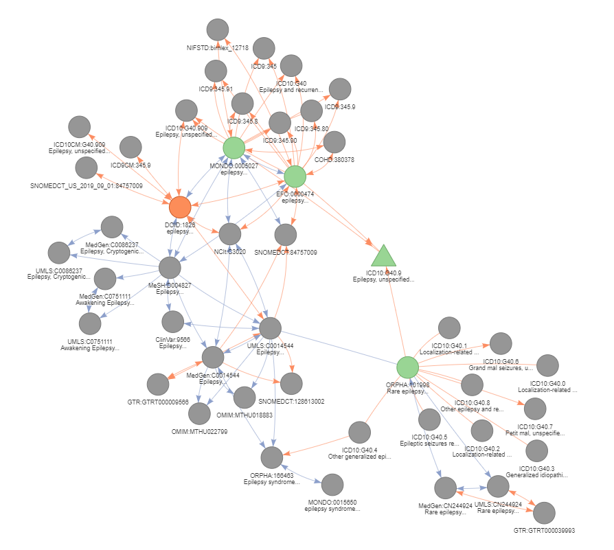
```

The underlying reason for this behavior and difference between the two functions is depicted in Figure \@ref(fig:getRelated). As there are no relationships from the ICD10 seed node that meet the criteria defined for transitive mapping (*intranstivity_ambiguity* = 1 and cross-reference relationships of *is_xref* type), the seed node cannot be mapped to the DO node of interest using the *convert_concept* function. The *get_related* function relaxes these transitive mapping criteria in the first step and allow to reach the directly related nodes connected by either type of relationships and with no constraint on backward ambiguity (green round circles in Figure \@ref(fig:getRelated)). After this initial step, transitivity rules are applied to map the direct cross-reference identifiers to the identifier in DO (orange node in Figure \@ref(fig:getRelated)).

Currently, the default conversion procedure refers to the third use case (extended indirect conversion) when transitivity mappings are used to extend through cross-reference relationships and no filtering is applied to the final step of extension through the network (default parameters: step = NULL, intransitive_ambiguity = 1). This conversion can be used to get all identifiers around a disease concept and it is the approach to use when converting from a narrower concept to a broader concept. Additional filtering can then subsequently be put in place to allow adaptation for specific use cases. However, for the first step using transitivity mapping on *is_xref* edges it is strongly recommended to use the default filtering on ambiguity by limiting (backward) ambiguity to one.

### Use case 5: conversion between concepts

Conversion can also be used to convert between concepts types, i.e. from disease identifier to phenotype identifiers or vice versa. This conversion is achieved by the same convert_concept function that will leverage *has_pheno* relationships. Practically, it is handled in two phases. The first phase uses the transitivity mechanism as detailed above to connect disease identifiers to phenotype identifiers even when no direct *has_pheno* relation is available. This initial step takes the same options as listed above to convert identifiers within the same concept (this step can be avoided by using parameter "step = NA"). The second phase converts identifiers between concepts by returning phenotype or disease nodes related to the original identifiers (including the converted identifiers obtained in the first phase) with the possibility to return direct and/or indirect relations with the parameter "step".

```{r, include = TRUE, echo = TRUE}
## From disease to phenotype
toPhenotype <- convert_concept(from = "MONDO:0012391",
                               to = "HP",
                               from.concept = "Disease",
                               to.concept = "Phenotype") 
toPhenotype <- toPhenotype %>%
  mutate(diseaseLabel = describe_concept(from)$label,
         phenotypeLabel = describe_concept(to)$label)
toPhenotype

## From phenotype to disease
toDisease <- convert_concept(from = "HP:0002384",
                               from.concept = "Phenotype",
                               to.concept = "Disease") 
toDisease <- toDisease %>%
  mutate(phenotypeLabel = describe_concept(from)$label,
         diseaseLabel = describe_concept(to)$label)
toDisease
```

### Use case 6: return deprecated identifiers

Finally, conversion can also be used to return previous version (deprecated) identifiers when these are available.


```{r, include = TRUE, echo = TRUE}
deprecated <- convert_concept(from = "HP:0009638",
                               deprecated = TRUE,
                               from.concept = "Phenotype",
                               to.concept = "Phenotype") 
deprecated
```

## Efficiency of conversion strategies

```{r, include = FALSE, echo = FALSE}
mondo <- get_ontology("MONDO")

## option 1
conv1 <- convert_concept(from = mondo$nodes$id,
                         to = "DO",
                         from.concept = "Disease",
                         to.concept = "Disease",
                         step = 1)
summary(conv1 %>% count(from) %>% pull(n))
a <- conv1 %>%
  add_count(from) %>%
  filter(n > 1)
length(unique(a$from))
length(unique(conv1$from))
length(unique(conv1$to))

conv2 <- convert_concept(from = mondo$nodes$id,
                         to = "DO",
                         from.concept = "Disease",
                         to.concept = "Disease",
                         step = NULL, 
                         intransitive_ambiguity = 1)
summary(conv2 %>% count(from) %>% pull(n))
a <- conv2 %>%
  add_count(from) %>%
  filter(n > 1)
length(unique(a$from))
length(unique(conv2$from))
length(unique(conv2$to))


conv3 <- convert_concept(from = mondo$nodes$id,
                         to = "DO",
                         from.concept = "Disease",
                         to.concept = "Disease",
                         step = NULL, 
                         intransitive_ambiguity = NULL)
summary(conv3 %>% count(from) %>% pull(n))
a <- conv3 %>%
  add_count(from) %>%
  filter(n > 1)
length(unique(a$from))
length(unique(conv3$from))
length(unique(conv3$to))


##########################################
a <- build_disNet("MONDO:0019587")
a <- extend_disNet(a)
b <- focus_disNet(a, diseaseID = "MONDO:0019587", steps = 1)
col <- DODO:::color_database(disNet = a)

edges <- b$xref %>%
    dplyr::select(from, 
                  to,
                  type,
                  FA = forwardAmbiguity,
                  BA = backwardAmbiguity) %>%
    dplyr::mutate(color = dplyr::case_when(grepl("is_related", type) ~ "#fc8d62",
                                           TRUE ~ "#8da0cb"),
                  title = paste(gsub("_nba", "", type), ", FA = ", FA, ", BA = ", BA),
                  arrows = case_when(FA == 1 & BA == 1 ~ "to;from",
                                     BA == 1 ~ "to",
                                     FA == 1 ~ "from",
                                     TRUE ~ "FALSE"))
  
## Nodes
nodes <- tibble(id = b$nodes$id,
                database = b$nodes$database,
                label = b$nodes$label) %>%
  distinct() %>%
  mutate(color = col[database],
         shape = case_when(id %in% b$seed ~ "triangle",
                          TRUE ~ "dot"),         
         lbl = label,
         label = case_when(is.na(lbl) ~ id,
                      TRUE ~ paste(id, paste0(stringr::str_sub(lbl, start = 1, end = 40), "..."), 
                                   sep = "\n")))
## Visnetwork
p <- visNetwork::visNetwork(nodes = nodes,
                       edges = edges) %>%
  visNetwork::visIgraphLayout(smooth = TRUE)
```

```{r effConversion, include = TRUE, out.width="100%", echo = FALSE, fig.cap="Direct cross-reference of MonDO identifier for 'autosomal dominant non-syndromic deafness' (MONDO:0019587)"}
# visNetwork::visNetwork(nodes = nodes,
#                        edges = edges) %>%
#   visNetwork::visIgraphLayout(smooth = TRUE) %>% 
#    visPhysics(solver = "forceAtlas2Based",
#                forceAtlas2Based = list(gravitationalConstant = -3000, avoidOverlap = 1,
#                                        springlength = 100))
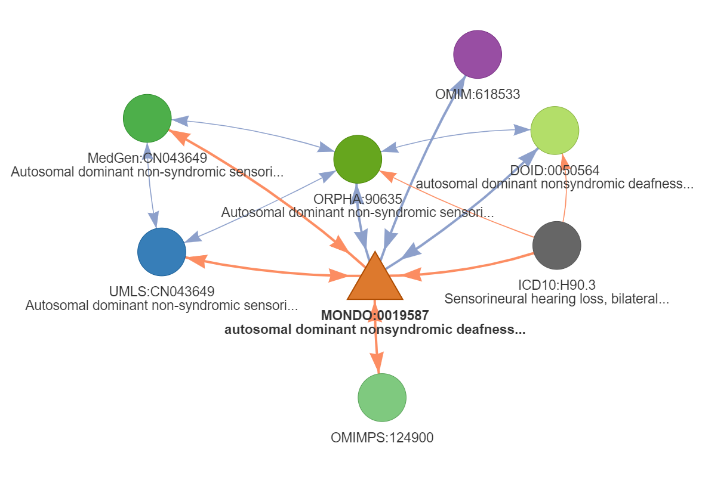
```

(ref:c1) #MonDO identifiers$^1$
(ref:c2) #Target ontology identifiers$^2$
(ref:c3) Distribution of equivalent mapping$^3$
(ref:c4) #MonDO with ambiguous conversion$^4$

```{r benchmark, include = TRUE, out.width = "100%", warning=FALSE, echo = FALSE, message=FALSE}
# Comparison of different conversion strategies using the MonDO ontology
toShow <- readxl::read_xlsx(here("inst/documentation/DODO-F1000-publication/data/benchmark_summary.xlsx"), 
                            sheet = "Sheet2") 
  # filter(! Type %in% c("MeSH", "DO"))
# toShow <- toShow %>%
#   slice(-2, -6, -7, -11)

toShow$...1[c(1,4,7)] <- paste0("Direct conversion", 
                                      footnote_marker_number(5))
toShow$...1[c(2,5,8)] <- paste0("Indirect strict conversion", 
                                      footnote_marker_number(6))
toShow$...1[c(3,6,9)] <- paste0("Indirect extended conversion", 
                                      footnote_marker_number(7))
# LaTeX Table
kable(toShow, 
      col.names = c(" ", " ", " ", "Median", "Mean", "Max", ""),
      format = "latex", 
      booktabs = T,
      escape = FALSE,
      caption = "Comparison of different conversion strategies using the MonDO ontology") %>%
   kable_styling(latex_options = c("striped", "scale_down")) %>%
   add_header_above(c(" ", "(ref:c1)", "(ref:c2)", "(ref:c3)" = 3, "(ref:c4)")) %>%
   pack_rows("EFO", 1, 3) %>%
   pack_rows("MeSH", 4, 6) %>%
   pack_rows("DO", 7, 9) %>%
   add_footnote(c("Number of unique MonDO identifiers with a conversion",
                  "Number of unique converted identifiers in the targeted ontology",
                  "Distribution of the number of conversions returned per MonDO identifier.",
                  "Number of MonDO identifiers with ambiguous conversions",
                  "Conversion as performed by use case 1: direct conversion (see above), the parameter is step = 1", 
                  "Conversion as performed by use case 2: strict indirect conversion (see above), the parameters are step = NULL and intransitive_ambiguity = 1", 
                  "Conversion as performed by use case 3: extended indirect conversion (see above), the parameters are step = NULL and intransitive_ambiguity = NULL)"),
                notation="number") 
``` 


The different use cases were applied to only one identifier to show in more detail the conversion procedure. However, the conversion procedure is designed to take multiple identifiers as input. Here, the first three different approaches outlined in the previous section are applied to convert all 21,653 identifiers in the MonDO ontology to their corresponding identifiers in EFO, MesH, and DO. The mapping outcomes are summarized in Table \@ref(tab:benchmark).

```{r, echo  = TRUE, eval = FALSE}
mondo <- get_ontology("MONDO")

## option 1
conv1 <- convert_concept(from = mondo$nodes$id,
                         to = "EFO",
                         from.concept = "Disease",
                         to.concept = "Disease",
                         step = 1)
summary(conv1 %>% count(from) %>% pull(n))

conv2 <- convert_concept(from = mondo$nodes$id,
                         to = "EFO",
                         from.concept = "Disease",
                         to.concept = "Disease",
                         step = NULL, 
                         intransitive_ambiguity = 1)
summary(conv2 %>% count(from) %>% pull(n))


conv3 <- convert_concept(from = mondo$nodes$id,
                         to = "EFO",
                         from.concept = "Disease",
                         to.concept = "Disease",
                         step = NULL, 
                         intransitive_ambiguity = NULL)
summary(conv3 %>% count(from) %>% pull(n))
```


Except for Disease Ontology (DO) (which is included by MonDO while constructing their ontology based on semantic similarity), the majority of MonDO identifiers cannot be converted to EFO or MeSH identifiers. However, compared to direct mapping of encoded relationships (use case 1 – direct conversion), the use of transitive mapping allows the conversion of 20% additional MonDO identifiers (use case 2 – strict indirect conversion). Enabling the extension to broader disease concepts (use case 3 – extended indirect conversion), still increases, by design and as expected, the number of mappings between two ontologies.


In parallel, the average ambiguity in mappings also increases with the different use cases (Table \@ref(tab:benchmark) - column 3). While it varies strongly across the different ontologies, the ambiguity is mostly minor for most identifiers (based on median and mean). Still, a limited set of mappings is strongly affected by ambiguity with as many as 294 corresponding DO identifiers and 91 corresponding MeSH identifiers for “autosomal dominant non-syndromic deafness” (MONDO:0019587). This identifier could not be mapped to EFO. Looking into this identifier in more detail shows that it only has six direct cross-references among which one DO identifier (DOID:0050564) (Figure \@ref(fig:effConversion)). However, these direct cross-reference identifiers themselves report a multitude of cross-reference identifiers encoding various subtypes of the condition. As mentioned before, the mappings are derived directly from the original resources. The observed ambiguity after transitive mapping highlights disease areas that are heterogeneously defined across ontologies. This ambiguity is naturally more prevalent for those indications with a lot of reported subtypes reported in different ontology and/or the ontology using a higher level of granularity used to define diseases. 

<!-- ##### -->
## Build and explore a network of diseases

### Building a disease network

While conversion facilitates connecting biomedical resources directly, another possibility provided by DODO is the exploration of diseases and their relationships as a disease network. Contrary to conversion, a network retains all relationships as they are encoded in the DODO graph database. In this use case, we will show how to construct such a disease network and which functionalities are available to interact with a network.

```{r, include = TRUE, echo = TRUE}
disNet <- build_disNet(term = "amyotrophic lateral sclerosis", 
                       fields = c("label", "synonym"))
disNet
```

<!-- ##### -->
### Extension through different relationships 

After the construction of a disease network, it is likely that it doesn't contain the complete information on that particular disease of interest. The *extend_disNet* function enriches the *disNet* and extends it to cross-reference identifiers, child/parent terms, annotated phenotypes/disease, and/or alternative identifiers when available. In concordance with the conversion procedure, extension follows the same two-step approach using transitive mapping on is_xref edges followed by a final one-step extension on any cross-reference relationship taking filtering on backward ambiguity into account. To perform this extension the same parameters can be supplied with similar aims as for the conversion procedure (see above). 

```{r, include = TRUE, echo = TRUE}
disNet <- build_disNet(term = "amyotrophic lateral sclerosis",
                       fields = c("label", "synonym"))
extendedDisNet <- extend_disNet(disNet,
                                relations = c("xref", "child"),
                                intransitive.ambiguity = 1)
extendedDisNet
```


```{r, include = FALSE, echo = FALSE}
##############################@
## Compare disNet and extension
## Edges
edges <- extendedDisNet$xref %>%
  dplyr::select(from, 
                to,
                type,
                FA = forwardAmbiguity,
                BA = backwardAmbiguity) %>%
  dplyr::mutate(color = dplyr::case_when(grepl("is_related", type) ~ "#fc8d62",
                                         TRUE ~ "#8da0cb"),
                title = paste(gsub("_nba", "", type), ", FA = ", FA, ", BA = ", BA),
                arrows = case_when(FA == 1 & BA == 1 ~ "to;from",
                                   BA == 1 ~ "to",
                                   FA == 1 ~ "from",
                                   TRUE ~ "FALSE"))

## Nodes
nodes <- tibble(id = extendedDisNet$nodes$id,
                database = extendedDisNet$nodes$database) %>%
  distinct() %>%
  mutate(color = case_when(id %in% disNet$nodes$id ~ "#99d594",
                           TRUE ~ "#fc8d59"),
         shape =  "dot",
         label = id)

## Visnetwork
p <- visNetwork::visNetwork(nodes = nodes,
                       edges = edges) %>%
  visNetwork::visIgraphLayout(smooth = TRUE)
```

(ref:fig10) The disNet build on the term 'amyotrophic lateral sclerosis' querying both labels and synonyms provided in DODO (green nodes). This disNet is subsequently extended to return all cross-reference identifiers and child terms using the *extend_disNet* function (orange nodes) (parameters relations = c('xref', 'child') and intransitive_ambiguity = 1 to return only equivalent identifiers)

```{r alsplotdisNet, include = TRUE, out.width = "110%", echo = FALSE, fig.cap="(ref:fig10)"}
# 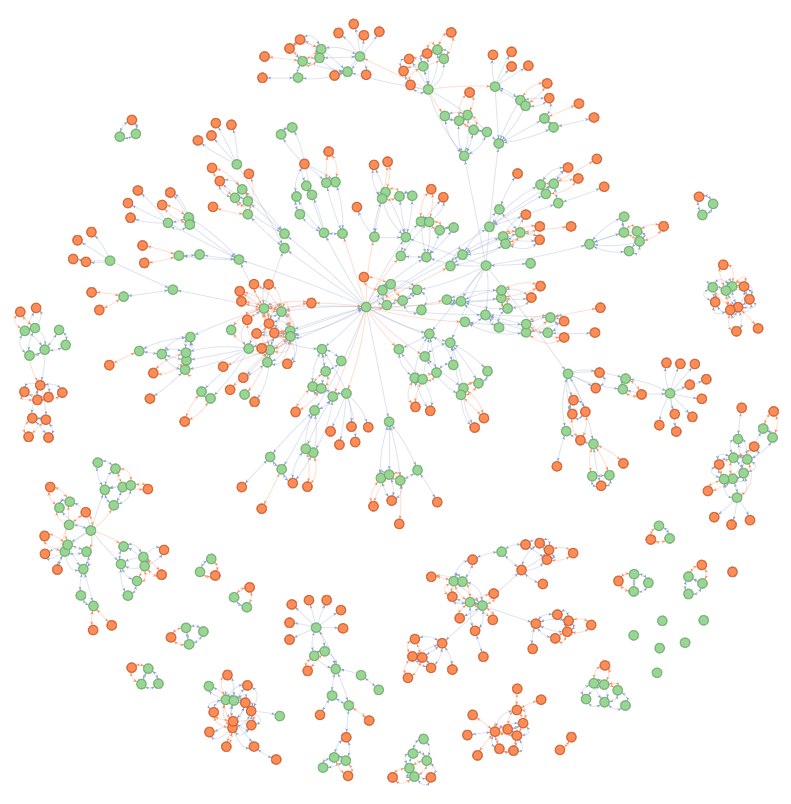
p
```

The disease network gathers 488 disease concepts across 25 ontologies; only 251 where identified directly matching the search term (Figure \@ref(fig:alsplotdisNet)). The additional terms were obtained through extension of both cross-references and parent/child relationships. 
Of specific note is the extension to (or from) phenotype information. Within one extension all different parameters (xref, child, parent, alt, and disease/phenotype) can be supplied with the exception that it is not possible to extend to both disease and phenotype simultaneously. In contrast with the conversion procedure, it does not use the transitivity mechanisms but rather takes all the diseases within the network and returns any associated phenotypes that can be obtained through the has_pheno relationship. 

```{r, include = TRUE, echo = TRUE}
disNet <- build_disNet(id = c("HP:0003394", "HP:0002180", "HP:0002878"))
disNet <- extend_disNet(disNet = disNet, relations = "disease")
disNet
```

### Explore a network of diseases

(ref:fig11) Plot of a small disease network constructed around 'Amyotrophic lateral sclerosis' (MONDO:0004976). The colors refer to different databases. *Is_xref* and *is_related* edges are indicated in blue and orange respectively. The arrows on the edge refer to the backward ambiguity and show how an edge can be traversed. When no arrow is present, it can only be reached through the final step of conversion when no filtering is present.

```{r plotexample, include = TRUE, plotly = TRUE, warnings = FALSE, message = FALSE, out.width="100%", echo = FALSE, fig.cap="(ref:fig11)"}
disNet <- build_disNet(id = "MONDO:0004976")
disNet <- extend_disNet(disNet, step = 1)
plot(disNet)
# 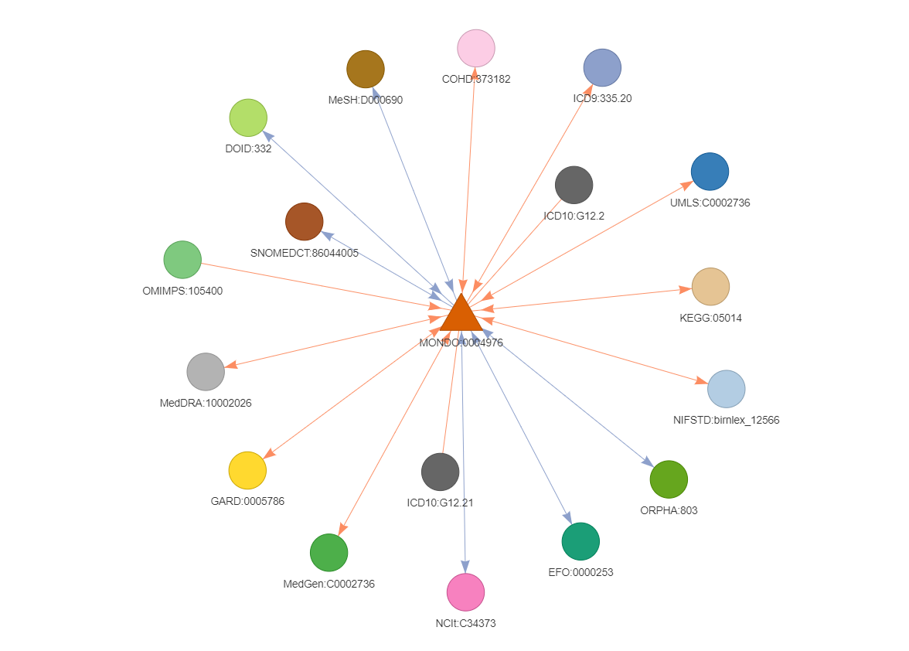
```

DODO is built as a meta-database incorporating several disease ontologies and their listed relationships. As disease concepts and definitions are not a natural process but rather an artificial, human-biased effort, concepts might not always be clearly defined or related to each other in a straightforward manner. The different ontologies employ heterogeneous definitions, cross-reference axes are not always exact, and errors present in the original ontologies will impact DODO as well. The *explore_disNet* on a single *disNet* object returns a data table presenting information on the different identifiers present in the network.  The plot function displays as a network how diseases are related to each other across the different ontologies (Figure \@ref(fig:plotexample)).

```{r, include = FALSE, echo = TRUE, eval = FALSE}
disNet <- build_disNet(id = "MONDO:0004976")
disNet <- extend_disNet(disNet, step = 1)
# plot(disNet)
```

It may be required to review the returned network of diseases after building and/or extending it to assess whether all nodes are relevant or of interest. This process can be simplified by considering clusters of cross-references (nodes dealing with similar concepts) using the *cluster_disNet* functionality. 

```{r, include = TRUE, echo = TRUE}
disNet <- build_disNet(term = "amyotrophic lateral sclerosis", 
                       fields = c("label", "synonym"))
clDisNet <- cluster_disNet(disNet = disNet,
                          clusterOn = "xref")
clDisNet


explore_disNet(clDisNet)
```

```{r cldisNet, echo = FALSE, include = TRUE}
## Explore clusters
counter <- 1
toShow <- do.call(rbind,
                  lapply(clDisNet,
                         function(x){
                           toRet <- x$nodes %>%
                             dplyr::arrange(level, label) %>%
                             dplyr::mutate(clusterSize = length(id),
                                           level = as.character(level)) %>%
                             dplyr::slice(1) %>%
                             dplyr::mutate(label,
                                           cluster = counter,
                                           level = case_when(is.na(level) ~ "",
                                                             TRUE ~ level)) %>%
                             dplyr::select(cluster, clusterSize, id, label) 
                           counter <<- counter + 1
                           return(toRet)
                         })
)
kable(toShow,
      row.names = FALSE, 
      caption = "Annotation of the different cross-reference clusters of nodes identified for a disNet around 'amyotrophic lateral sclerosis'. ",
        format = "latex", 
        booktabs = T)   %>%
  kable_styling(latex_options = c("striped", "scale_down"))
```


Instead of reviewing each node, the different cross-reference clusters can be reviewed to identify those of interest while using the relationships between nodes to handle equivalent nodes simultaneously without the need to review them separately. A summary of the clusters can be visualized using the explore_disNet function and the output is shown in Table \@ref(tab:cldisNet). For a list of disease networks created after clustering the *explore_disNet* functionality summarizes information on the different clusters, provides information on the size of each cluster and presents a tag identifier information. This tag identifier is identified as the node with the highest level in the ontology and a label available. If multiple identifiers have the same level, the tag one is picked on alphabetical order of the label. Summarizing disease networks using cluster of cross-reference edges also allows the revision of identifiers that have no label information attached.


<!-- ##### -->
## Connecting to external resources


```{r, include = FALSE, echo = TRUE}
disNet <- build_disNet(term = "amyotrophic lateral sclerosis", 
                       fields = c("label", "synonym"))
extendedDisNet <- extend_disNet(disNet,
                                relations = c("xref", "child"),
                                intransitive.ambiguity = 1)
```

```{r, include = FALSE, echo = FALSE, message = FALSE, warning=FALSE}
# if(!rerun){
#   load(here("inst/documentation/DODO-F1000-publication/data/als_disNet_to_externalResources.rda"))
#   load(here("inst/documentation/DODO-F1000-publication/data/als_direct_chembl_clinvar_results.rda"))
# }else{
  ## Obtain all drugs for psoriasis using CHEMBL version 25

## Load resources
## CHEMBL 25
## Clinvar 27/03/2020
ClinVar_rcvaVariant <- read_tsv(
  here("inst/documentation/DODO-F1000-publication/data/clinvar_2020-03-27/ClinVar_rcvaVariant.txt"))
ClinVar_variants <- read_tsv(
  here("inst/documentation/DODO-F1000-publication/data/clinvar_2020-03-27/ClinVar_variants.txt"))
ClinVar_varEntrez <- read_tsv(
  here("inst/documentation/DODO-F1000-publication/data/clinvar_2020-03-27/ClinVar_varEntrez.txt"))
ClinVar_rcvaTraits <- read_tsv(
  here("inst/documentation/DODO-F1000-publication/data/clinvar_2020-03-27/ClinVar_rcvaTraits.txt"))
ClinVar_traitNames <- read_tsv(
  here("inst/documentation/DODO-F1000-publication/data/clinvar_2020-03-27/ClinVar_traitNames.txt"))
CHEMBL_drug_indication <- read_tsv(
  here("inst/documentation/DODO-F1000-publication/data/chembl_25/CHEMBL_drug_indication.txt"))
clinvarVariants <- ClinVar_rcvaVariant %>%
    inner_join(ClinVar_variants,
               by = c("varId" = "id")) %>%
    inner_join(ClinVar_varEntrez,
               by = c("varId")) %>%
    select(varId,
           rcvaId,
           variantType = type.x,
           entrez)

#############################@
## disNet
chembl_disnet <- CHEMBL_drug_indication %>%
  mutate(dbid = paste(DB, id, sep = ":")) %>%
  filter(dbid %in% extendedDisNet$nodes$id)
## Number of identified compounds
length(unique(chembl_disnet$molregno))

clinvar_disnet <- ClinVar_rcvaTraits %>%
  mutate(dbid = paste("ClinVar", t.id, sep = ":")) %>%
  filter(dbid %in% extendedDisNet$nodes$id) %>%
  inner_join(clinvarVariants,
             by = c("rcvaId"))
## Number of identified genes carrying a disease variant
length(unique(clinvar_disnet$entrez))

##########################@
## Query resource directly
## CHEMBL
chembl_als <- CHEMBL_drug_indication %>%
  filter(grepl("amyotrophic lateral sclerosis", name, ignore.case = T)) %>%
  mutate(dbid = paste(DB, id, sep = ":"))
## Number of identified compounds
length(unique(chembl_als$molregno))
## Compounds identified through use of disNet or CHEMBl directly
table(unique(chembl_disnet$molregno) %in% unique(chembl_als$molregno))

## ClinVar
clinvar_als <- ClinVar_traitNames %>%
  filter(grepl("amyotrophic lateral sclerosis", name, ignore.case = TRUE)) %>%
  inner_join(ClinVar_rcvaTraits,
             by = "t.id") %>%
  inner_join(clinvarVariants,
             by = "rcvaId") %>%
  mutate(dbid = paste("ClinVar", t.id, sep = ":"))
## Number of identified genes carrying a disease variant
length(unique(clinvar_als$entrez))
## Genes identified through use of disNet or ClinVar directly
table(unique(clinvar_als$entrez) %in% unique(clinvar_disnet$entrez))

  # save(chembl_als, clinvar_als,
  #      file = here("inst/documentation/DODO-F1000-publication/data/02042020_als_direct_chembl_clinvar_results.rda"))
# }
```


```{r chemblDisNetind, include = TRUE, echo = FALSE}
toShow <- chembl_disnet %>% 
  select(dbid, name, molregno) %>%
  distinct() %>%
  group_by(dbid) %>%
  count(dbid) %>%
  distinct()

kable(toShow,
      col.names = c("Disease identifier", "Number of compounds"),
      row.names = FALSE,
      caption = "Using the disNet to connect to CHEMBL results identifies compounds available for different disease identifiers listed here.") 
    # kable_styling(latex_options = c("striped", "scale_down"))

```

```{r, include = TRUE, echo = FALSE}
toShow <- build_disNet(id = unique(chembl_disnet$dbid))
col <- DODO:::color_database(disNet = toShow)
## Edges
edges <- toShow$xref %>%
  dplyr::select(from, 
                to,
                type,
                FA = forwardAmbiguity,
                BA = backwardAmbiguity) %>%
  dplyr::mutate(color = dplyr::case_when(grepl("is_related", type) ~ "#fc8d62",
                                         TRUE ~ "#8da0cb"),
                title = paste(gsub("_nba", "", type), ", FA = ", FA, ", BA = ", BA),
                arrows = case_when(FA == 1 & BA == 1 ~ "to;from",
                                   BA == 1 ~ "to",
                                   FA == 1 ~ "from",
                                   TRUE ~ "FALSE"))
edges <- toShow$children %>%
  dplyr::select(from = parent, 
                to = child,
                origin) %>%
  dplyr::mutate(title = paste("is_a, origin = ", origin),
                arrows = "to",
                color = "#66c2a5") %>%
  dplyr::bind_rows(edges)

## Nodes
nodes <- tibble(id = toShow$nodes$id,
                database = toShow$nodes$database,
                label = toShow$nodes$label) %>%
  distinct() %>%
  mutate(color = col[database],
         shape =  "dot",
         lbl = label,
         label = case_when(is.na(lbl) ~ id,
                      TRUE ~ paste(id, paste0(stringr::str_sub(lbl, 
                                                               start = 1, 
                                                               end = 21), "..."), 
                                   sep = "\n")),)

## Visnetwork
p <- visNetwork::visNetwork(nodes = nodes,
                       edges = edges) %>%
  visNetwork::visIgraphLayout(smooth = TRUE) %>%
  visHierarchicalLayout(nodeSpacing = 200)
```

(ref:fig12) The figure shows the relations between the different diseases with compounds available in CHEMBL resource. The term 'ORPHA:98756' was identified as a child term of 'EFO:0001356' through extension using *is_a* edge (green edges). Cross-reference edges are indicated in blue. The arrows on edges refer to the direction an edge can be traversed.

```{r disnetALSchembl, include = TRUE, echo = FALSE, out.width="100%", fig.cap="(ref:fig12)"}
# 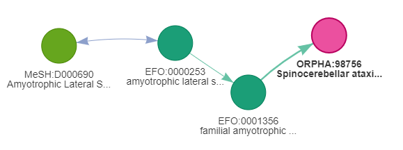
p
```

```{r, include = FALSE, echo = FALSE}
clDisNet <- cluster_disNet(disNet = extendedDisNet,
                           clusterOn = "xref")
explore_disNet(clDisNet)
clDisNet <- clDisNet[c(1:2, 4:6, 8:9, 13:20, 22, 24:28)]
fedisNet <- merge_disNet(list = clDisNet)

## ClinVar
clinvar_disnet <- ClinVar_rcvaTraits %>%
  mutate(dbid = paste("ClinVar", t.id, sep = ":")) %>%
  filter(dbid %in% fedisNet$nodes$id) %>%
  inner_join(clinvarVariants,
             by = c("rcvaId"))
## Number of identified genes carrying a disease variant
length(unique(clinvar_disnet$entrez))
table(unique(clinvar_als$entrez) %in% unique(clinvar_disnet$entrez))

## CHEMBL
chembl_disnet <- CHEMBL_drug_indication %>%
  mutate(dbid = paste(DB, id, sep = ":")) %>%
  filter(dbid %in% fedisNet$nodes$id)
## Number of identified compounds
length(unique(chembl_disnet$molregno))
## Compounds identified through use of disNet or CHEMBl directly
table(unique(chembl_disnet$molregno) %in% unique(chembl_als$molregno))
```

(ref:fig13) The identifier 'ClinVar:18286' ('Inclusion body myopathy with early-onset Paget disease with or without frontotemporal dementia 2') connects to 'ORPHA:52430' through the use of transitivity on cross-reference edges (label: 'Inclusion body myopathy with Paget disease of bone and frontotemporal dementia' synonym: 'Pagetoid amyotrophic lateral sclerosis'). The color of the nodes refers to the ontology, the *is_xref* edges are indicated in blue and *is_related* edges indicated in orange. The arrows on the edge refer to the backward ambiguity and show how an edge can be traversed. When no arrow is present, it can only be reached through the final step of conversion when no filtering is present.

```{r disnetALSclinvar, include = TRUE, echo = FALSE, out.width="70%", fig.cap="(ref:fig13)"}
toPlot <- focus_disNet(extendedDisNet,
                  diseaseID = "ClinVar:18286",
                  relationship = "xref",
                  step = 2)

edges <- toPlot$xref %>%
  dplyr::select(from, 
                to,
                type,
                FA = forwardAmbiguity,
                BA = backwardAmbiguity) %>%
  dplyr::mutate(color = dplyr::case_when(grepl("is_related", type) ~ "#fc8d62",
                                         TRUE ~ "#8da0cb"),
                title = paste(gsub("_nba", "", type), ", FA = ", FA, ", BA = ", BA),
                arrows = case_when(FA == 1 & BA == 1 ~ "to;from",
                                   BA == 1 ~ "to",
                                   FA == 1 ~ "from",
                                   TRUE ~ "FALSE"))
edges <- toPlot$children %>%
  dplyr::select(from = parent, 
                to = child,
                origin) %>%
  dplyr::mutate(title = paste("is_a, origin = ", origin),
                arrows = "to",
                color = "#66c2a5") %>%
  dplyr::bind_rows(edges)

## Nodes
nodes <- tibble(id = toPlot$nodes$id,
                database = toPlot$nodes$database,
                label = toPlot$nodes$label) %>%
  distinct() %>%
  mutate(color = col[database],
         shape =  case_when(id == "ORPHA:52430" ~ "triangle",
                            TRUE ~ "dot"),
         lbl = label,
         label = case_when(is.na(lbl) ~ id,
                      TRUE ~ paste(id, paste0(stringr::str_sub(lbl, 
                                                               start = 1, 
                                                               end = 21), "..."), 
                                   sep = "\n")),)

# ## Visnetwork
# visNetwork::visNetwork(nodes = nodes,
#                        edges = edges) %>%
#   visNetwork::visIgraphLayout(smooth = TRUE) %>%
#   visPhysics(solver = "barnesHut",barnesHut = list(avoidOverlap = 1, 
#                                                    centralGravity = 0.1,
#                                                    gravitationalConstant = -55000))

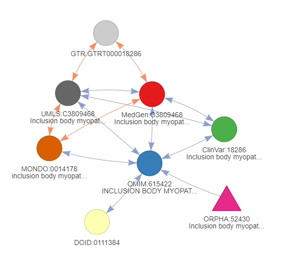
```

The aim of DODO is to facilitate the connection with external resources. As described above, DODO allows the creation of a structured disease network around diseases of interest and their relationships and information. The use of this disease network facilitates the connection and exploration of different biomedical knowledge resources as it also allows tracing their connections more easily.

It is exemplified below by connecting two different external resources: ClinVar (release 2020-03) and CHEMBL (release 25) using “amyotrophic lateral sclerosis” (ALS) as an example [@Landrum2018; @Mendez2019]. We start by building a disease network around the term "amyotrophic lateral sclerosis" and extending through both cross-reference and parent/child relationships as described in the previous section. 
For comparison, CHEMBL and ClinVar are queried directly using the same search term. Each of these resources uses a different ontology as reference. CHEMBL uses both EFO and MeSH to annotate compounds to indication. ClinVar uses a variety of ontologies to connect variants and diseases, such as SNOMEDCT, MedGen, Orphanet or OMIM. 

Through the use a disease network, 96 unique compounds were identified in CHEMBL for ALS connected to four different disease identifiers (Table \@ref(tab:chemblDisNetind)). The same set of compounds is identified by querying the resource directly, demonstrating the performance of DODO to properly map those different ontologies. One associated disease is missing in CHEMBL, namely the identifier “ORPHA:98756”. This term was identified as a child term of 'EFO:0001356' with the extension of the *disNet* using DODO and providing more granularity (Figure \@ref(fig:disnetALSchembl)). The disease can not be identified using a free-text query in CHEMBL directly as it’s labelled ‘Spinocerebellar ataxia type 2’. However, while different resources such as Monarch Initiative and EFO report ALS as a parent term, it is unclear whether this can be considered as ALS disease. OMIM does report a genetic overlap between spinocerebellar ataxia and amyotrophic lateral sclerosis type 13. The information integrated in the DODO graph database is based on the original information provided by ontologies such as EFO and MonDO without any additional curation. Errors in disease definitions and provided mappings will inherently be present in these ontologies and will therefore persist within DODO as well. While it was not within the initial scope of DODO, it may help to assess and identify underlying issues present in the ontologies.


```{r, echo = TRUE, include = FALSE, eval = FALSE}
disNet <- build_disNet(term = "amyotrophic lateral sclerosis",
                       fields = c("label", "synonym"))
extendedDisNet <- extend_disNet(disNet,
                                relations = c("xref", "child"),
                                intransitive.ambiguity = 1)
```

For the ClinVar resource associating gene variants to diseases, all 105 unique Entrez gene variants returned querying ClinVar directly for "amyotrophic lateral sclerosis" are also identified using a network of diseases as a query start. However, an additional variant was reported for "Inclusion body myopathy with early-onset Paget disease with or without frontotemporal dementia 2" (ClinVar:18286). This identifier was found by extending through cross-references edges using transitivity mapping starting from "ORPHA:52430" (“Inclusion body myopathy with Paget disease of bone and frontotemporal dementia” and “Pagetoid amyotrophic lateral sclerosis” as a synonym (Figure \@ref(fig:disnetALSclinvar))). This disease identifier is not an actual ALS disease but rather another neurodegenerative disorder related to frontotemporal dementia. This example highlights the necessity of reviewing the queried disease not only when using a network of diseases, but the same need remains when querying resources directly. Using DODO, it is possible to use underlying disease relationships to cluster diseases and identify groups of identifiers with similar or related concepts (Table \@ref(tab:cldisNet)) Particular clusters that are outside of the scope can be dropped and a more precise network of diseases returned to connect to external knowledgebases. The reviewed network of diseases no longer includes identifiers outside of the scope and identifies the same set of 105 unique Entrez gene identifiers compared to querying the ClinVar resource directly.  For CHEMBL, the results remain the same. The ability to apply use and review easily disease networks should facilitate the integration of biomedical resources. 

```{r, include = TRUE, echo = TRUE}
##########################@
## reviewing disNet
clDisNet <- cluster_disNet(disNet = extendedDisNet,
                           clusterOn = "xref")
explore_disNet(clDisNet)
clDisNet <- clDisNet[c(1:2, 4:6, 8:9, 13:20, 22, 24:28)]
fedisNet <- merge_disNet(list = clDisNet)
```


## Tracing connections

```{r, include = TRUE, echo = FALSE}
comp_disNet <- build_disNet(id = c(unique(clinvar_disnet$dbid),
                                      unique(chembl_disnet$dbid)),
                            ambiguity = NULL)
comp_disNet <- extend_disNet(comp_disNet,
                            step = 1,
                            relations = "xref")
nodes <- comp_disNet$nodes %>%
  mutate(title = paste(id, label, sep = "|"),
         color = case_when(id %in% clinvar_disnet$dbid ~ "#67a9cf",
                           id %in% chembl_disnet$dbid ~ "#ef8a62",
                           TRUE ~ "#999999"),
         label = case_when(color == "#67a9cf" ~ "ClinVar",
                           color == "#ef8a62" ~ "ChEMBL",
                           TRUE ~ ""))
## Edges
edges <- comp_disNet$xref %>%
    dplyr::select(from, 
                  to,
                  type,
                  FA = forwardAmbiguity,
                  BA = backwardAmbiguity) %>%
    dplyr::mutate(color = dplyr::case_when(grepl("is_related", type) ~ "#fc8d62",
                                           TRUE ~ "#8da0cb"),
                  title = paste(gsub("_nba", "", type), ", FA = ", FA, ", BA = ", BA),
                  arrows = case_when(FA == 1 & BA == 1 ~ "to;from",
                                     BA == 1 ~ "to",
                                     FA == 1 ~ "from",
                                     TRUE ~ "FALSE"))

p <- visNetwork::visNetwork(nodes = nodes,
                       edges = edges) %>%
  visNetwork::visOptions(highlightNearest = list(enabled = TRUE, hover = TRUE),
                         collapse = list(enabled = TRUE)) %>%
  visNetwork::visIgraphLayout()
```

(ref:fig14) The figure shows the extended network of ALS constructed in DODO. The colour of the nodes refers to the disease identifiers that are also identified through a direct query in CHEMBL (orange) and ClinVar (blue). The edges between the nodes capture the *is_xref* and *is_related* relationship in blue and orange respectively.

```{r traceConn, include = TRUE, echo = FALSE, out.width = "120%", fig.cap = "(ref:fig14)"}
p
# 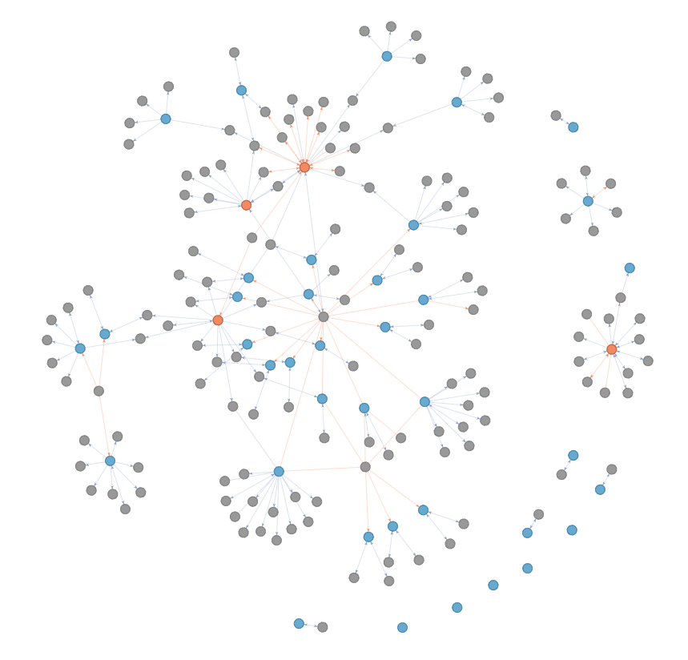
```

Understanding the relation between disease identifiers obtained when querying a resource directly through a search term is not a trivial thing. The question remains whether these identifiers are dealing with the same disease concepts. An additional feature from connecting resources using a network of diseases, is the possibility to identify if and how diseases returned from each resource are connected to each other. This does not only allow a better understanding of disease, but also facilitates downstream analyses. Figure \@ref(fig:traceConn) shows the original ALS extended and reviewed network with disease identifiers matching in CHEMBL (orange) and those matching in ClinVar (blue). As both resources use different ontologies as references, there is a necessity to use cross-reference to understand their relationship to each other. Indirect relationships are used and recorded when extending and can facilitate the understanding and integration of different biological resources.

# Conclusions

Disease ontologies have allowed a more formal classification of diseases. They facilitate the integration of biological databases thereby increasing disease information usage and supporting the development of novel treatments. However, efforts to integrate biological databases or the ontologies directly are complicated by ontology-specific identifiers, heterogeneous decisions on disease definitions, and the inherent presence of errors. Despite ongoing integration efforts, we identified two remaining challenges that prevent seamless integration of different databases based on disease ontologies:

-	Currently no resource provides a flexible and complete mapping across the multitude of disease ontologies
-	There is no software available to comprehensively explore and interact with disease ontologies

DODO aims to tackle these two challenges by constructing a meta-database containing information on disease identifiers and their relationships across different ontologies. Through well-defined and controlled transitivity mechanisms, the combined information across resources can be used dynamically to identify indirect cross-references. The R package contains several functions to build and interact with disease networks or convert concept identifiers between ontologies. The workflow to construct a custom, local DODO database is provided with the intent to allow adaptation. A docker image with the presented ontologies is provided for convenience.

DODO helps clarifying and defining conditions of interest in addition to help in the understanding of relationships between disease concepts. It improves accessibility of disease ontologies for a standard user. In addition, connecting different biomedical knowledge resources through a disease network facilitates the integration of all this information. It also ensures these resources are queried transparently using equivalent identifiers of the disease of interest. In addition, it also allows visualizing the connection between these resources directly. 

Through the aggregation of different ontologies and their mappings, DODO facilitates the generation of exhaustive descriptions of disease landscapes. The code to build and query DODO is provided under open source license to allow further improvement by other developers.

# Extended data

This archive contains the extended data. This includes two sheet within the "ExtendedData.xlsx" file:
https://doi.org/10.5281/zenodo.3922210

**Table1:** List of all functions available in DODO R package with description and scope details.
**Table2:** List of ontologies among which the cross-reference relations are encoded as is_xref

Data are available under the terms of the Creative Commons Zero "No rights reserved" data waiver (CC0 1.0 Public domain dedication).

# Software availability
The source code for parsing disease ontologies are available at:

-	[https://github.com/Elysheba/Monarch](https://github.com/Elysheba/Monarch)
-	[https://github.com/Elysheba/EFO](https://github.com/Elysheba/EFO)
-	[https://github.com/Elysheba/Orphanet](https://github.com/Elysheba/Orphanet)
-	[https://github.com/Elysheba/MedGen](https://github.com/Elysheba/MedGen)
-	[https://github.com/Elysheba/MeSH](https://github.com/Elysheba/MeSH)
-	[https://github.com/patzaw/HPO](https://github.com/patzaw/HPO)
-	[https://github.com/patzaw/ClinVar](https://github.com/patzaw/ClinVar)
-	[https://github.com/Elysheba/DO](https://github.com/Elysheba/DO)
-	[https://github.com/Elysheba/ICD11](https://github.com/Elysheba/ICD11)

The source code for DODO is available at: [https://github.com/Elysheba/DODO](https://github.com/Elysheba/DODO)

A docker image of the DODO Neo4j instance is available at: [https://hub.docker.com/repository/docker/elysheba/dodo](https://hub.docker.com/repository/docker/elysheba/dodo) (tag:02.04.2020) Software is available to use under a GPL-3 license.

Archived source code as at time of publication:

https://doi.org/10.5281/zenodo.3922143 [@Francois2020]

Archived database docker image as at time of publication:

http://doi.org/10.5281/zenodo.3921874 [@Francois2020b]

Software is available to use under a GPL-3 license

# Competing interests

L.F., J.v.E., and P.G. are employees of UCB Pharma. J.v.E. and P.G. own stocks and/or shares from UCB Pharma. The authors declare no other competing interests.

# Grant information

This work was entirely supported by UCB Pharma. The authors declared that no grants were involved in supporting this work.

<!-- # Supplementary tables -->

```{r functions, include = FALSE, echo = FALSE}
ftie <- c("build_disNet", 
          "extend_disNet", 
          "filter_by_id", 
          "filter_by_database", 
          "focus_disNet", 
          "cluster_disNet", 
          "setdiff_disNet", 
          "split_disNet", 
          "explore_disNet",
          "show_relations", 
          "plot.disNet", 
          "convert_concept",
          "get_related",
          "check_dodo_connection", 
          "connect_to_dodo", 
          "forget_dodo_connection",
          "list_dodo_connections",
          "call_dodo", 
          "show_dodo_model", 
          "get_version", 
          "get_concept_url", 
          "list_database", 
          "list_node_type", 
          "get_ontology", 
          "describe_concept")
descr <- c("Building a network of disease identifiers",
           "Extending a disNet by different edges",
           "Filtering a disNet by id",
           "Filtering a disNet by database", 
           "Focus on identifiers of interest and its neighbors",
           "Clustering a disNet, generates a setDisNet",
           "Substract one disNet from another",
           "Split a disNet based on a list of identifiers into a setDisNet",
           "Visualizes a datatable to explore a disNet",
           "Visualizes cross-reference relationships for the provided identifier",
           "Visualizes a disNet using visNetwork",
           "Convert the provided set of identifiers to another ontology or between concepts",
           "Convert function for ontologies separated by *is_related* edges mainly",
           "Check connection with DODO graphical database",
           "Establish connection with DODO graphical database",
           "Forget a saved connection to DODO",
           "List all saved connections to DODO",
           "Calls a function on the DODO graphical database",
           "Return DODO data model",
           "Return DODO database version", 
           "Returns concept url", 
           "Lists databases in DODO", 
           "Lists node type in DODO", 
           "Returns whole ontology", 
           "Returns concept description")
scope <- c(rep("Disease network functions", 8),
           rep("Visualization and exploration", 3),
           rep("Conversion", 2),
           rep("Connection and low-level interactions", 9),
           rep("Data information", 3))
toShow <- tibble(Function = ftie,
                 Description = descr,
                 scope = scope)
toShow %>%
  kable(caption = "List of all functions available in DODO R package with description and scope details.",
        format = "latex", booktabs = T) %>%
  kable_styling(latex_options = c("striped", "scale_down"))
```

<!-- (ref:tab) List of ontologies among which the cross-reference relations are encoded as is_xref -->
```{r, include = FALSE, echo = FALSE, message = FALSE, warning=FALSE}
toShow <- readxl::read_xlsx(here("inst/documentation/CrossreferencesEdges.xlsx"), sheet = "Max_ambiguity_4_across_DBs") 
toShow %>%
  kable(caption = "(ref:tab)",
        format = "latex", booktabs = T) 
  # kable_styling(latex_options = c("striped", "scale_down"))
```

<!-- # ```{r disNetObject, echo = FALSE, out.width="75%", include = TRUE} -->
<!-- # column = c("id", "database", "shortID", "label", "definition", "level", "type", -->
<!-- #            "id", "synonym", -->
<!-- #            "parent", "child", "origin", -->
<!-- #            "from", "to", "ur", "forwardAmbiguity", "backwardAmbiguity", "type", -->
<!-- #            "id", "alt", -->
<!-- #            "disease", "phenotype", -->
<!-- #            "seed") -->
<!-- # content = c("disease ids (database:shortID)", -->
<!-- #             "disease databases", -->
<!-- #             "disease short identifiers", -->
<!-- #             "disease labels", -->
<!-- #             "disease descriptions", -->
<!-- #             "maximum level the identifier holds in the hierarchical ontology tree", -->
<!-- #             "type of node (disease or phenotype)", -->
<!-- #             "disease ids", -->
<!-- #             "disease synonyms", -->
<!-- #             "parent disease ids", -->
<!-- #             "child disease ids", -->
<!-- #             "ontology of origin where the parent/child relationship is recorded", -->
<!-- #             "disease 1 ids", -->
<!-- #             "disease 2 ids", -->
<!-- #             "unique cross-reference identifier", -->
<!-- #             "number of cross-references between disease 1 and database 2", -->
<!-- #             "number of cross-references between disease 2 and database 1", -->
<!-- #             "type of cross-reference edge (is_xref or is_related)", -->
<!-- #             "current identifier", -->
<!-- #             "deprecated identifier", -->
<!-- #             "disease identifier", -->
<!-- #             "phenotype identifier", -->
<!-- #             "vector of disease ids used to seed the disNet") -->
<!-- # s3 <- tibble(Part = column, -->
<!-- #              Content = content) -->
<!-- #  -->
<!-- # kable(s3, "latex", caption = "The center object used through the DODO R package is the disease network or disNet S3 object. It captures all information (disease node information, hierarchical information, phenotype information, and cross-reference informatino) around a disease.", booktabs = T) %>% -->
<!-- #   # kable_styling(latex_options = c("striped", "scale_down")) %>% -->
<!-- #   pack_rows("nodes", 1,7) %>% -->
<!-- #   pack_rows("synonyms", 8, 9) %>% -->
<!-- #   pack_rows("children", 10, 12) %>% -->
<!-- #   pack_rows("xref", 13, 18) %>% -->
<!-- #   pack_rows("alt", 19, 20) %>% -->
<!-- #   pack_rows("pheno", 21, 22) %>% -->
<!-- #   pack_rows("seed", 23, 23) -->
<!-- # ``` -->

# References
