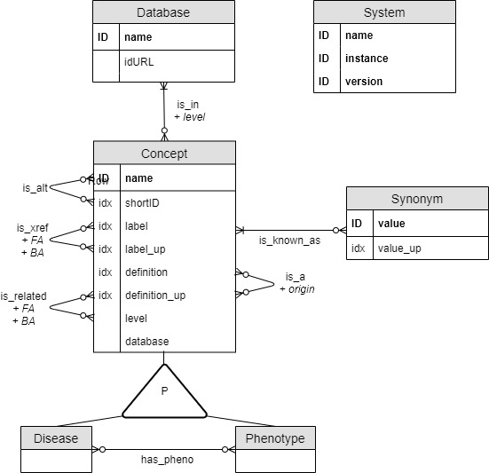
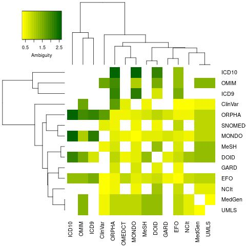
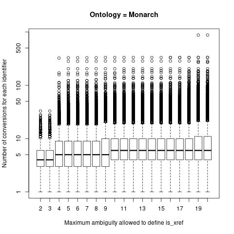
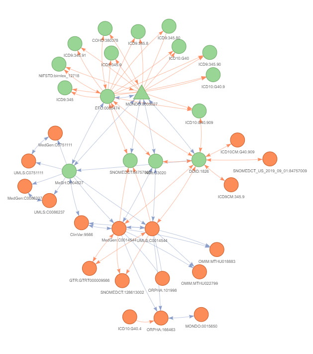
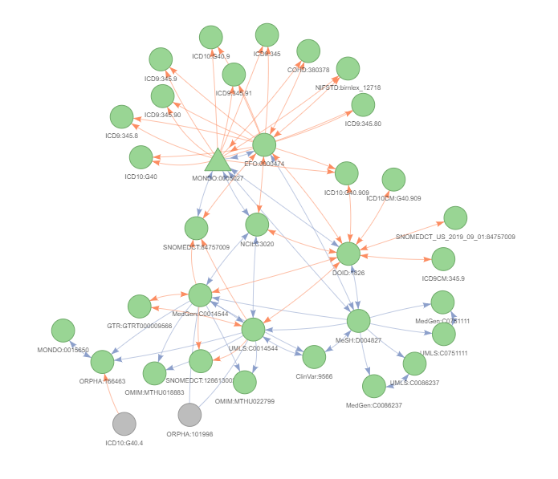

**R version**: `r R.version.string`

**Bioconductor version**: `r BiocManager::version()`

**Package**: `r packageVersion("DODO")`


```{r setup, include = FALSE, warning=FALSE, echo=FALSE}
# knitr::opts_chunk$set(
#   collapse = TRUE,
#   comment = "#>"
# )
library(DODO)
connect_to_dodo(url = "http://localhost:7476")
library(BED)
library(TKCat)
library(here)
library(dplyr)
library(knitr)
options(kableExtra.latex.load_packages = FALSE)
library(kableExtra)
library(ggplot2)
tkcon <- chTKCat()

## Rerun calculations
rerun <- FALSE
```

<!-- ============================================================= -->
<!-- ============================================================= -->
<!-- Introduction -->
# Introduction

Disease ontologies have been developed to meet the need to structure, classify, and describe diseases [@Gruber1993; @Haendel2018; @Hoehndorf2013]. As a result of the diversity in their usage a multitude of disease ontologies exist,  aiming to facilitate the integration with drug information, transcriptomics and genomics information, etc. as well as to support development of novel treatments [@Haendel2018; @Hoehndorf2013; @Rappaport2013]. Disease ontologies allow a more formal description of diseases; however, each ontology often defines an independent identifier and will only link to a subset of independent biological databases [@Hasnain2014; @Hoehndorf2013; @Kibbe2015; @Livingston2015; @Malone2010; @Rappaport2013]. While this stimulated the construction of integrated biological knowledgebases, the use of independent, ontology-specific identifiers, heterogeneous decisions on disease definitions, and the inherent presence of errors complicates integrating disease ontologies [@Livingston2015; @Rappaport2013]. In addition, the navigation of these large integrated knowledgebases with often an inheritely complicated data model, is difficult for most, non-expert users [@Hasnain2014; @Hu2017; @Livingston2015]. 

Several efforts have been made to connect the different disease ontologies themselves by generating of a single new integrative ontology [@Mungall2017; @Shefchek2019; @Rappaport2013]. Using semantic similarity the Monarch Disease Ontology (MonDO) aggregates different sources including OMIM, Orphanet, NCiT, GARD, DO, and MF [@Mungall2017; @Shefchek2019]. Other examples is the Disease Ontology (DO) resource which aims to standardize disease descriptions and classification from a clinical perspective using equivalence mappings [@Cheng2013; @Schriml2015; @Yu2015]. The Experimental Factor Ontology (EFO) also establishes an unified ontology (not limited to diseases)  by re-using several reference ontologies that lie within its scope. It subsequently enriches these classes with additional axioms when needed [@Malone2010]. Currently, it combines information from OMIM, Orphanet, ICD9/10 and SNOMEDCT, HPO, UBERON, and MonDO [@EFO2019].

Despite ongoing efforts, two issues remain to use disease ontologies efficiently: the issue of completeness and ease of access. To this end, the Dictionary of Disease Ontologies (DODO) was developed. The first issue of completeness concerns the exhaustiveness of disease cross-reference mappings [@Hu2017; @Rappaport2013]. While efforts such as the Monarch Initiative and EFO try to integrate different disease ontologies through semantic learning and manual curation, these resources, like the different disease ontologies themselves, are currently not providing a complete mapping across different disease ontologies.  In addition, the existing efforts for integration are not flexible to extend easily to proprietary disease ontologies. DODO combines the information provided by the different ontologies, to enrich cross-reference mappings. It also allows connecting ontologies to each other that have no direct cross-reference mapping between them by indirectly inferring relationships using transitivity. Another challenge is the availability of an efficient and straightforward manner to access disease information through well-established bioinformatics platforms (R or python) [@Rappaport2013; @Saqi2018]. Such access could facilitate a more flexible connection to the different life science resources and create a more complete disease landscape. Currently, the programmatic access provided by many ontologies often requires expertise in creating SPARQL queries and a high level of understanding of the underlying databases or data model to be able to generate more complex queries [@Hasnain2014; @Hu2017; @Rappaport2013]. The presented  database is accompagnied by a R package that allows easy access, exploration, and definition of disease concepts of interest. It can work as the intermediate player to facilitate access and ensure exhaustive extraction of information from other life science databases without the need to harmonize these up front. In this paper we will present DODO graphical database and R package with use cases.

<!-- ============================================================= -->
<!-- ============================================================= -->
<!-- Methods -->
# Methods

## Implementation

In this section, an overview is presented of the DODO database and the accompagnying R package.

### Data model 

```{r dataModel, include = TRUE, echo = FALSE, fig.cap="The DODO data model is shown as an Entity/Relationship (ER) diagram. It consist of four types of entities (concept, disease, phenotype, database) corresponding to graph nodes. Several relationships between the nodes are described referring to graph edges. 'ID' refers to an unique entity while 'idx' indicates whether this entity is indexed.", out.width='50%'}

```

The data model underlying DODO aims to capture the relationship between disease and phenotypes as described across different databases (Figure \@ref(fig:dataModel)). It relies on four types of nodes (concept, disease, phenotype, and database) each with specific proporties. A disease or phenotype node share the same properties. *Name* is a primary property and the full length identifier of a disease or phenotype, a concatenation of database and identifier, e.g. "MONDO:0005027". Additional properties are (when available) a unique (canonical) *label*, disease *definition*, *database*, and node *type*. In addition, *label_up* and *definition_up* are the uppercase version of *label* and *definition* respectively. When available, a node also has the property of (hierarchical) *level* which captures the lowest level a disease has in the ontological tree. Each node with class disease or phenotype is also encoded with the class "Concept". Synonyms of the nodes are available through the *is_known_as* relationship with *value* and *value_up* containing the (uppercase) synonyms. A database node has only two property values, its *name* (the name of the database) and url link (*idURL*).  

Nodes can be related to each other through different relations based on information provided by the
resources. A disease/phenotype/concept node can be related to another node belonging to a different database by the *is_xref* or *is_related* relationship. This relationship indicates nodes relating to the same or highly similar disease concepts (as defined by the original resources). The relationship is directional and has the property *FA* (forward ambiguity) and *BA* (backward ambiguity). As disease definitions can be implemented in a broad or narrow sense by each disease ontology, *is_xref* and *is_related* relationships across ontologies are not always unambiguous. The concept of forward and backward ambiguity is implemented to handle transitivity mapping (see paragraph \@ref(transitivity-mapping). The *is_xref* and *is_related* relationship is dependent on the direction one is traversing through and is therefore encoded twice between each node. Each of these directions has its subsequent forward and backward ambiguity information provided as properties.

Phenotype/disease/concept nodes may also be related through *is_a* directional hierarchical relationship identifying parent/child nodes based on an ontological tree. This relationship is only available between nodes of the same database with the exception of diseases defined by EFO. EFO combines the re-use of identifiers from external resources and enriches this information with additional internal disease classifiers to construct its ontology [@Malone2010]. To distinguish the origin of the *is_a* relationship, the property *origin* is a added.

Phenotypes are highly detailed descriptions of clinical abnormalities which are used to describe disease through *has_pheno* non-directional relationship. And finally, each disease or phenotype node belongs to a database encoded by the *is_in* relationship. This relationship is assigned the property (hierarchical) *level* capturing the highest position a node has in the ontology tree. 

### Feeding the database
 
To construct a DODO instance, a set of scripts is available to load and feed a Neo4j instance. These are not exposed directly to the user instead and a general workflow is available in the *build/scripts* folder. The feeding of DODO is based on the parsed files of the different ontologies. The workflow to download and parse each included ontology is available through GitHub (Table \@ref(tab:githubOntology)).

```{r githubOntology, include = TRUE, echo = FALSE}
do <- c("Monarch Disease Ontology (MonDO)", "Experimental Factor Ontology (EFO)", "Orphanet", "MedGen", "Medical Subject Headings (MeSH)", "Human Phenotype Ontology (HPO)", "ClinVar", "Disease Ontology (DO)", "International Classification of Diseases (ICD11)")
gh <- c("https://github.com/Elysheba/Monarch",
        "https://github.com/Elysheba/EFO",
        "https://github.com/Elysheba/Orphanet",
        "https://github.com/Elysheba/MedGen",
        "https://github.com/Elysheba/MeSH",
        "https://github.com/patzaw/HPO",
        "https://github.com/patzaw/ClinVar",
        "https://github.com/Elysheba/DO",
        "https://github.com/Elysheba/ICD11")
toShow <- tibble(`Disease ontology` = do,
                 GitHub = gh)
toShow %>%
  kable(caption = "Different disease ontologies included into DODO database and link to GitHub repository.",
        format = "latex", 
        booktabs = T) 
```

The different steps to construct a new DODO Neo4j instance are briefly described below: 

 1. Creating the relationship tables based on the information from the different resources
 2. Creating a new DODO instance and importing the relationship tables 
 3. Compiling the instance into a Dgraph image
 4. Start the new instance

### Availability

The DODO instance build using the workflow described above is provided as a Docker image [@Docker2019]: [https://hub.docker.com/repository/docker/elysheba/dodo](https://hub.docker.com/repository/docker/elysheba/dodo) (tag: 02.04.2020). This instance is build on information from the following disease ontologies listed in (Table \@ref(tab:githubOntology)).

### S3 object

The center object used through the DODO R package is the disease network or disNet S3 object. It captures all information (disease node information, hierarchical information, phenotype information, alternative identifiers, and cross-reference information) around a disease and is structured as shown in Table \@ref(tab:disNetObject).

```{r disNetObject, echo = FALSE, out.width="75%", include = TRUE}
column = c("id", "database", "shortID", "label", "definition", "level", "type",
           "id", "synonym", 
           "parent", "child", "origin", 
           "from", "to", "ur", "forwardAmbiguity", "backwardAmbiguity", "type",
           "id", "alt", 
           "disease", "phenotype", 
           "seed")
content = c("disease ids (database:shortID)", 
            "disease databases", 
            "disease short identifiers", 
            "disease labels", 
            "disease descriptions", 
            "maximum level the identifier holds in the hierarchical ontology tree", 
            "type of node (disease or phenotype)", 
            "disease ids", 
            "disease synonyms", 
            "parent disease ids", 
            "child disease ids", 
            "ontology of origin where the parent/child relationship is recorded", 
            "disease 1 ids", 
            "disease 2 ids", 
            "unique cross-reference identifier", 
            "number of cross-references between disease 1 and database 2", 
            "number of cross-references between disease 2 and database 1",
            "type of cross-reference edge (is_xref or is_related)",
            "current identifier",
            "deprecated identifier", 
            "disease identifier", 
            "phenotype identifier", 
            "vector of disease ids used to seed the disNet")
s3 <- tibble(Part = column,
             Content = content)

kable(s3, "latex", caption = "The center object used through the DODO R package is the disease network or disNet S3 object. It captures all information (disease node information, hierarchical information, phenotype information, and cross-reference informatino) around a disease.", booktabs = T) %>%
  # kable_styling(latex_options = c("striped", "scale_down")) %>%
  pack_rows("nodes", 1,7) %>%
  pack_rows("synonyms", 8, 9) %>%
  pack_rows("children", 10, 12) %>%
  pack_rows("xref", 13, 18) %>%
  pack_rows("alt", 19, 20) %>%
  pack_rows("pheno", 21, 22) %>%
  pack_rows("seed", 23, 23)

```

In addition, a *setDisNet* S3 object is also available which build as a list of *disNet* objects. Figure \@ref{fig:disNet} shows an example disNet object for epilepsy.

<!-- ============================================================= -->
<!-- ============================================================= -->
<!-- Operation -->
## Operation
<!-- This part of the methods should include the minimal system requirements needed to run the software and an overview of the workflow for the tool for users of the tool. -->

The data model is implemented using the Neo4j software which uses the Cypher query language [@Neo4j2020]. An accompagnying R package *DODO* was developed to connect and provides higher level functions to query the Neo4j graph database based on the described data model (paragraph \@ref(data-model)) [@R2019].

The minimal system requirements are: 

- R $\geq$ 3.6
- Operating system: Linux, macOS, Windows
- Memory $\geq$ 4GB RAM

The graph database has been implemented with Neo4j 3.5.14 [@Neo4j2020], the DODO R package uses the following packages:

- `r BiocStyle::CRANpkg("dplyr")` [@Wickham2019]
- `r BiocStyle::CRANpkg("tibble")` [@Muller2019]
- `r BiocStyle::CRANpkg("neo2R")` [@Godard2018]
- `r BiocStyle::CRANpkg("rlist")` [@Ren2016]
- `r BiocStyle::CRANpkg("stringr")` [@Wickham2019b]
- `r BiocStyle::CRANpkg("readr")` [@Wickham2018]
- `r BiocStyle::CRANpkg("visNetwork")` [@Almende2019]
- `r BiocStyle::CRANpkg("shinythemes")` [@Chang2018]
- `r BiocStyle::CRANpkg("DT")` [@Xie2019]
- `r BiocStyle::CRANpkg("igraph")` [@Csardi2006]
- `r BiocStyle::CRANpkg("shiny")` [@Chang2019]

### Querying the database

The DODO R package combines several functions to construct, interact, and explore a disNet object. These will be briefly outlined in the sections below. DODO R package provides function to allow four different scopes: building and interacting with a *disNet* of *setDisNet* object, visualizing a *disNet*, converting disease and phenotype concepts to different ontologies, and several utility functions to connect to DODO graph database or obtain low level information on identifiers. The Table \@ref(tab:functions) briefly list all function available within the package, as well as a short description and identification of the scope. 

```{r functions, include = TRUE, echo = FALSE}
ftie <- c("build_disNet", 
          "extend_disNet", 
          "filter_by_id", 
          "filter_by_database", 
          "focus_disNet", 
          "cluster_disNet", 
          "setdiff_disNet", 
          "split_disNet", 
          "explore_disNet",
          "show_relations", 
          "plot.disNet", 
          "convert_concept",
          "get_related",
          "check_dodo_connection", 
          "connect_to_dodo", 
          "forget_dodo_connection",
          "list_dodo_connections",
          "call_dodo", 
          "show_dodo_model", 
          "get_version", 
          "get_concept_url", 
          "list_database", 
          "list_node_type", 
          "get_ontology", 
          "describe_concept")
descr <- c("Building a network of disease identifiers",
           "Extending a disNet by different edges",
           "Filtering a disNet by id",
           "Filtering a disNet by database", 
           "Focus on identifiers of interest and its neighbors",
           "Clustering a disNet, generates a setDisNet",
           "Substract one disNet from another",
           "Split a disNet based on a list of identifiers into a setDisNet",
           "Visualizes a datatable to explore a disNet",
           "Visualizes cross-reference relationships for the provided identifier",
           "Visualizes a disNet using visNetwork",
           "Convert the provided set of identifiers to another ontology or between concepts",
           "Convert function for ontologies separated by *is_related* edges mainly",
           "Check connection with DODO graphical database",
           "Establish connection with DODO graphical database",
           "Forget a saved connection to DODO",
           "List all saved connections to DODO",
           "Calls a function on the DODO graphical database",
           "Return DODO data model",
           "Return DODO database version", 
           "Returns concept url", 
           "Lists databases in DODO", 
           "Lists node type in DODO", 
           "Returns whole ontology", 
           "Returns concept description")
scope <- c(rep("Build and interact", 8),
           rep("Visualize", 3),
           rep("Conversion", 2),
           rep("Utility", 12))
toShow <- tibble(Function = ftie,
                 Description = descr,
                 scope = scope)
toShow %>%
  kable(caption = "Summary of the available functions in DODO with a short description and identification of their scope.",
        format = "latex", booktabs = T) %>%
  kable_styling(latex_options = c("striped", "scale_down"))
```

### Transitivity mapping

As a consequence of the different way ontologies define disease (or phenotype) concepts, some cross-reference edges connect identifiers that are not exactly equal. Therefore, some cross-reference edges are trusted more than others. Ontologies such as MONDO or EFO use more narrow disease definitions than others like ICD10 or ICD9. If cross-reference edges are all considered equal without taking this distinction into account, it will result in the return of more distantly related concepts when traversing these edges. Table \@ref(tab:exampleAmb) shows an example of "Coffin-Lowry syndrome" (Orphanet identifier "192") for which most cross-reference identifiers are defined in similar terms. However, its cross-reference to ICD10 deals with a very broad term of "Conginetal malformation syndromes predominantly affecting facial appearance" ("ICD:Q87.0"). This identifier is highly ambiguous and has 284 different direct cross-referenced disease identifiers. As mentioned before, not all nodes have label information available. This information can only be added when it is provided by the original resources. 

<!-- Table -->

```{r exampleAmb, echo = FALSE, include = TRUE}
disNet <- build_disNet(id = "ORPHA:192")
disNet <- extend_disNet(disNet)

col <- DODO:::color_database(disNet = disNet)

edges <- disNet$xref %>%
  dplyr::select(from, 
                to,
                type,
                FA = forwardAmbiguity,
                BA = backwardAmbiguity) %>%
  filter(BA == 1 & FA == 1) %>%
  bind_rows(disNet$xref %>%
              filter(to == "ICD10:Q87.0") %>%
              select(from, 
                to,
                type,
                FA = forwardAmbiguity,
                BA = backwardAmbiguity)) %>%
  dplyr::mutate(color = dplyr::case_when(grepl("is_related", type) ~ "#fc8d62",
                                         TRUE ~ "#8da0cb"),
                title = paste(gsub("_nba", "", type), ", FA = ", FA, ", BA = ", BA),
                arrows = case_when(FA == 1 & BA == 1 ~ "to;from",
                                   BA == 1 ~ "to",
                                   FA == 1 ~ "from",
                                   TRUE ~ "FALSE"))
# edges <- disNet$children %>%
#   dplyr::select(from = parent, 
#                 to = child,
#                 origin) %>%
#   dplyr::mutate(title = paste("is_a, origin = ", origin),
#                 arrows = "to",
#                 color = "#66c2a5") %>%
#   dplyr::bind_rows(edges)

## Nodes
nodes <- tibble(id = disNet$nodes$id,
                database = disNet$nodes$database,
                label = disNet$nodes$label) %>%
  filter(id %in% c(edges$from, edges$to)) %>%
  distinct() %>%
  mutate(color = col[database],
         shape =  "dot",
         lbl = label,
         label = case_when(is.na(lbl) ~ id,
                      TRUE ~ paste(id, paste0(stringr::str_sub(lbl, start = 1, end = 21), "..."), 
                                   sep = "\n")),)

## Visnetwork
visNetwork::visNetwork(nodes = nodes,
                       edges = edges) %>%
  visNetwork::visIgraphLayout(smooth = TRUE)

# disNet$nodes %>%
#   mutate(label = case_when(is.na(label) ~ "",
#                            TRUE ~ label)) %>%
#   select(`Disease identifier` = id,
#          `Disease label` = label) %>%
#   arrange(desc(`Disease label`)) %>%
#   kable(caption = "The EFO (and Orphanet) identifier for 'Coffin-Lowry syndrome' ('ORPHA:192') is cross-referenced to 21 different identifiers. Many of these cross-references are similarly defined as the original identifier. However, among its cross-references it lists a relation to an ICD10 identifier (Q87.0), a broad term of 'Congenital malformation syndromes predominantly affecting facial appearance'. This identifier is highly ambiguous and links directly to 284 disease concepts. (Disease labels are only available when present in the parsed resources. Otherwise only a disease identifier is available).",
#         format = "latex", booktabs = T) %>%
#   kable_styling(latex_options = c("striped", "scale_down"))
``` 

The concept of *ambiguity* is introduced to identify nodes that have many cross-references to the same database. Cross-reference edges are implemented in a directional manner in Neo4j, therefore both a forward (FA) and backward (BA) ambiguity is calculated and encoded on every direction. As it is often desired to move from a broader concept to a more narrow one, no filtering on forward ambiguity is put in place. However, the opposite, namely moving from a more narrow and through a broader concept is not always wanted. This can result in an exponential increase of converted/expanded identifiers that are only distantly related to the original disease identifier. 

In addition to the concept of *ambiguity*, two types of cross-reference edges encoded in DODO: *is_xref* and *is_related*. The *is_xref* edge is used for equal cross-reference relationships where the concepts relate more directly to each other (similar concept definitions). The *is_related* edge is used for all other cross-reference edges. The assignemnt of these edges is based on the maximum value of the sum of forward and backward ambiguities of all cross-references relationships between two databases to quantify the symmetry between them and knowledge of how ontologies deal with and define disease concepts. Ontologies included for this quantification are: MoNDO, EFO, Orphanet, Orphanet, OMIM, MedGen, UMLS, MeSH, ICD10, ICD9, DOID, ClinVar, MEDDRA, GARD, SNOMEDct, and NCIt. The heatmap (Figure \@ref(fig:heatmapAmbiguity)) shows the $log_{10}$ transformed maximum total ambiguity between ontologies. 

```{r tableAmbiguity, echo = FALSE,  message=FALSE, include=FALSE}
toShow <- readr::read_csv(file = "fig/ambiguity_between_ontologies.csv")
toShow %>%
  mutate(Mean = round(Mean, digits = 2)) %>%
  kable(caption = "To define a subtype for a cross-reference edge, the total ambiguity on cross-reference edges between ontologies is assessed. The total ambiguity is calculated by aggregating the forward and backward ambiguity to quantify the symmetry of the relationships between them. The table provides a summary of the total ambiguity on all cross-references edges between two ontologies (DB1 and DB2).",
        format = "latex", booktabs = T) %>%
  kable_styling(latex_options = c("striped", "scale_down"))
```

```{r, include = FALSE, echo= FALSE, eval = rerun}
oriAmb <- reshape2::acast(toShow,
                          formula = DB1 ~ DB2,
                          value.var = "Max.")  %>%
  log10()
my_palette <- colorRampPalette(c("yellow", "darkgreen"))(n = 20)

jpeg(file = "fig/heatmap_ambiguity.jpg")
gplots::heatmap.2(x = oriAmb,
                  revC = T,
                  Rowv = TRUE,
                  Colv = TRUE,
                  trace = "none",
                  symbreaks = FALSE,
                  col = my_palette,
                  density.info = "none")
dev.off()
```

```{r heatmapAmbiguity, echo = FALSE, out.width="50%", include = TRUE, fig.cap="The heatmap shows the maximum value of total ambiguity between ontologies using a $log_{10}$ transformation. While many ontologies are using concepts of similar level as identified by low total ambiguity, a few can be identified that are more ambiguous in their mappings. The 'optimal' ambiguity for a *is\\_xref* edges is determinged by comparing the number of conversions when incrementally increasing the cutoff of total ambiguity to defining a cross-reference edge between ontologies of either *is\\_xref* or *is\\_related* and knowledge of the way disease concepts are defined within ontologies."}

```

The number of conversions per identifier is shown on Figure \@ref(fig:boxplotAmbiguity) for MonDO as an example when incrementally increasing the cutoff for the (total) ambiguity to define ontologies connected through *is_xref* and *is_related* edges. A very low cutoff would not return all cross-reference identifiers, while a too high cutoff impact especially a few identifiers strongly with the return of many, more distantly related cross-reference identifiers. 

```{r boxplotAmbiguity, out.width="50%", include = TRUE, echo = FALSE, fig.cap="Number of conversions comparing incremental cutoffs in the (total) ambiguity to define *is\\_xref* and *is\\_related* cross-reference edges on an ontology scale (example of MonDO ontology)."}

```

By comparing the results and relationship between the different ontologies with a (total) ambiguity equal or lower than four are considered as *is_xref*. An exception is used for ICD10 and ICD9 which are never connected through an *is_xref* edge except between themselves. Additionally, as OMIM and Orphanet define very narrow subtypes of diseases and these will also be encoded as an *is_xref* edge.


<!-- ============================================================= -->
<!-- ============================================================= -->
# Results

The table below shows the number of nodes available through each disease ontology, in total there are `r sum(list_database()$count)` nodes (Figure \@ref{fig:listDB)) in this DODO instance.

```{r listDB, out.width="50%", fig.cap="Overview of the number of nodes present for each disease ontology in DODO.", include = TRUE, echo = FALSE}
list_database() %>%
  arrange(desc(count)) %>%
  mutate(database=factor(database, levels=database)) %>%   
  ggplot(aes(x = database, y = count)) +
  geom_point(color = "#66c2a5") +
  xlab(label = "Ontology") +
  ylab(label = "Number of nodes") +
  coord_flip() +
  theme_classic()
```

<!-- ============================================================= -->
<!-- ============================================================= -->
# Use cases

<!-- ##### -->
## Converting concepts 

One of the basic functionalities of DODO is the ability to convert disease and phenotype identifiers. The conversion of identifiers is generally performed using a two step process based on the type of cross-reference edges to traverse through and ambiguity values to filter on. Four separate use cases can be identified based on these parameters for converting within the same concept, e.g. converting one disease identifier to other ontologies. 

A first and default conversion consists of two steps. The first step uses the transitivity on *is_xref* edges followed by one step expansion using both types of cross-reference edges (parameters "step = NULL" and "intranstivity_ambiguity = NULL").  In Figure \@ref(fig:extension) an example is presented of the extension starting from the MonDO identifier "MONDO:0005027" encoding for "Epilepsy". The transitive mapping with filtering on ambiguity moves between the *is_xref* edges (blue) with ambiguity equal to one. The final intransitive mapping step will return all nodes related through either an *is_related* or *is_xref* edge with no filtering (orange) so ambigious relations can also to be returned but not used when extending. 

This conversion can be used to get all identifiers around a disease concept whether broadly or narrowly related or when converting from a more narrow concept to a broader concept. In general, when the aim is to reach a broader concept related to the original identifiers but not move through it, it is recommended to put no filter on the *intransitive_ambiguity*. However, for the first step using transitivity mapping on *is_xref* edges it is strongly recommended to use the default filtering on ambiguity by limiting (backward) ambiguity to one. 

```{r, include = FALSE, echo = FALSE, eval=rerun}
disNet <- build_disNet(id = "MONDO:0005027")
sdisNet <- extend_disNet(disNet = disNet)
                        
edisNet <- extend_disNet(disNet = disNet,
                        transitive.ambiguity = 1,
                        intransitive.ambiguity = NULL,
                        relations = "xref")
# col <- DODO:::color_database(disNet = disNet)

conv1 <- convert_concept(from = "MONDO:0005027",
                         to = "EFO",
                         from.concept = "Disease",
                         to.concept = "Disease",
                         step = 1,
                         intransitive_ambiguity = 1)
conv2 <- convert_concept(from = "MONDO:0005027",
                         to = "ORPHA",
                         from.concept = "Disease",
                         to.concept = "Disease",
                         step = NULL,
                         intransitive_ambiguity = 1)
conv3 <- convert_concept(from = "MONDO:0005027",
                         to = "ORPHA",
                         from.concept = "Disease",
                         to.concept = "Disease",
                         step = NULL,
                         intransitive_ambiguity = NULL) %>%
  filter(!to %in% conv2$to)

## Edges
edges <- edisNet$xref %>%
  dplyr::select(from, 
                to,
                type,
                FA = forwardAmbiguity,
                BA = backwardAmbiguity) %>%
  dplyr::mutate(color = dplyr::case_when(grepl("is_related", type) ~ "#fc8d62",
                                         TRUE ~ "#8da0cb"),
                title = paste(gsub("_nba", "", type), ", FA = ", FA, ", BA = ", BA),
                arrows = case_when(FA == 1 & BA == 1 ~ "to;from",
                                   BA == 1 ~ "to",
                                   FA == 1 ~ "from",
                                   TRUE ~ "FALSE"))

## Nodes
nodes <- edisNet$nodes %>%
  dplyr::select(id,
                database,
                label) %>%
  dplyr::mutate(color = case_when(#id %in% sdisNet$nodes$id ~ "#fb9a99",
    id == "MONDO:0005027" ~ "#feb24c",
    id %in% conv3$to ~ "#33a02c",
    id %in% conv2$to ~ "#1f78b4",
    id %in% conv1$to ~ "#e31a1c",
    TRUE ~ "#969696"),
    shape = case_when(id %in% edisNet$seed ~ "triangle",
                      TRUE ~ "dot"),
    lbl = label,
    label = case_when(is.na(lbl) ~ id,
                      TRUE ~ paste(id, paste0(stringr::str_sub(lbl, start = 1, end = 21), "..."), sep = "\n")),
    title = paste(id, lbl, sep = " | "))


## Visnetwork
visNetwork::visNetwork(nodes = nodes,
                       edges = edges) %>%
  visNetwork::visIgraphLayout(smooth = TRUE)
```


```{r extension, include = TRUE, echo = FALSE, out.width="75%", fig.cap="A disNet constructed and subsequently extended using only cross-reference relations using the MonDO identifier for 'Epilepsy' ('MONDO:0005027') as an example. This extension is performed in two phases. First, the transitive mapping uses the *is\\_xref* edges (blue edges) wich are trusted to a larger extend to obtain all relations with filtering on ambiguity (backward ambiguity = 1) (green nodes). The second steps uses no filtering as all relations (ambiguous or not) need to be returned but not used while extending (red nodes). This final intransitive mapping step will return all nodes related through either an *is\\_related* (orange edges) or *is\\_xref* edge (blue) with no filtering. The arrows show how nodes can be reached when taking backward ambiguity filtering into account. When there are no arrows present the ambiguity is higher than one and this node can only be reached during the final step of intransitive mapping with no filtering put in place."}

```

A second use case can be identified when the aim is to only get direct cross-references of the identifier of interest withouth using transitivity to return indirect relations (parameter "step = 1"). While transitivity allows the incorporation of information from different ontologies and allows users to connect indirectly related concepts, these relationships might be more vague. This would limit the returned conversion to the nodes indicated in green on Figure \@ref(fig:extension). 

A third use case can be identified when the aim of conversion is to only return equivalent concepts and not return broader disease concepts. This can be a good practise when converting between ontologies that define concept similarly. Here the transitivity mechanism can be employed by parameter 'step = NULL' and supplying 'intransitive_ambiguity = 1' to ensure that only equivalent edges are traversed in the final step.  Figure \@ref(fig:equivalentConversion) shows the difference between the default conversion and filtering on the final one step extension. 

```{r, include = FALSE, eval = rerun, echo = FALSE}
# conversion <- convert_concept(from = "MONDO:0005027",
#                           from.concept = "Disease",
#                           to.concept = "Disease",
#                           step = NULL,
#                           intransitive_ambiguity = 1)
# ## Edges
# edges <- edisNet$xref %>%
#   dplyr::select(from, 
#                 to,
#                 type,
#                 FA = forwardAmbiguity,
#                 BA = backwardAmbiguity) %>%
#   dplyr::mutate(color = dplyr::case_when(grepl("is_related", type) ~ "#fc8d62",
#                                          TRUE ~ "#8da0cb"),
#                 title = paste(gsub("_nba", "", type), ", FA = ", FA, ", BA = ", BA),
#                 arrows = case_when(FA == 1 & BA == 1 ~ "to;from",
#                                    BA == 1 ~ "to",
#                                    FA == 1 ~ "from",
#                                    TRUE ~ "FALSE"))
# 
# ## Nodes
# nodes <- edisNet$nodes %>%
#   dplyr::select(id,
#                 database,
#                 label) %>%
#   dplyr::mutate(color = case_when(id %in% conversion$to ~ "#99d594",
#                              TRUE ~ "#bdbdbd"),
#                 shape = case_when(id %in% edisNet$seed ~ "triangle",
#                                   TRUE ~ "dot"),
#                 lbl = label,
#                 label = id,
#                 title = paste(id, lbl, sep = " | "))
# 
# 
# ## Visnetwork
# visNetwork::visNetwork(nodes = nodes,
#                        edges = edges) %>%
#   visNetwork::visIgraphLayout(smooth = TRUE)
```

```{r equivalentConversion, include = TRUE, out.width="50%", echo = FALSE, fig.cap = "Conversion of 'MONDO:0005027' (epilepsy) using transtivity mapping but only returning equivalent concepts in the final step by filtering on intransitive\\_ambiguity"}

```

Finally, a specific conversion procedure is recommended for the ontologies that consider disease concepts that are less connected through *is_xref* edges to the "core" ontologies in DODO (e.g. MonDO, EFO, MedGen, etc.) such as ontologies like ICD10 or ICD9. When converting from these identifiers as a starting point, the conversion will not be able to return cross-reference relationships to all other database. It limits or removes the transitivity mechanism and, therefore, we recommend an additional step to the standard conversion. Implemented in the *get_related* function, an addition expension step through *is_related* and *is_xref* edges is performed before the standard conversion procedure. The ambiguity on this additional step is the same for the final intransitive step in the standard conversion procedure (modified by the *intransitive_ambiguity* parameter). Figure \@ref(fig:getRelated) shows the difference between the standard conversion procedure and the recommended procedure on ICD10:G40.9 (Epilepsy). When using the standard conversion only the nodes indicated in green are returned and it is not possible to make use of the transitivity mechanism. By using the recommend *get_related* procedure with an additional expansion step followed by standard conversion, the transitivity mapping can be employed (nodes in orange). 

```{r, include = TRUE, echo = FALSE, eval = rerun}
conversion <- convert_concept(from = "ICD10:G40.9",
                              # to = "DOID",
                              from.concept = "Disease",
                              to.concept = "Disease")
related <- get_related(from = "ICD10:G40.9",
                        from.concept = "Disease",
                        to.concept = "Disease")
conv <- get_related(from = "ICD10:G40.9",
                    to = "DOID",
                    from.concept = "Disease",
                    to.concept = "Disease")
disNet <- build_disNet(id = c(related$from, related$to))
## Edges
edges <- disNet$xref %>%
  dplyr::select(from, 
                to,
                type,
                FA = forwardAmbiguity,
                BA = backwardAmbiguity) %>%
  dplyr::mutate(color = dplyr::case_when(grepl("is_related", type) ~ "#fc8d62",
                                         TRUE ~ "#8da0cb"),
                title = paste(gsub("_nba", "", type), ", FA = ", FA, ", BA = ", BA),
                arrows = case_when(FA == 1 & BA == 1 ~ "to;from",
                                   BA == 1 ~ "to",
                                   FA == 1 ~ "from",
                                   TRUE ~ "FALSE"))

## Nodes
nodes <- tibble(id = unique(c(related$from, related$to))) %>%
  distinct() %>%
  mutate(database = gsub(":.*", "", id),
         color = case_when(id %in% unique(c(conversion$to, conversion$from)) ~ "#99d594",
                           id %in% conv$to ~ "#fc8d59",
                           TRUE ~ "#969696"),
         shape = case_when(id %in% related$from ~ "triangle",
                           TRUE ~ "dot"),
         lbl = disNet$nodes$label[match(id, disNet$nodes$id)],
         label = case_when(is.na(lbl) ~ id,
                      TRUE ~ paste(id, paste0(stringr::str_sub(lbl, start = 1, end = 21), "..."), 
                                   sep = "\n")))


## Visnetwork
visNetwork::visNetwork(nodes = nodes,
                       edges = edges) %>%
  visNetwork::visIgraphLayout(smooth = TRUE)
```

```{r getRelated, include = TRUE, out.width="100%", echo = FALSE, fig.cap="Comparison of the default conversion results with the output of the specific conversion for ontologies with limited connections through is\\_xref edges (blue edges). The example is the ICD10 identifier G40.9 (Epilepsy). The nodes in green signify those return when using the standard conversion. This removes the functionality of the transitive mapping between nodes. Using the recommended procedure implemented in get\\_related() function with an additional step of expansion before the standard conversion, the transitivity can be employed (nodes in orange). The edges in blue represent is\\_xref edges, while those in pink present is\\_related edges between nodes. The arrows show how nodes can be reached when taking backward ambiguity filtering into account. When there are no arrows present the ambiguity is higher than one and this node can only be reached during the final step of intransitive mapping with no filtering put in place."}
include_graphics("fig/get_related_ambiguity_NULL_G409.png")

```

Conversion can also be used to convert between concept, i.e. from disease identifier to phenotype identifiers or vice versa. This conversion is handled in two distinct phases. First, depending on the options listed above, identifiers are converted within the same concept. When this is not required, using parameter "step = NA" the conversion within the same concept can be avoided. The second phase converts between concepts by returning phenotype or disease nodes directly related to the original identifiers (including the converted identifiers obtain in the first phase).

```{r, include = TRUE, echo = TRUE}
## From disease to phenotype
toPhenotype <- convert_concept(from = "MONDO:0012391",
                               to = "HP",
                               from.concept = "Disease",
                               to.concept = "Phenotype") 
toPhenotype

## From phenotype to disease
toDisease <- convert_concept(from = "HP:0002384",
                               from.concept = "Phenotype",
                               to.concept = "Disease") 
toDisease
```

Finally, conversion can also be used to return deprecated identifiers when these are available.

```{r, include = TRUE, echo = TRUE}
deprecated <- convert_concept(from = "HP:0009638",
                               deprecated = TRUE,
                               from.concept = "Phenotype",
                               to.concept = "Phenotype") 
head(deprecated)
```

### Benchmarking

```{r}
# mondo <- get_ontology("MONDO")

## option 1
conv1 <- convert_concept(from = mondo$nodes$id,
                         to = "MeSH",
                         from.concept = "Disease",
                         to.concept = "Disease",
                         step = 1)
length(unique(conv1$from))
length(unique(conv1$to))
a <- conv1 %>% count(from)
summary(a$n)
a %>% filter(n > 1)

conv2 <- convert_concept(from = mondo$nodes$id,
                         to = "MeSH",
                         from.concept = "Disease",
                         to.concept = "Disease",
                         step = NULL, 
                         intransitive_ambiguity = 1)
length(unique(conv2$from))
length(unique(conv2$to))
a <- conv2 %>% count(from)
summary(a$n)
a %>% filter(n > 1)
# d <- conv2[which(duplicated(conv2$from)),] 
# dd <- conv2[which(duplicated(conv2$to)),] 
# neq <- conv2 %>% filter(from %in% union(d$from,dd$from))
# eq <- conv2 %>% filter(!from %in% neq$from)
# neq
# eq

conv3 <- convert_concept(from = mondo$nodes$id,
                         to = "MeSH",
                         from.concept = "Disease",
                         to.concept = "Disease",
                         step = NULL, 
                         intransitive_ambiguity = NULL)
length(unique(conv3$from))
length(unique(conv3$to))
a <- conv3 %>% count(from)
summary(a$n)
a %>% filter(n > 1)

conv3 <- convert_concept(from = mondo$nodes$id,
                         from.concept = "Disease",
                         to.concept = "Disease",
                         step = NULL, 
                         intransitive_ambiguity = NULL)
a <- conv3 %>% count(from)
a %>% arrange(n) 
# b <- conv3 %>%
#   filter(from == "MONDO:0019587")
# bb <- describe_concept(ids = b$to)
# b <- conv1 %>%
#   filter(from == "MONDO:0019587")
# bb <- describe_concept(ids = b$to)

```

```{r}
a <- build_disNet("MONDO:0019587")
a <- extend_disNet(a)
b <- focus_disNet(a, diseaseID = "MONDO:0019587", steps = 1)
col <- DODO:::color_database(disNet = a)

edges <- b$xref %>%
    dplyr::select(from, 
                  to,
                  type,
                  FA = forwardAmbiguity,
                  BA = backwardAmbiguity) %>%
    dplyr::mutate(color = dplyr::case_when(grepl("is_related", type) ~ "#fc8d62",
                                           TRUE ~ "#8da0cb"),
                  title = paste(gsub("_nba", "", type), ", FA = ", FA, ", BA = ", BA),
                  arrows = case_when(FA == 1 & BA == 1 ~ "to;from",
                                     BA == 1 ~ "to",
                                     FA == 1 ~ "from",
                                     TRUE ~ "FALSE"))
  
## Nodes
nodes <- tibble(id = b$nodes$id,
                database = b$nodes$database,
                label = b$nodes$label) %>%
  distinct() %>%
  mutate(color = col[database],
         shape = case_when(id %in% b$seed ~ "triangle",
                          TRUE ~ "dot"),         
         lbl = label,
         label = case_when(is.na(lbl) ~ id,
                      TRUE ~ paste(id, paste0(stringr::str_sub(lbl, start = 1, end = 40), "..."), 
                                   sep = "\n")))
## Visnetwork
visNetwork::visNetwork(nodes = nodes,
                       edges = edges) %>%
  visNetwork::visIgraphLayout(smooth = TRUE)

```

<!-- ##### -->
## Building a disNet

A core concept in DODO is the S3 *disNet* object which contains all information on diseases/phenotypes and their internal relationships. This object can be constructed using helper function *build_disnet* and supplying it with either a vector of disease identifiers or search terms.

```{r, include = TRUE, echo = TRUE}
disNet <- build_disNet(id = c("MONDO:0005144"))

disNet <- build_disNet(term = "amyotrophic lateral sclerosis", 
                       fields = c("label", "synonym"))
```

<!-- ##### -->
## Extending a disNet

When building a *disNet* by either identifier(s) or search term(s), the resulting *disNet* will likely not contain the complete information on that particular disease landscape. The *extend_disNet* function enriches the disNet and extends it to cross-reference identifiers, child/parent terms, annotated phenotypes/disease, and/or alternative identifieres when available. In concordance with the conversion procedure, extension follows the same two-step approach. Please refer to paragraph \@ref(converting-concepts) for more details and the different use cases. 

Of specific note is the extension to (or from) phenotype information. Within one extension all different parameters (xref, child, parent, alt, and disease/phenotype) can be supplied with the exception that it is not possible to extend to both disease and phenotype simultaneously. Extending to or from phenotypes does not employ the transitivity mechanism but is performed as a final step (similar to conversion, please refer to paragraph \@ref{converting-concepts} for more details). 

```{r, include = TRUE, echo = TRUE}
disNet <- build_disNet(id = c("HP:0003394", "HP:0002180", "HP:0002878"))
disNet <- extend_disNet(disNet = disNet, relations = "disease")
disNet
```

<!-- ##### -->
## Reviewing

It may be required to review the returned *disNet* after building and/or extending it to assess whether all nodes are of interest. This process can be simplified by considering clusters of cross-references (nodes dealing with similar concepts) using the *cluster_disNet* functionality. Instead of reviewing each node, the different cross-reference clusters can be reviewed to identify those of interest while using the relationships between nodes to handle equivalent nodes simultaneously without the need to review them separately (Table \@ref(tab:cldisNet)). In addition, the process of using cross-reference clusters also allows the revision of identifiers that have no label information attached. 

```{r, include = FALSE, echo = TRUE}
disNet <- build_disNet(term = "amyotrophic lateral sclerosis", 
                       fields = c("label", "synonym"))
clDisNet <- cluster_disNet(disNet = disNet,
                          clusterOn = "xref")
```

```{r cldisNet, echo = FALSE, include = TRUE}
## Explore clusters
counter <- 1
toShow <- do.call(rbind,
                  lapply(clDisNet,
                         function(x){
                           toRet <- x$nodes %>%
                             dplyr::arrange(level, label) %>%
                             dplyr::mutate(clusterSize = length(id),
                                           level = as.character(level)) %>%
                             dplyr::slice(1) %>%
                             dplyr::mutate(label,
                                           cluster = counter,
                                           level = case_when(is.na(level) ~ "",
                                                             TRUE ~ level)) %>%
                             dplyr::select(cluster, clusterSize, id, label) 
                           counter <<- counter + 1
                           return(toRet)
                         })
)
kable(toShow,
      row.names = FALSE, 
      caption = "Annotation of the different cross-reference clusters of nodes identified for a disNet around 'amyotrophic lateral sclerosis'. The annotation is obtained from node within the cluster with the highest order in its disease ontology ('level') and avialability of label information.",
        format = "latex", 
        booktabs = T)   %>%
  kable_styling(latex_options = c("striped", "scale_down"))
```

<!-- ###### -->
## Visualizations

DODO is build as a meta-database incorporating several disease ontologies and their listed relationships. As disease concepts and definitions are not auto-generated but rather a human effort, concepts might not always be clearly defined or related to each other in a straightforward manner. The different ontologies employ hetergeneous definitions, cross-reference axes are not always exact, and errors present in the original ontologies will impact DODO as well. Using the *explore_disNet* and plotting function may increase understanding in how disease are defined across the different ontologies and visualize the relationship between different resources.

<!-- ##### -->
## Connecting to external resources

The aim of DODO is to facilitate the connection with external resources. By defining a *disNet* around a disease of interest and annotating it with all its cross-references and/or child terms across different ontologies, the return will be an exhaustive network of disease identifier to connect to external resources. In addition, the use of a disNet across multiple resources ensures transitivity by defining a network of diseases allows tracing the connecting between these different resources more easily.

Below this use case with DODO will be exemplified by connecting to two different external resources: ClinVar and CHEMBL for "amyotropic lateral sclerosis" (ALS). To compare this usage, the resources themselves (ClinVar and CHEMBL) are queried directly for this indication and the results compared to using DODO. 

The *disNet* is constructed by querying for the term "amyotrophic lateral sclerosis" on labels and synonyms provided in DODO. This disNet is then extended to use the transitivity mappings to obtain indirect cross-references. The CHEMBL resource using the ontology of EFO and MeSH to annotated compounds with indication, while ClinVar uses a variety of ontologies such as SNOMEDCT, MedGen/UMLS, Orphanet, OMIM. Therefore, we are interested in equivalent cross-references edges only and have no need for broader terms, so the parameter *intransitive_ambiguity* to put to one. 

```{r, echo = TRUE, include = FALSE, eval = FALSE}
disNet <- build_disNet(term = "amyotrophic lateral sclerosis",
                       fields = c("label", "synonym"))
extendedDisNet <- extend_disNet(disNet,
                                relations = c("xref", "child"),
                                intransitive.ambiguity = 1)
```

```{r, include = TRUE, echo = FALSE}
if(!rerun){
  load(here("inst/documentation/DODO-F1000-publication/data/als_disNet_to_externalResources.rda"))
  load(here("inst/documentation/DODO-F1000-publication/data/als_direct_chembl_clinvar_results.rda"))
}else{
  ## Obtain all drugs for psoriasis using CHEMBL version 25
  chembl <- TKCat::chMDB(tkcon, "CHEMBL")
  clinvar <- TKCat::chMDB(tkcon, "ClinVar")
  clinvarVariants <- clinvar$ClinVar_rcvaVariant %>%
    inner_join(clinvar$ClinVar_variants,
               by = c("varId" = "id")) %>%
    inner_join(clinvar$ClinVar_varEntrez,
               by = c("varId")) %>%
    select(varId,
           rcvaId,
           variantType = type.x,
           entrez)
  ############################@
  ## Use disNet
  disNet <- build_disNet(term = "amyotrophic lateral sclerosis",
                         fields = c("label", "synonym"))
  edisNet <- extend_disNet(disNet,
                          relations = c("xref", "child"),
                          intransitive.ambiguity = 1)
  ##############################@
  ## Compare disNet and extension
  ## Edges
  edges <- edisNet$xref %>%
    dplyr::select(from, 
                  to,
                  type,
                  FA = forwardAmbiguity,
                  BA = backwardAmbiguity) %>%
    dplyr::mutate(color = dplyr::case_when(grepl("is_related", type) ~ "#fc8d62",
                                           TRUE ~ "#8da0cb"),
                  title = paste(gsub("_nba", "", type), ", FA = ", FA, ", BA = ", BA),
                  arrows = case_when(FA == 1 & BA == 1 ~ "to;from",
                                     BA == 1 ~ "to",
                                     FA == 1 ~ "from",
                                     TRUE ~ "FALSE"))
  
  ## Nodes
  nodes <- tibble(id = edisNet$nodes$id,
                  database = edisNet$nodes$database) %>%
    distinct() %>%
    mutate(color = case_when(id %in% disNet$nodes$id ~ "#99d594",
                             TRUE ~ "#fc8d59"),
           shape =  "dot",
           label = id)
  
  ## Visnetwork
  visNetwork::visNetwork(nodes = nodes,
                         edges = edges) %>%
    visNetwork::visIgraphLayout(smooth = TRUE)
  
  
  #############################@
  ## Resources
  chembl_disnet <- chembl$CHEMBL_drug_indication %>%
    mutate(dbid = paste(DB, id, sep = ":")) %>%
    filter(dbid %in% edisNet$nodes$id)
  ## Number of identified compounds
  length(unique(chembl_disnet$molregno))
  
  clinvar_disnet <- clinvar$ClinVar_rcvaTraits %>%
    mutate(dbid = paste("ClinVar", t.id, sep = ":")) %>%
    filter(dbid %in% edisNet$nodes$id) %>%
    inner_join(clinvarVariants,
               by = c("rcvaId"))
  ## Number of identified genes carrying a disease variant
  length(unique(clinvar_disnet$entrez))
  save(disNet,
       edisNet,
       chembl_disnet,
       clinvar_disnet,
       file = here("inst/documentation/DODO-F1000-publication/data/als_disNet_to_externalResources.rda"))
  
  
  ##########################@
  ## Query resource directly
  ## CHEMBL
  chembl_als <- chembl$CHEMBL_drug_indication %>%
    filter(grepl("amyotrophic lateral sclerosis", name, ignore.case = T)) %>%
    mutate(dbid = paste(DB, id, sep = ":"))
  
  ## Number of identified compounds
  length(unique(chembl_als$molregno))
  ## Compounds identified through use of disNet or CHEMBl directly
  table(unique(chembl_disnet$molregno) %in% unique(chembl_als$molregno))
  
  ## ClinVar
  clinvar_als <- clinvar$ClinVar_traitNames %>%
    filter(grepl("amyotrophic lateral sclerosis", name, ignore.case = TRUE)) %>%
    inner_join(clinvar$ClinVar_rcvaTraits,
               by = "t.id") %>%
    inner_join(clinvarVariants,
               by = "rcvaId") %>%
    mutate(dbid = paste("ClinVar", t.id, sep = ":"))
  
  ## Number of identified genes carrying a disease variant
  length(unique(clinvar_als$entrez))
  ## Genes identified through use of disNet or ClinVar directly
  table(unique(clinvar_als$entrez) %in% unique(clinvar_disnet$entrez))
  
  
  ## reviewing disNet
  disNet <- build_disNet(term = "amyotrophic lateral sclerosis",
                         fields = c("label", "synonym"))
  clDisNet <- cluster_disNet(disNet = disNet,
                            clusterOn = "xref")
  explore_disNet(clDisNet)
  lapply(clDisNet, function(x){x$nodes$id == "ORPHA:52430"})
  lapply(clDisNet, function(x){x$nodes$id == "ClinVar:1898"})

  clDisNet <- clDisNet[c(1:13, 16:25, 27:29)]

  fedisNet <- merge_disNet(list = clDisNet)
    ## ClinVar
  clinvar_disnet <- clinvar$ClinVar_rcvaTraits %>%
    mutate(dbid = paste("ClinVar", t.id, sep = ":")) %>%
    filter(dbid %in% fedisNet$nodes$id) %>%
    inner_join(clinvarVariants,
               by = c("rcvaId"))
  ## Number of identified genes carrying a disease variant
  length(unique(clinvar_disnet$entrez))
  table(unique(clinvar_als$entrez) %in% unique(clinvar_disnet$entrez))
  
  ## CHEMBL
  chembl_disnet <- chembl$CHEMBL_drug_indication %>%
    mutate(dbid = paste(DB, id, sep = ":")) %>%
    filter(dbid %in% fedisNet$nodes$id)
  ## Number of identified compounds
  length(unique(chembl_disnet$molregno))
  ## Compounds identified through use of disNet or CHEMBl directly
  table(unique(chembl_disnet$molregno) %in% unique(chembl_als$molregno))
  
  
  save(chembl_als, clinvar_als, 
       file = here("inst/documentation/DODO-F1000-publication/data/als_direct_chembl_clinvar_results.rda"))
}
```

**disNet**

The *disNet* and consequent extension around "amyotrophic lateral sclerosis" returns `r nrow(edisNet)` disease concepts across `r length(unique(edisNet$nodes$database))` ontologies. Figure \@ref(fig:disNetalsExtension) shows the retrieval of additional nodes not identified when querying directly for "amyotrophic lateral sclerosis" through either labels or synonyms.  `r nrow(disNet)`nodes match the query term directly in either label or synonym information attached to the nodes. 

```{r disNetalsExtension, out.width="75%", include = TRUE, echo = FALSE, fig.cap="The disNet build on the term 'amyotrophic lateral sclerosisr querying both labels and synonyms provided in DODO (green nodes). This disNet is subsequenctly extended to return all cross-reference identifiers and child terms using the extend\\_disNet function (orange nodes) (parameters 'relations = c('xref', 'child')' and 'intransitive\\_ambiguity = 1' to return only equivalent identifiers )."}

```

By using the disNet to connect to the CHEMBL resource, `r  length(unique(chembl_disnet$molregno))` unique compounds are identified as being documented for amyotrophic lateral sclerosis in the database for `r  length(unique(chembl_disnet$dbid))` different disease identifiers (Table \@ref(tab:chemblDisNetind)). 

```{r chemblDisNetind, include = TRUE, echo = FALSE}
kable(chembl_disnet %>% 
        select(dbid, name) %>%
        distinct(),
      row.names = FALSE,
      caption = "Using the disNet to connect to CHEMBL results identifies compounds available for different disease identifiers listed here."
) 
```

Similarly, the *disNet* is used to identify disease variants reported for amyotrophic lateral sclerosis in ClinVar. `r length(unique(clinvar_disnet$entrez))` unique Entrez gene identifiers are reported for `r length(unique(clinvar_disnet$dbid))` different disease identifiers (Table \@ref(tab:clinvarDisNetind)). 

```{r clinvarDisNetind, include = TRUE, echo = FALSE}
kable(edisNet$nodes %>% 
        filter(id %in% clinvar_disnet$dbid) %>%
        select(id, label) %>%
        distinct(),
      row.names = FALSE,
      caption = "Using the disNet to connect to CHEMBL results identifies compounds available for different disease identifiers listed here."
) 
```

**CHEMBL**

There are `r length(unique(chembl_als$molregno))` compounds identified through `r length(unique(chembl_als$dbid))` disease identifiers when querying CHEMBL directly for amyotrophic lateral sclerosis. Both the direct query of CHEMBL and the use of the *disNet* identify the same drug compounds but an additional disease was available through use of a *disNet*.

```{r, include = TRUE, echo = FALSE}
## Use disNet
table(chembl_disnet$dbid)

## Directy query
table(chembl_als$dbid)
```

This disease is a child term identified through extending the *disNet* (Figure \@ref(fig:disnetALSchembl)). This term 'ORPHA:98756' was identified as a child term of 'EFO:0001356' with the extension of the *disNet* using DODO. The disease could not be identified through querying CHEMBL directly as it's labelled 'Spinocerebellar ataxia type 2'". While this enriched extended network did not return additional compounds from CHEMBL in this example, the annotation of compounds used for treatment of ALS shows more granularity. 

```{r, include = TRUE, echo = FALSE, eval = rerun}
toShow <- build_disNet(id = unique(chembl_disnet$dbid))
col <- DODO:::color_database(disNet = toShow)
## Edges
edges <- toShow$xref %>%
  dplyr::select(from, 
                to,
                type,
                FA = forwardAmbiguity,
                BA = backwardAmbiguity) %>%
  dplyr::mutate(color = dplyr::case_when(grepl("is_related", type) ~ "#fc8d62",
                                         TRUE ~ "#8da0cb"),
                title = paste(gsub("_nba", "", type), ", FA = ", FA, ", BA = ", BA),
                arrows = case_when(FA == 1 & BA == 1 ~ "to;from",
                                   BA == 1 ~ "to",
                                   FA == 1 ~ "from",
                                   TRUE ~ "FALSE"))
edges <- toShow$children %>%
  dplyr::select(from = parent, 
                to = child,
                origin) %>%
  dplyr::mutate(title = paste("is_a, origin = ", origin),
                arrows = "to",
                color = "#66c2a5") %>%
  dplyr::bind_rows(edges)

## Nodes
nodes <- tibble(id = toShow$nodes$id,
                database = toShow$nodes$database,
                label = toShow$nodes$label) %>%
  distinct() %>%
  mutate(color = col[database],
         shape =  "dot",
         lbl = label,
         label = case_when(is.na(lbl) ~ id,
                      TRUE ~ paste(id, paste0(stringr::str_sub(lbl, start = 1, end = 21), "..."), 
                                   sep = "\n")),)

## Visnetwork
visNetwork::visNetwork(nodes = nodes,
                       edges = edges) %>%
  visNetwork::visIgraphLayout(smooth = TRUE)
```

```{r disnetALSchembl, include = TRUE, echo = FALSE, out.width="50%", fig.cap="The visualized disNet shows the relations between the different diseases with compounds available in CHEMBL resource. This term 'ORPHA:98756' was identified as a child term of 'EFO:0001356' through extension (green edges). Cross-reference edge is\\_xref are indicated in blue.  The disease could not be identified through querying CHEMBL directly as it's labelled 'Spinocerebellar ataxia type 2'. Using disease relationships present in DODO this node was identified additionally."}
include_graphics("fig/disNet_als_chembl.png")
```

**ClinVar**

All entrez gene identifiers identified by querying the ClinVar resource directly for "amyotrophic lateral sclerosis" were also returned when using the disNet disease network. However, the use of the *disNet* around ALS returns `r sum(!unique(clinvar_disnet$entrez) %in% unique(clinvar_als$entrez))` additional Entrez gene identifiers reported for ClinVar identifier `r clinvar_disnet %>% filter(!entrez %in% clinvar_als$entrez) %>% distinct(dbid) %>% pull(dbid)` with label: `r edisNet$nodes %>% dplyr::filter(id == "ClinVar:18286") %>% pull(label)`.  This identifier was identified through extending through cross-references edges through transitivity mapping related to "ORPHA:52430" which carries "Pagetoid amyotrophic lateral sclerosis" as a synonym (Figure \@ref(fig:disnetALSclinvar)). 

```{r, include = TRUE, echo = FALSE, eval = rerun}
toShow <- focus_disNet(disNet = edisNet, 
                       diseaseID = "ClinVar:18286", 
                       relationship = c("xref", "parent"), 
                       step = 2)
## Edges
edges <- toShow$xref %>%
    dplyr::select(from, 
                  to,
                  type,
                  FA = forwardAmbiguity,
                  BA = backwardAmbiguity) %>%
    dplyr::mutate(color = dplyr::case_when(grepl("is_related", type) ~ "#fc8d62",
                                           TRUE ~ "#8da0cb"),
                  title = paste(gsub("_nba", "", type), ", FA = ", FA, ", BA = ", BA),
                  arrows = case_when(FA == 1 & BA == 1 ~ "to;from",
                                     BA == 1 ~ "to",
                                     FA == 1 ~ "from",
                                     TRUE ~ "FALSE"))
edges <- toShow$children %>%
  dplyr::select(from = parent, 
                to = child,
                origin) %>%
  dplyr::mutate(title = paste("is_a, origin = ", origin),
                arrows = "to",
                color = "#66c2a5") %>%
  dplyr::bind_rows(edges)

## Nodes
nodes <- toShow$nodes %>%
  dplyr::select(id,
                database,
                label) %>%
  dplyr::mutate(color = col[database],
                shape = case_when(id %in% disNet$seed ~ "triangle",
                                  TRUE ~ "dot"),
                lbl = label,
                label = case_when(is.na(lbl) ~ id,
                      TRUE ~ paste(id, paste0(stringr::str_sub(lbl, start = 1, end = 21), "..."), 
                                   sep = "\n")),
                title = paste(id, lbl, sep = " | ")) 
## Visnetwork
visNetwork::visNetwork(nodes = nodes,
                       edges = edges) %>%
  visNetwork::visIgraphLayout(smooth = TRUE)
```

```{r disnetALSclinvar, include = TRUE, echo = FALSE, out.width="50%", fig.cap="The visualized disNet shows how the identifier 'ClinVar:18286' ('Inclusion body myopathy with early-onset Paget disease with or without frontotemporal dementia 2') was returned through the use of transitivity on cross-reference edges starting from 'ORPHA:52430' ('Pagetoid amyotrophic lateral sclerosis'). With the is\\_xref edges are indicated in blue and the is\\_related edges indicated in orange."}
include_graphics("fig/disNet_als_clinvar.png")
```

**Tracing connections**

Understanding the relation between disease identifiers obtained when querying a resources directly through a search term is not a trivial thing. The question remains whether these identifiers are dealing with the same disease concepts. An additional feature from connecting resources through the use of a disNet, is the possibility to identify if and how diseases returned from each resource are connected to each other. This does not only allow a better understanding of disease, but also facilitates downstream analyses. Figure \@ref(fig:traceConn) shows the original ALS extended disNet with disease identifiers matching in CHEMBL (orange) and those matching in ClinVar (blue). As both resources use different ontologies as references, there is a necessity to use cross-reference to understand their relationship to each other. Indirect relationships are used and recorded when extending and can facilitate the understanding and integration of different biological resources. 

```{r, include = TRUE, echo = FALSE, eval = rerun}
comp_disNet <- build_disNet(id = c(unique(clinvar_disnet$dbid),
                                      unique(chembl_disnet$dbid)),
                            ambiguity = NULL)
comp_disNet <- extend_disNet(comp_disNet,
                            step = 1,
                            relations = "xref")
nodes <- comp_disNet$nodes %>%
  mutate(title = paste(id, label, sep = "|"),
         color = case_when(id %in% clinvar_disnet$dbid ~ "#67a9cf",
                           id %in% chembl_disnet$dbid ~ "#ef8a62",
                           TRUE ~ "#999999"),
         label = case_when(color == "#67a9cf" ~ "ClinVar",
                           color == "#ef8a62" ~ "ChEMBL",
                           TRUE ~ ""))
## Edges
edges <- comp_disNet$xref %>%
    dplyr::select(from, 
                  to,
                  type,
                  FA = forwardAmbiguity,
                  BA = backwardAmbiguity) %>%
    dplyr::mutate(color = dplyr::case_when(grepl("is_related", type) ~ "#fc8d62",
                                           TRUE ~ "#8da0cb"),
                  title = paste(gsub("_nba", "", type), ", FA = ", FA, ", BA = ", BA),
                  arrows = case_when(FA == 1 & BA == 1 ~ "to;from",
                                     BA == 1 ~ "to",
                                     FA == 1 ~ "from",
                                     TRUE ~ "FALSE"))

visNetwork::visNetwork(nodes = nodes,
                       edges = edges) %>%
  visNetwork::visOptions(highlightNearest = list(enabled = TRUE, hover = TRUE),
                         collapse = list(enabled = TRUE)) %>%
  visNetwork::visIgraphLayout()
```

```{r traceConn, include = TRUE, echo = FALSE, out.width = "50%", fig.cap = "A additional feature from connecting resources through the use of a disNet, is the possibility to identify if and how diseases returned from each resource are connected to each other. This does not only allow a better understanding of disease, but also facilitates downstream analyses."}
include_graphics("fig/trace_connections.png")
```

<!-- ##### -->
<!-- ## Bridging external resources -->

<!-- Connecting ClinVar to CHEMBL -->

<!-- ============================================================= -->
<!-- ============================================================= -->
<!-- Discussion -->
<!-- # Discussion <!-- Optional - only if novel data or analyses are included --> 
<!-- This section is only required if the paper includes novel data or analyses, and should be written in the same style as a traditional discussion section. -->
<!-- Please include a brief discussion of allowances made (if any) for controlling bias or unwanted sources of variability, and the limitations of any novel datasets. -->

<!-- ============================================================= -->
<!-- ============================================================= -->
# Conclusions

Disease ontologies have allowed a more formal classification of diseases. They facilitate the integration of biological databases thereby increasing disease understanding and supporting the development of novel treatments. However, efforts to integrate biological databases or the ontologies directly are complicated by ontology-specific identifiers, heterogeneous decisions on disease definitions, and the inherent presence of errors. Despite ongoing efforts, we identified two remaning challenges:

- Currently no resource provides a flexible and complete mapping across the multitude of disease ontologies 
- Availability of efficient and straightforward software on standard bioinformatics platform (R or python)

DODO database and R package aims to tackle these two challenges by constructing a meta-database containing information on disease identifiers and their relationships across different ontologies. Through the transitivity mechanisms, the information across resources can be used to identify indirect cross-references. The R package contains several functions to build and interact with a disNet or convert concept identifiers between ontologies. While the workflow to construct a custom, local DODO database is provided with the intent to allow adaptation and addition, a docker image with the presented ontologies is provided for ease of use. 

We believe that DODO can help clarify and define conditions of interest as well as aid in the understanding of relationships between disease concepts. We hope it improves accessibility of disease ontologies for a standard user. In addition, connecting different biological database (information on compounds, text mining, transcriptomics, etc.) through a disNet facilitates integration. It also ensures these resources are queried using equivalent identifiers of the disease of interest without the user being required to make decisions on these mappings. In addition, it also allows visualizing the connection between these resources directly. 

Through the aggregation of different ontologies and their mappings, DODO functions as a meta-database with easy access and possibility to estabblish a more exhaustive disease landscape. The code to build and query DODO is provided under open source license to allow further improvement by other developers.

<!-- ============================================================= -->
<!-- ============================================================= -->
<!-- Author information -->
<!-- # Author information -->
<!-- In order to give appropriate credit to each author of an article, the individual contributions of each author to the manuscript should be detailed in this section. We recommend using author initials and then stating briefly how they contributed. -->


<!----------------------------------------------------------------------------->
<!----------------------------------------------------------------------------->
# Software availability

The source code for parsing disease ontologies are available at:

- https://github.com/Elysheba/Monarch 
- https://github.com/Elysheba/EFO 
- https://github.com/Elysheba/Orphanet 
- https://github.com/Elysheba/MedGen 
- https://github.com/Elysheba/MeSH 
- https://github.com/patzaw/HPO 
- https://github.com/patzaw/ClinVar 
- https://github.com/Elysheba/DO 
- https://github.com/Elysheba/ICD11 

The source code for DODO is available at: 
https://github.com/Elysheba/DODO

A docker image of the DODO Neo4j instance is available at: 
https://hub.docker.com/repository/docker/elysheba/dodo (tag:02.04.2020)
Software is available to use under a GPL-3 license

<!----------------------------------------------------------------------------->
<!----------------------------------------------------------------------------->
# Competing interests

No competing interests were disclosed.

# Grant information

This work was entirely supported by UCB Pharma.
The authors declared that no grants were involved in supporting this work.
