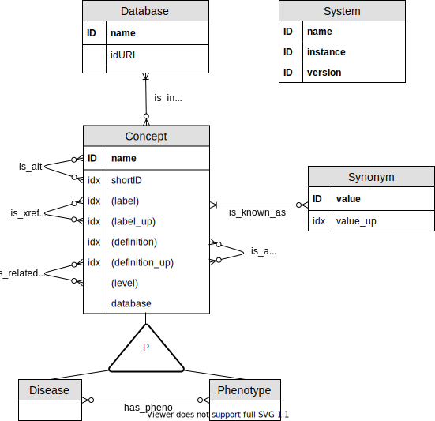

```{r, include = FALSE}
knitr::opts_chunk$set(
  collapse = TRUE,
  comment = "#>"
)
```


```{r setup, warning=FALSE, echo=FALSE}
library(DODO)
connect_to_dodo(url = "http://localhost:7476")
```

```{r, echo = FALSE}
library(BED)
library(TKCat)
library(here)
library(dplyr)
library(kableExtra)
tkcon <- chTKCat()
```


<!-- ============================================================= -->
<!-- ============================================================= -->
# Abstract

<!-- ============================================================= -->
<!-- ============================================================= -->
# Introduction

Disease ontologies have been developed to meet the need to structure, classify, and describe diseases [@Gruber1993; @Haendel2018; @Hoehndorf2013]. As a result of the diversity in their usage, a multitude of disease ontologies exist aiming to facilitate the integration with drug information, transcriptomics and genomics information, etc. and to support development of novel treatments [@Haendel2018; @Hoehndorf2013; @Rappaport2013]. Disease ontologies allow a more formal description of disease; however, each often defines an independent identifier and only link to a subset of independent biological databases [@Hasnain2014; @Hoehndorf2013; @Kibbe2015; @Livingston2015; @Malone2010; @Rappaport2013]. This stimulated the construction of integrated biological knowledge bases; however, the use independent, ontology-specific identifiers, heterogeneous decisions on disease definitions, and the inherent presence of errors, complicates integrating disease ontologies [@Livingston2015; @Rappaport2013]. In addition, navigating this large integrated knowledgebase with often an inheritely complicated data model, is difficult for most, non-expert users [@Hasnain2014; @Hu2017; @Livingston2015]. 

Several efforts have been made to connect the different disease ontologies themselves by generating of a single new integrative ontology [@Mungall2017; @Shefchek2019; @Rappaport2013]. Using semantic similarity the Monarch Disease Ontology (MonDO) aggregates different sources including OMIM, Orphanet, NCiT, GARD, DO, and MF [@Mungall2017; @Shefchek2019]. Other examples is the Disease Ontology (DO) which aims to standardize disease descriptions and classification from a clinical perspective using equivalence mappings [@Cheng2013; @Schriml2015; @Yu2015]. The Experimental Factor Ontology (EFO) also establishes an unified ontology (not limited to diseases) by re-using several reference ontologies that lies within its scope and enriches these classess with additional axioms when needed [@Malone2010]. Currently, it combines information from OMIM, Orphanet, ICD9/10 and SNOMEDCT, HPO, UBERON, and MonDO [@EFO2019].

Despite ongoing efforts, two issues remain in relation using disease ontologies efficiently: the issue of completeness and ease of access. To this end, the Dictionary of Disease Ontologies (DODO) was developed to deal with these two main issues. The first issue concerns the completeness of disease cross-reference mappings [@Hu2017; @Rappaport2013]. While efforts such as the Monarch Initiative and EFO try to integrate different disease ontologies through semantic learning and manual curation, these resources, like the different disease ontologies themselves, are currently not providing a complete mapping across different disease ontologies. By combining the information provided by the different ontologies, these cross-reference mappings can be enriched. It also allows connecting ontologies to each other that have no direct cross-reference mapping between them by indirectly inferring this connecting through another resource. In addition, the existing efforts for integration are not flexible to extend easily to include proprietary ontologies. Another challenge is the availability of an efficient and straightforward manner to access disease information through well established bioinformatics platforms (R or python) [@Rappaport2013; @Saqi2018]. This will facilitate a more flexible connection to the different life science resources to create a more complete disease landscape. Currently, the programmatic access provided by many ontologies often requires expertise in creating SPARQL queries and a high level of understanding of the underlying databases or data model to be able to generate more complex queries [@Hasnain2014; @Hu2017; @Rappaport2013]. DODO's graphical database is accompagnied by an R package that allows easy access, exploration, and definition of disease concepts of interest. It can work as the intermediate player to facilitate access and exhaustive extraction of information from other life science databases without the need to harmonize these up front. In this paper we will present DODO graphical database and R package, present some use cases as well as benchmark its usage to other available tools.


<!-- ============================================================= -->
<!-- ============================================================= -->
# Methods

In this section, an overview is presented of the DODO graphQL+ database and the accompagnying R package.

## Data model 



Figure: (fig:dodo_data_model) The DODO graph model is shown as an Entity/Relationship (ER) diagram. It consist of three types of entities (disease, phenotype, database) corresponding to graph nodes. Several relationships between the nodes are described referring to graph edges. "ID" refers to a unique entity while "idx" indicates whether this entity is indexed.

The data model underlying DODO aims to capture the relationship between disease and phenotypes as described across different databases [Figure1]. It relies on three types of nodes (disease, phenotype, and database) each with specific proporties. A disease or phenotype nodes have the same properties with *name* as their primary property. *Name* is the full length identifier of a disease or phenotype, namely a concatenation of database and identifier, e.g. "MONDO:0005027". Additional properties are (when available) a unique (canonical) *label*, a set of *synonyms*, disease *definition*, *database* of origin, hierarchical *level* and node *type*. The *level* of a disease is the highest position a node has in the ontological tree. A database node has only two property values, its *name* (the name of the database) and url link (*idURL*).

Nodes can be related to each other through different relations based on information provided by the 
resources. A disease node can be related to another node belonging to a different database by the *is_xref* relationship. This relationship indicates nodes relating to the same or highly similar disease concepts (as defined by the original resources). The *is_xref* relationship is directional and has the property *FA* (forward ambiguity) and *BA* (backward ambiguity). As disease definitions can be implemented in a broad or narrow sense by each disease ontology, *is_xref* relationships across ontologies are not always unambiguous. The concept of forward and backward ambiguity is implemented to handle transitivity mapping (see below). The *is_xref* relationship is dependent on the direction one is traversing through and is therefore encoded twice between each node. Each of these directions has its subsequent forward and backward ambiguity information provided as properties.

Phenotype and disease nodes may also be related through *is_a* non-directional relationship identifying parent/child nodes based on an ontological tree. This relationship is only available between nodes of the same database with the exception of diseases defined by EFO. EFO combines the re-use of identifiers from external resources and enriches this information with additional internal disease classifiers to construct its ontology [@Malone2010]. To distinguish the origin of the *is_a* relationship, the property *origin* is a added.

Phenotypes are highly detailed descriptions of clinical abnormalities which are used to describe disease through *has_pheno* non-directional relationship. And finally, each disease or phenotype node belongs to a database as encoded by the *is_in* relationship. This relationship is assigned the property *id* capturing the short identifier of the disease or phenotype node.

## Implementation

The data model is implemented using the Dgraph graph database which using the GraphQL query language [@Dgraph2017]. Two accompagnying R packages were developed to connect and query the resource [@R2019]. *DgraphR* provides low level function to connect and interact with the Dgraph instance. The second package, *DODO*, provides higher level functions to query the Dgraph graphical database based on the described data model. 

The minimal system requirements are: 

- R ≥ 3.6
- Operating system: Linux, macOS, Windows
- Memory ≥ 4GB RAM

The graph database has been implemented with Dgraph v1.0.16 [Dgraph2017] the DODO R package depends on the following packages available:

- dplyr [@Wickham2019]
- tibble [@Muller2019]
- neo2R
- rlist [@Ren2016]
- tidyr [@Wickham2019a]
- stringr [@Wickham2019b]
- visNetwork [@Almende2017]
- shinythemes [@Chang2018]
- DT [@Xie2019]
- igraph [@Csardi2006]
- shiny [@Chang2019]

## Feeding the database

To construct a DODO instance, a set of script is available to load and feed a Dgraph instance. These are not exposed directly to the user instead, these scripts are available in the *build/scripts* folder. The feeding of DODO is based on the parsed files of the different ontologies, a workflow on downloading and parsing for each included ontology is available through GitHub:

Disease ontology                                | GitHub
------------------------------------------------|--------------
Monarch Disease Ontology (MONDO)                |
Experimental Factor Ontology (EFO)              |
Orphanet                                        |
MedGen                                          |
Medical Subject Headings (MeSH)                 |
Human Phenotype Ontology (HPO)                  |
ClinVar                                         |
Disease Ontology (DO)                           |
International Classification of Diseases (ICD10)|
------------------------------------------------|--------------

Table: (tab:github_ontology) Different disease ontologies included into DODO database and link to GitHub repository.

The different steps are briefly described below: 

 1. Creating the relationship tables based on the information from the different ontologies
 2. Creating a new DODO instance and importing the relationship tables 
 3. Comparing the information on the new instance to the former (generates a html report)
 4. Compiling the instance into a Dgraph image
 5. Start the new instance

## Availability

The DODO instance build using the workflow described above is provided as a Docker image [@Docker2017] here:
This instance is build on information from the following disease ontologies:
 
 - MonDO
 - EFO
 - Orphanet 
 - MedGen (identifiers also encoded as UMLS)
 - MeSH
 - DO
 - ICD11
 - ClinVar

In the sections below, the presented results and use cases are obtained based on this instance of the DODO database. 
## Querying the database

DODO R package provides function to allow four different scopes: building and interacting with a disNet of setDisNet object, visualizing a disNet, converting disease and phenotype concepts to different ontologies, and several utility functions to connect to DODO graphical database or obtain low level information on identifiers. The table belows briefly list all function available within the package, as well as a short description and identification of the scope. 

```{r, include = TRUE, echo = FALSE}
ftie <- c("build_disNet", 
          "extend_disNet", 
          "filter_by_id", 
          "filter_by_database", 
          "focus_disNet", 
          "cluster_disNet", 
          "setdiff_disNet", 
          "split_disNet", 
          "explore_disNet",
          "show_relations", 
          "plot.disNet", 
          "convert_concept",
          "check_dodo_connection", 
          "connect_to_dodo", 
          "forget_dodo_connection",
          "list_dodo_connections",
          "call_dodo", 
          "show_dodo_model", 
          "get_version", 
          "get_concept_url", 
          "list_database", 
          "list_node_type", 
          "get_ontology", 
          "describe_concept")
descr <- c("Building a network of disease identifiers",
           "Extending a disNet by different edges",
           "Filtering a disNet by id",
           "Filtering a disNet by database", 
           "Focus on identifiers of interest and its neighbors",
           "Clustering a disNet, generates a setDisNet",
           "Substract one disNet from another",
           "Split a disNet based on a list of identifiers into a setDisNet",
           "Visualizes a datatable to explore a disNet",
           "Visualizes cross-reference relationships for the provided identifier",
           "Visualizes a disNet using visNetwork",
           "Convert the provided set of identifiers to another ontology",
           "Check connection with DODO graphical database",
           "Establish connection with DODO graphical database",
           "Forget a saved connection to DODO",
           "List all saved connections to DODO",
           "Calls a function on the DODO graphical database",
           "Return DODO data model",
           "Return DODO database version", 
           "Returns concept url", 
           "Lists databases in DODO", 
           "Lists node type in DODO", 
           "Returns whole ontology", 
           "Returns concept description")
scope <- c(rep("Build and interact", 8),
           rep("Visualize", 3),
           "Conversion",
           rep("Utility", 12))
toShow <- tibble(Function = ftie,
                 Description = descr,
                 scope = scope)
toShow %>%
  kable() %>%
  kable_styling()
```

# Transitivity mapping

As a consequence of the different way ontologies defines disease concepts, some cross-reference edges are trusted more than others. Some ontologies (e.g. MONDO, EFO) consider more narrow definition than others (eg. ICD10, ICD9). If cross-reference edges are considered equal without taking this information into account, it might result in the return of more distantly related concepts. Therefore, there are two types of cross-reference edges encoded in DODO: *is_xref* and *is_related*.  The *is_xref* edge is used for equal cross-reference relationships where the concepts relate more directly to each other (similar concept levels). The *is_related* edge is used for all other cross-reference edges. These edges are defined based on the sum of forward and backward ambiguities between databases to quantify the symmetry between them. Ontologies with a ambiguity equal or lower than 4 are considered as *is_xref* with the exception of ICD10 and ICD9 which are never an *is_xref* edge except between these two databases. In addition, MedGen and UMLS identifiers are duplicated therefore there is an additional *is_xref* edge between these. For more information please consult the vignette. 

In addition to the two types of edges, the concept of *ambiguity* is implemented to identify nodes with have many cross-references to the same database. Cross-reference edges are implemented in a directional manner in Neo4j, therefore both a forward (FA) and backward (BA) are calculated and encoded on every edge. As it is often desired to move from a broader concept to a more narrow one, no filtering on forward ambiguity is put in place. However, the opposite, namely moving from a more narrow and through a broader concept is not always desired. This can result in an exponential increase of converted/expanded identifiers that are only distantly related to the original identifier. 

The conversion of identifiers and extension or a disNet is performed in two steps. First, transitivity mapping is used on *is_xref* edges only where it is strongly recommended to use the default filtering on ambiguity to limit backward ambiguity to one. The final step is a intransitive mapping where both *is_related* and *is_xref* cross-reference edges are traversed with only one step to get the directly related cross-references (see below). As it is likely you want to obtain a broader concept related to the original identifiers but not move through it, it is recommended to put not filter on the *intransitive_ambiguity*.

Finally, a specific conversion procedure is recommended for the ontologies that consider disease concepts that are less connected through *is_xref* edges(e.g. ICD10, ICD9, ClinVar) and are mostly only related to other identifiers using *is_related* edges. This limits or removes the effect of the transitive mapping and not return all cross-references. Therefore, for these ontologies it is recommend that in addition to the standard conversion, an additional step of intransitive mapping is performed which is implemented in the function *get_related*. 

```{r}
## Show heatmap ambiguities
## show datatable sum ambiguities
## Show example of cross-reference edge -> broad to narrow
## example of conversion and the two steps (or three, convert_concept + get_related)

# cql <- c("MATCH (n:Disease)-[r:is_xref|is_related]->(n1:Disease)", 
#          "RETURN n.name, Type(r), n1.name, r.FA, r.BA LIMIT 100")
# a1 <- sapply(unique(a$DB1),
#              function(x){
#                t <- a %>% filter(DB1 == x)
#                b <- do.call(rbind,
#                             by(data = t, 
#                                INDICES = t$DB2, 
#                                function(y) summary(y$ambiguity)))
#                nm <- rownames(b)
#                toRet <- cbind(DB = nm, as.data.frame(b)) %>%
#                  arrange(Max.)
#                return(toRet)
#              },
#              simplify = FALSE,
#              USE.NAMES = TRUE)
# toShow <- do.call(rbind, 
#                   sapply(names(a1),
#                          function(x){
#                     toRet <- a1[[x]] %>%
#                       mutate(DB1 = x) %>%
#                       rename(DB2 = DB) 
#                     head(toRet)
#                     return(toRet)
#                   },
#                   simplify = FALSE,
#                   USE.NAMES = TRUE))
# toShow <- toShow %>%
#   mutate(DB1 = as.factor(DB1),
#          DB2 = as.factor(DB2)) %>%
#   select(DB1, DB2, Median, Mean, Third_Quantile = `3rd Qu.`, Max = Max.)
```

```{r, include = TRUE}
# max_amb <- do.call(rbind,sapply(names(a1),
#                function(x){
#                  toRet <- a1[[x]] %>%
#                    mutate(DB1 = x) %>%
#                    select(DB1, 
#                           DB2 = DB,
#                           Max.)
#                  return(toRet)
#                },
#                simplify = FALSE,
#                USE.NAMES = TRUE))  
# oriAmb <- reshape2::acast(max_amb, formula = DB1 ~ DB2, value.var = "Max.")  %>%
#   log10()
# heatmaply(x = oriAmb)
```


```{r, eval = FALSE}
# tmp <- DODO:::calculate_ambiguity(DODO_crossId)
# 
# a <- tmp %>% 
#   filter(DB1 %in% c("EFO", "MONDO", "DOID", "ClinVar", "Cortellis_condition","Cortellis_indication", "ORPHA", "UMLS", "MedGen", "MeSH", "OMIM", "ICD10", "ICD9") & 
#            DB2 %in% c("EFO", "MONDO", "DOID", "ClinVar", "Cortellis_condition","Cortellis_indication", "ORPHA", "UMLS", "MedGen", "MeSH", "OMIM", "ICD10", "ICD9")) %>%
#   select(DB1, DB2, FA, BA) 
# 
# a1 <- sapply(unique(a$DB1),
#              function(x){
#                t <- a %>% filter(DB1 == x)
#                b <- do.call(rbind,
#                             by(data = t, INDICES = t$DB2, function(y) summary(y$FA)))
#                nm <- rownames(b)
#                toRet <- cbind(DB = nm, as.data.frame(b)) %>%
#                  arrange(Max.)
#                return(toRet)
#              },
#              simplify = FALSE,
#              USE.NAMES = TRUE)
# toShow <- do.call(rbind, 
#                   sapply(names(a1),
#                          function(x){
#                     toRet <- a1[[x]] %>%
#                       mutate(DB1 = x) %>%
#                       rename(DB2 = DB) 
#                     head(toRet)
#                     return(toRet)
#                   },
#                   simplify = FALSE,
#                   USE.NAMES = TRUE))
# toShow <- toShow %>%
#   mutate(DB1 = as.factor(DB1),
#          DB2 = as.factor(DB2)) %>%
#   select(DB1, DB2, Median, Mean, Third_Quantile = `3rd Qu.`, Max = Max.)
```

```{r, include = FALSE, eval = TRUE}
# datatable(toShow,
#           filter = "top",
#           rownames = FALSE) %>%
#   DT::formatRound(c("Mean"), digits = 2)
```


As the backward ambiguity is not a symmetric measure, the direction of the edge can be used to assess how different ontologies relate to each other or employ different level of concept definitions. 

```{r, eval = FALSE}
# max_amb <- do.call(rbind,sapply(names(a1),
#                function(x){
#                  toRet <- a1[[x]] %>%
#                    mutate(DB1 = x) %>%
#                    select(DB1, 
#                           DB2 = DB,
#                           Max.)
#                  return(toRet)
#                },
#                simplify = FALSE,
#                USE.NAMES = TRUE))  
# oriAmb <- reshape2::acast(max_amb, formula = DB1 ~ DB2, value.var = "Max.")  %>%
#   log10()
# heatmaply(x = oriAmb)
```

To assess the general similarity between ontologies, the backward ambiguities between two ontologies (from either direction) are summed. This allows the visualization of ontologies that are more or less similar compared to those that are dissimilar based on the direction of the edge. 


```{r, eval = FALSE}
# symmAmb <- max_amb %>%
#    mutate_if(is.factor,as.character) %>%
#    mutate(db1_db2 = paste(pmin(DB1, DB2), pmax(DB1, DB2), sep = "|"))  %>%
#    group_by(db1_db2) %>% 
#    summarise(totalAmbiguity = sum(Max.)) %>%
#    mutate(DB1 = stringr::str_remove(string = db1_db2, pattern = "\\|.*"),
#           DB2 = stringr::str_remove(string = db1_db2, pattern = ".*\\|")) %>%
#    select(-db1_db2) 
# toShow <- bind_rows(symmAmb,
#                      symmAmb %>% select(DB1 = DB2, DB2 = DB1, totalAmbiguity)) %>%
#    distinct() %>%
#    arrange(DB1, desc(DB2))
# toShow <- reshape2::acast(toShow, drop = FALSE, formula = DB1 ~ DB2, value.var = "totalAmbiguity") %>%
#   log10()
# heatmaply(x = toShow) #, Rowv = NULL, Colv = NULL)
```


```{r, include = FALSE, eval = FALSE}
# datatable(symmAmb %>% select(DB1, DB2, totalAmbiguity),
#           filter = "top",
#           rownames = FALSE)
```


Finally, a "benchmarking" is used based on different cutoffs ranging from 1 to 10 of maximum ambiguity between the ontologies based on the tables above. For DO, Monarch, Cortellis_indication, Cortellis_condition this comparison has been done. Specific edges are created (*is_xref_bm* and *is_related_bm*) and all identifiers from these resources are converted (Concept -> Concept, not specifying a resource to conver to). Finally, the distribution of the number of conversions per identifier is shown below by ontology. The aim is to identify a particular cutoff that shows a strong increase in the number of conversions. 

```{r, eval = FALSE}
# load(here("tmp/All_benchmark_ambiguities.rda"))
# efo <- lapply(results_benchmark, function(x){x$EFO})
# monarch <- lapply(results_benchmark, function(x){x$Monarch})
# do <- lapply(results_benchmark, function(x){x$DO})
# clinvar <- lapply(results_benchmark, function(x){x$ClinVar})
# orphanet <- lapply(results_benchmark, function(x){x$Orphanet})
# medgen <- lapply(results_benchmark, function(x){x$MedGen})
# mesh <- lapply(results_benchmark, function(x){x$MeSH})
# icd11 <- lapply(results_benchmark, function(x){x$ICD11})
# load(here("tmp/Cortellis_condition_benchmark_ambiguities.rda"))
# cort_cond <- results_benchmark
# load(here("tmp/Cortellis_indication_benchmark_ambiguities.rda"))
# cort_ind <- results_benchmark
```

--> put in 1 graph all databases, showing distribution + max conversions. Show the the problem case - > decision on FA = 3

```{r, eval = FALSE}
# lapply(cort_cond, function(x){x %>% arrange(desc(n))})
# toShow_cortcond <- lapply(results_benchmark, function(x) x$n)
# boxplot(toShow_cortcond,
#         log = "y",
#         xlab = "Maximum ambiguity allowed to define is_xref",
#         ylab = "Number of converted IDs",
#         main = "Ontology = Cortellis_condition" )
```

```{r, eval = FALSE}
# max_conv <- do.call(rbind, sapply(1:length(cort_cond), function(x){
#   tibble(amb = x,
#          max = head(sort(cort_cond[[x]]$n, decreasing = T)))
# },
# simplify = FALSE))
# plot(x = max_conv$amb,
#      y = max_conv$max,
#       # log = "y", 
#       xlab = "Maximum ambiguity allowed to define is_xref", 
#       ylab = "Number of converted IDs", 
#       main = "Ontology = Cortellis_condition" )
```


==================================

Each ontology provides mapping information to a set of other ontologies. Most of these mappings are non-ambiguous: for each concept in an ontology there is only one concept mapped in another ontology. However, it often happens that some concepts in an ontology are mapped to several similar concepts in another ontology (provide an example here), the number of which corresponds to what we call forward ambiguity. A forward ambiguity greater than 1 indicates that the original concept is probably more general than the concepts to which it is mapped. If the mapping is taken in the other direction this ambiguity value is considered as backward ambiguity. Thus, similarly, forward ambiguity greater than 1 indicates that the original concept is probably less general than the concepts to which it is mapped. Depending on ontologies and on diseases, the ambiguity values can be quite large (show values). These large values can lead to conversion tables between disease concepts quite important and inaccurate, especially when considering transitive mappings between concepts (a->b and b-> ==> a->c). For conversion purpose, we propose to limit mappings to those with a backward ambiguity equal to 1. Doing so allows to convert a general term in more specific ones but not the opposite. Thus it prevents large inaccurate mappings when allowing transitivity. Limiting mappings according to transitivity improves the quality of the conversion of concepts from one ontology to another. Nevertheless, some inaccurate conversions can still be achieved when considering transitive some mappings with forward ambiguity. This behavior highly depends on the ontologies tackled by the mappings (show values here). According to this result, we propose to divide mappings between ontologies into 2 categories: "xref" considered as transitive and "is_related" considered as non-transitive. The classification of mappings has been achieved as following...

===================================

In some cross-reference edges more trust is put than in other as a consequence of the different manner (disease) concepts are defined across ontologies. While some ontologies use a narrower definition than other, cross-reference edges between these may result in the return of distantly related concepts. Therefore, based on the ontology as different type of cross-reference edge is implemented to capture these differences. The *is_xref* edge is used to signify relations that defined similarly related concept, while the *is_related* edge is used between nodes where the relationship is less equivalent. All nodes originating from ICD10, ICD9, MedGen/UMLS, and Cortellis resources (when available) are defined as *is_related* edges.

Due to the definitions of diseases within the different ontologies, it is not always possible to establish a clear one-on-one relationship. Some ontologies (such as ICD10) defined disease concepts much broader than other (e.g. MONDO). Therefore, traversing between cross-reference edges between such nodes should be handled with care. The issue is exemplified below where one disease identifier is cross-referenced to many only distantly relating IDs from another database. Traversing such cross-reference edges can result in exponential increase of the number of nodes returned. Therefore the concept of *ambiguity* was introduced and added as a facet proporty to each *is_xref* edge. It captures the number of cross-reference edges starting from one node and extending to nodes of the same database. As edges are directional in Dgraph, both a forward (FA) and backward (BA) ambiguity are calculating, allowing the user to filter easily no matter the direction the node is traversed. 

This ambiguity captures whether a crossreference edge between two disease nodes is exact or ambiguous, meaning that a particular node can have multiple cross-references to a database or only one (as shown below). As edges can be traversed in both direction, ambiguity is embedded as both forward and backward ambiguity allowing to filter for both forward and backward ambiguity no matter the direction that is used.

Firstly, the concept of ambiguity is introduced between cross-references edges. Due to the differences in disease concept definition between ontologies, it is advised to not filter on forward ambiguity as this can be considered as moving from a more broadly defined disease concept to several narrower disease concepts in another ontology (as shown below). However, limiting the on backward ambiguity to one is strongly advised as a larger backward ambiguity would correspond to moving from a more narrow concepts to a larger one. This can result in 'hopping' through more broader defined nodes, far more distantly related to the initial concept. The returned cross-reference edges cannot be considered as exact or close crossreferences of a node (shown below).

A second adaptation is the possibility to define a blacklist and whitelist of database that should be avoided or required (respectively) when passing through cross-references edges. A blacklist can be considered as a list of databases who's crossreferences edges are trusted less than those of other databases. The nodes of these blacklisted databases are returned; however, they are not traversed when returning cross-references. By providing NA and NULL values to either blacklist or whitelist, a specific filtering can be obtained, more details in the table below:


## S3 object

The center object used through the DODO R package is the disease network or disNet S3 object. It captures all information (disease node information, hierarchical information, phenotype information, and cross-reference informatino) around a disease and is structured as such:

- nodes: a dataframe describing disease nodes with the following columns
  - id: disease ids (database:shortID)
  - database: disease databases
  - shortID: disease short identifiers
  - label: disease labels
  - definition: disease descriptions
  - level: maximum level the identifier holds in the hierarchical ontology tree
  - type: type of node (disease or phenotype)
  
- synonyms: a dataframe with disease synonyms with the following columns
  - id: disease ids
  - synonym: disease synonyms
  
- children: a dataframe with ontology information
  - parent: parent disease ids
  - child: child disease ids
  - origin: ontology of origin where the parent/child relationship is recorded
  
- xref: a dataframe with cross-references
  - from: disease 1 ids
  - to: disease 2 ids
  - ur: unique cross-reference identifier
  - forwardAmbiguity: number of cross-references between disease 1 and database 2
  - backwardAmbiguity: number of cross-references between disease 2 and database 1
  
- pheno: a dataframe with phenotype information
  - disease: disease identifier
  - phenotype: phenotype identifier
  
- seed: a disease ids used to seed the disNet

The DODO R package combines several functions to construct, interact, and explore such a disNet object. These will be briefly outlined in the sections below. These functions also split or cluster a disNet, generating a list of disNet object, captured by the S3 setDisNet.


<!-- ============================================================= -->
<!-- ============================================================= -->
# Results

The table below shows the number of nodes available through each disease ontology, in total there are `r sum(list_database()$count)` nodes in this DODO instance.

```{r, include = TRUE, echo = FALSE}
toShow <- list_database()
DT::datatable(toShow,
          colnames = c("Disease ontology", "Number of identifiers"),
          rownames = FALSE,
          filter = "top")
```


# Use cases

<!-- ##### -->
## Converting concepts

One of the basic functionalities of DODO is the ability to convert disease and phenotype identifiers. The input can either be a vector of disease identifiers or a dataframe with columns "id" and "database". When providing disease identifiers these can be short disease identifiers (0005027) with database specification (MONDO). However, this allows only one database as input. Alternatively, by formatting the *id* as full disease identifiers (MONDO:0005027), identifiers from different ontologies can be converted simultaneously to the same ontology.

```{r, include = TRUE, echo = TRUE}
## Using short identifiers
converted_ids <- convert_concept(from = c("MONDO:0005027", "MONDO:0005180"),
                                 to = "EFO",
                                 from.concept = "Disease",
                                 to.concept = "Disease")
converted_ids

## Using full identifiers
converted_ids <- convert_concept(from = c("MONDO:0005027", "DOID:14330"), 
                                 to = "EFO",
                                 from.concept = "Disease",
                                 to.concept = "Disease")
converted_ids

# 
# ## Using dataframe
# df <- tibble(id = c("0005027", "14330"),
#              database = c("MONDO", "DOID"))
# converted_ids <- convert_concept(df = df, 
#                                  to = "EFO")
# converted_ids
```

<!-- ##### -->
## Building a disNet

A core concept in DODO is the *disNet*, a S3 object containing all information on a disease and its relationship with other nodes in the object (see above). This object can be constructed using helper functions starting from disease identifiers (*buildDisNetByID*) or a search term (*buildDisNetByTerm*). When using disease identifiers as an input, this can be done in the same fashion as using the *convertConcepts* functions, namely using either short or full identifiers or a dataframe. Using a search term, it is possible to query a combination of label, synonym, and or definition information available on the different identifiers in the resource.


```{r, include = TRUE, echo = TRUE}
disNet <- build_disNet(id = c("MONDO:0005144"))

disNet <- build_disNet(term = "amyotrophic lateral sclerosis", 
                       fields = c("label", "synonym"))
disNet
```

<!-- ##### -->
## Extending a disNet

When building a *disNet* by either identifier or search term, the resulting *disNet* will likely not contain the complete information on that particular disease landscape and might be missing some cross-reference edges. Alternatively, it might be necessary to extend the returned nodes to include their child terms or annotated phenotypes when available. To this end, the *extendDisNet* function in DODO allows extending a disNet object and returning additional cross-references edges, parent/child information and/or phenotype annotation.

The most basic functionality is extending to all cross-references edges (default extension):

```{r, include = TRUE, echo = TRUE}
disNet <- build_disNet(id = c("MONDO:0004976"))
disNet <- extend_disNet(disNet = disNet,
                       relations = "xref")
```

As DODO functions as a dictionery or meta-database, it lists all cross-reference edges provided by the original resources. By plotting a *disNet* visualizes the sometimes more fuzzy concept of a disease as different ontologies employ hetergeneous definitions and cross-reference axes are not always exact. This may help to understand how disease are identified across ontologies and visualize the relationship between different resources.

```{r, include = TRUE, echo = TRUE}
plot(disNet)
```

Extending through child terms and cross-reference edges will extend the disease landscape to incorporate all related terms.

```{r, include = TRUE, echo = TRUE}
## Build a disNet for ALS (MONDO:0004976)
disNet <- build_disNet(id = "MONDO:0004976")

## Extending disNet
disNet <- extend_disNet(disNet = disNet, 
                       relations = c("xref", "child"))
```

Plotting all `r nrow(disNet$nodes)` becomes more difficult to show all relationships easily.

```{r, include = TRUE, fig.height = 6, fig.width = 6}
plot(disNet)
```

The *plotDisNet* functions can also be used to only focus on a particular relationship.

```{r, include = TRUE, fig.height = 6, fig.width = 6}
plot(disNet, 
     showEdges = "xref")
```

<!-- ##### -->
## Reviewing

Often after extending it is necessary to review the returned *disNet* to assess whether all nodes are of interest. This workflow decribed below aims to establish a process of reviewing a *disNet* following a top/down approach. Clustering the *disNet* nodes based on cross-reference edges, allows the user to focus on the disease he/she wishes to retain and takes care of these cross-reference information in the back. 

For a smaller-sized *disNet* the clustering step and exploring these clusters might be sufficient to review a given object.

```{r, include = TRUE, echo = TRUE}
## Cluster disNet on "xref"
clDisNet <- cluster_disNet(disNet = disNet, 
                          clusterOn = "xref")

## Explore clusters
explore_disNet(disNet = clDisNet)
disNet <- c(list = clDisNet[c(1:2, 5, 9)])
```

When establishing a *disNet* based on search terms, some returned nodes have no parent/child edges or cross-reference edges. These are considered as *singletons* and are treated separately as these can still be of interest when aiming to link to different external resources.

## Phenotypes

Finally, it is also possible to extend to phenotype information with some limitations. The basis of *DODO* is the objective to travers the different disease ontologies efficiently and exhaustively. Information on phenotype is included into the database to enrich en broaden the scope; however, the primary aim of the tool is focussed on disease identifiers and their landscape. Therefore, the extendDisNet function allows annotated the set of diseases with phenotype information. The reverse, starting from phenotype identifiers to their listed diseases cannot directly be done using the extendDisNet. This choice was made as a particular phenotype may have many (otherwise) unrelated disease identifiers linked to it. Therefore, this particular question to extend from phenotype to disease should be addressed separately using the *convert_concept* function whereafter a disNet object can created and manipulated (please refer to the workflow).

```{r, include = TRUE, echo = TRUE}
hp <- c("HP:0003394", "HP:0002180", "HP:0002878")
tibble(identifiers = hp,
       label = describe_concept(id = hp))

## Obtain all diseases related to the phenotype identifiers
hp_disease <- convert_concept(from = hp,
                              from.concept = "Phenotype",
                              to.concept = "Disease")
dim(hp_disease)

## Optionally converting to a disNet 
hp_disease <- build_disNet(id = c(hp_disease$to, hp_disease$from))
hp_disease
```

<!-- ##### -->
## Connecting to external resources

The aim of DODO is to facilitate the connection with external resources. Defining a disNet around a disease of interest annotated with its cross-references and child terms ensures the connection to an external resources returns a list that is exhaustive. 

Below this use with DODO will be exemplified by connecting to two different external resources ClinVar and CHEMBL for "Amyotropic Lateral Sclerosis". To compare this usage, the resources themselves (ClinVar and CHEMBL) are queried directly for this indication and the results compared to the use of a disNet. In addition the use of a disNet across multiple resources ensures transitivity by defining a network of equivalent diseases that allows tracing the connecting between these different resources easily.

```{r, include = TRUE, echo = TRUE}
## Obtain all drugs for psoriasis using CHEMBL version 25
chembl <- TKCat::chMDB(tkcon, "CHEMBL")
clinvar <- TKCat::chMDB(tkcon, "ClinVar")
clinvarVariants <- clinvar$ClinVar_rcvaVariant %>%
  inner_join(clinvar$ClinVar_variants,
             by = c("varId" = "id")) %>%
  inner_join(clinvar$ClinVar_varEntrez,
             by = c("varId")) %>%
  select(varId,
         rcvaId,
         variantType = type.x,
         entrez)
# save(chembl$CHEMBL_drug_indication, 
#      clinvar$ClinVar_traitNames,
#      file = here("vignettes/disNet_externalResources.rda"))

# load(here("vignettes/chembl_25.rda"))


############################@
## Use disNet
disNet <- build_disNet(term = "amyotrophic lateral sclerosis", 
                            fields = c("label", "synonym"))
disNet <- extend_disNet(disNet, 
                       relations = c("xref", "child"))

chembl_disnet <- chembl$CHEMBL_drug_indication %>%
  mutate(dbid = paste(DB, id, sep = ":")) %>%
  filter(dbid %in% disNet$nodes$id)
## Number of identified compounds
length(unique(chembl_disnet$molregno))

clinvar_disnet <- clinvar$ClinVar_rcvaTraits %>%
  mutate(dbid = paste("ClinVar", t.id, sep = ":")) %>%
  filter(dbid %in% disNet$nodes$id) %>%
  inner_join(clinvarVariants,
             by = c("rcvaId"))
## Number of identified genes carrying a disease variant
length(unique(clinvar_disnet$entrez))

##########################@
## Query resource directly

## CHEMBL
chembl_als <- chembl$CHEMBL_drug_indication %>%
  filter(grepl("amyotrophic lateral sclerosis", name, ignore.case = T)) %>%
  mutate(dbid = paste(DB, id, sep = ":"))

## Number of identified compounds
length(unique(chembl_als$molregno))
## Compounds identified through use of disNet or CHEMBl directly
table(unique(chembl_disnet$molregno) %in% unique(chembl_als$molregno))

## ClinVar
clinvar_als <- clinvar$ClinVar_traitNames %>%
  filter(grepl("amyotrophic lateral sclerosis", name, ignore.case = TRUE)) %>%
  inner_join(clinvar$ClinVar_rcvaTraits, 
             by = "t.id") %>%
  inner_join(clinvarVariants,
             by = "rcvaId") %>%
  mutate(dbid = paste("ClinVar", t.id, sep = ":"))

## Number of identified genes carrying a disease variant
length(unique(clinvar_als$entrez))
## Genes identified through use of disNet or ClinVar directly
table(unique(clinvar_als$entrez) %in% unique(clinvar_disnet$entrez))
```

**CHEMBL**

There are `r length(unique(chembl_disnet$molregno))` compounds identified through `r length(unique(chembl_disnet$dbid))` identified (identifiers: `r unique(chembl_disnet$dbid)`) using the disNet while `r length(unique(chembl_als$molregno))` compounds identified through `r length(unique(chembl_als$dbid))` disease identifiers (identifiers: `r unique(chembl_als$dbid)`.

Both approaches identify the same drug compounds but an additional disease was available through use of a disNet.

```{r, include = TRUE, echo = TRUE}
## Use disNet
table(chembl_disnet$dbid)

## Directy query
table(chembl_als$dbid)
```

This disease is a child term identified through extending the disNet:

```{r, include = TRUE, echo = FALSE}
toShow <- build_disNet(id = unique(chembl_disnet$dbid))
plot(toShow)
```

The table below shows the disease labels:

```{r, include = TRUE, echo = FALSE}
explore_disNet(toShow)
```

**ClinVar**

There are `r sum(!unique(clinvar_als$entrez) %in% unique(clinvar_disnet$entrez))` Entrez gene identifiers that were identified using ClinVar directly as a resource compared to using the disNet. A closer look shows that these internal ClinVar trait ids ("t.id") either have no external cross-references or have a cross-reference to a MedGen identifier signifying a "finding". DODO is constructed only including MedGen identifiers of the following types: "Disease or Syndrome","Acquired Abnormality", "Anatomical Abnormality", or "Congenital Abnormality". This explains these missing ClinVar trait ids as these are related to MedGen "Findings" (= clinical feature of many conditions) only (see link)[https://www.ncbi.nlm.nih.gov/books/NBK159970/].

```{r, include = TRUE, echo = TRUE}
sel <- clinvar_als %>% 
  filter(!entrez %in% clinvar_disnet$entrez) %>% 
  select(t.id, name, entrez) %>% 
  distinct()
toShow <- clinvar$ClinVar_traitCref %>%
  inner_join(sel, 
             by = c("t.id")) %>%
  mutate(disease = sprintf('<a target="_blank" href = "https://www.ncbi.nlm.nih.gov/medgen/%s">%s</a>',
                           id,
                           paste(db, id, sep = ":")),
         gene = getBeIdDescription(ids = as.character(entrez), 
                               be = "Gene", 
                               source = "EntrezGene", 
                               organism = "human")$symbol,
         variant = sprintf('<a target="_blank" href = "https://www.ncbi.nlm.nih.gov/gene/%s">%s</a>',
                           entrez,
                           gene))
```

The table below shows the genes carrying a disease variant only identified through ClinVar directly:

```{r, include = TRUE, echo = FALSE}
datatable(toShow %>% select(t.id, disease, variant),
          colnames = c("ClinVar trait identifier", "Disease cross-reference", "Gene variant"),
          rownames = FALSE,
          escape = FALSE)
```

Similarly, there is `r sum(!unique(clinvar_disnet$entrez) %in% unique(clinvar_als$entrez))` Entrez gene identifier that were identified additionally using the disNet approach compared to using the ClinVar resource directly. 

```{r, include = TRUE, echo = TRUE}
# # sel <- clinvar_disnet %>% 
# #   filter(!entrez %in% clinvar_als$entrez) %>% 
# #   select(dbid, entrez) %>% 
# #   distinct() %>%
# #   inner_join(disNet$nodes %>% select(id, label),
# #              by = c("dbid" = "id"))
# # toShow <- clinvar$ClinVar_traitCref %>%
# #   mutate(dbid = paste("ClinVar", t.id, sep = ":")) %>%
# #   inner_join(sel, 
# #              by = c("dbid")) %>%
# #   mutate(disease = sprintf('<a target="_blank" href = "%s">%s</a>',
# #                            get_concept_url(id = paste(db, id, sep = ":"), 
# #                                            exact = TRUE)$url,
# #                            label),
# #          gene = getBeIdDescription(ids = as.character(entrez), 
# #                                be = "Gene", 
# #                                source = "EntrezGene", 
# #                                organism = "human")$symbol,
# #          variant = sprintf('<a target="_blank" href = "https://www.ncbi.nlm.nih.gov/gene/%s">%s</a>',
# #                            entrez,
# #                            gene))
# ```
# 
# The table below shows the gene for which the additional variant was identified and the associated disorder.
# 
# ```{r, include = TRUE, echo = FALSE}
# datatable(toShow %>% select(dbid, disease, variant),
#           colnames = c("ClinVar trait identifier", "Disease cross-reference", "Gene variant"),
#           rownames = FALSE,
#           escape = FALSE)
```

These terms from MedGen and OMIM are related to term "MONDO:0014178" (`r disNet$nodes %>% filter(id == "MONDO:0014178") %>% pull(label)`) itself a child term of "MONDO:0000507" (`r disNet$nodes %>% filter(id == "MONDO:0000507") %>% pull(label)`). This additional variant was identified through extending the disNet and obtaining al child terms and related cross-references.

```{r, include = TRUE, echo = TRUE, fig.width = 6, fig.height = 6}
toShow <- focus_disNet(disNet, 
                   diseaseID = "ClinVar:18286", 
                   relationship = c("xref", "parent"), 
                   steps = 3)
plot(toShow)
```

**Tracing connections**

A additional feature from connecting resources through the use of a disNet, is the possibility to identify if and how diseases returned from each resource are connected to each other. This does not only allow a better understanding of disease, but also facilitates downstream analyses.

```{r, include = TRUE, echo = TRUE, fig.height=10, fig.width=10}
comp_disNet <- build_disNet(id = c(unique(clinvar_disnet$dbid), 
                                      unique(chembl_disnet$dbid)))
comp_disNet <- extend_disNet(comp_disNet, 
                            step = 1, 
                            relations = "xref")
nodes <- comp_disNet$nodes %>%
  mutate(title = paste(id, label, sep = "|"),
         color = case_when(id %in% clinvar_disnet$dbid ~ "#67a9cf",
                           id %in% chembl_disnet$dbid ~ "#ef8a62",
                           TRUE ~ "#999999"),
         label = case_when(color == "#67a9cf" ~ "ClinVar",
                           color == "#ef8a62" ~ "ChEMBL",
                           TRUE ~ ""))
edges1 <- comp_disNet$xref %>%
  dplyr::select(to, 
                from,
                ambiguity = forwardAmbiguity) %>%
  dplyr::mutate(color = dplyr::case_when(ambiguity > 1 ~ "#fdbb84",
                                         TRUE ~ "#7fcdbb"),
                title = paste("ambiguity = ", ambiguity),
                arrows = "to")
edges2 <- comp_disNet$xref %>%
  dplyr::select(to = from, 
                from = to,
                ambiguity = backwardAmbiguity) %>%
  dplyr::mutate(color = dplyr::case_when(ambiguity > 1 ~ "#fdbb84",
                                         TRUE ~ "#7fcdbb"),
                title = paste("ambiguity = ", ambiguity),
                arrows = "to")
edges <- dplyr::bind_rows(edges1,
                          edges2) %>%
  dplyr::distinct()

visNetwork::visNetwork(nodes = nodes, 
                       edges = edges) %>%
  visNetwork::visOptions(highlightNearest = list(enabled = TRUE, hover = TRUE),
                         collapse = list(enabled = TRUE)) %>%
  visNetwork::visIgraphLayout()
```


<!-- ##### -->
## Bridging external resources

Connecting ClinVar to CHEMBL


<!-- ============================================================= -->
<!-- ============================================================= -->
# Conclusion

Disease ontologies have allowed a more formal classification of diseases and could facilitate the integration of several biological databases to increase disease understanding and develop novel treatments. However, efforts to integrate biological databases or the ontologies directly are complicated by ontology-specific identifiers, heterogeneous decisions on disease definitions, and the inherent presence of errors. Despite this efforts, we identified two remaning challenges:

- Currently no resource provides a flexible and complete mapping across the multitude of disease ontologies 
- Availability of efficient and straightforward software on bioinformatics platform (R or python)


DODO R package contains several functions to build and interact with a disNet or convert concept identifiers between ontologies. The workflow to construct a custom, local DODO graphical database is provided with the intent to allow adaptation to specific needs and additional resources can be easily added without adaptation to the data model or R package. 

We believe that DODO can help clarify and define conditions of interest and explore and visualize relationships between disease concepts. This allows the exploration of a disease and how correct the different mappings between ontologies are. This hopefully helps to increase disease understanding to people inside and outside of the medical field. In addition, connecting different biological database (information on compounds, text mining, transcriptomics, etc.) through a disNet ensures these resources are queried using different equivalent identifiers of the disease of interest without the user being required to make decisions on these mappings. In addition, it also allows visualizing the connection between these resources directly. 

Through the aggregation of different ontologies and their mappings, DODO functions as a meta-database with easy access and possibility to estabblish a more exhaustive disease landscape. The code to build and query DODO is provided under open source license to allow further improvement by other developers.

<strong>Bibliography</strong>
